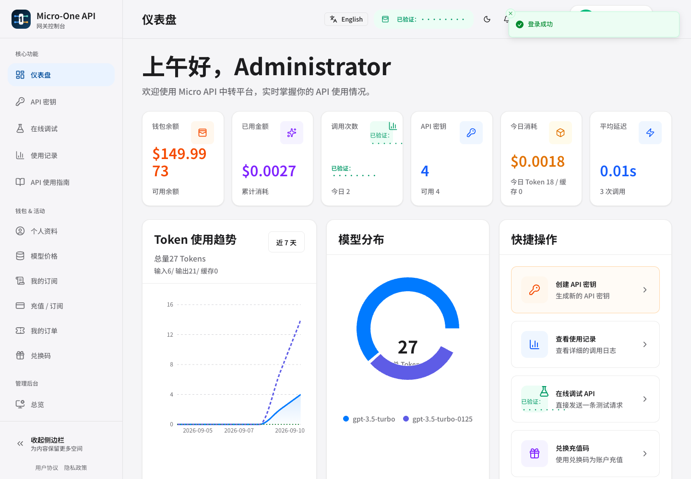
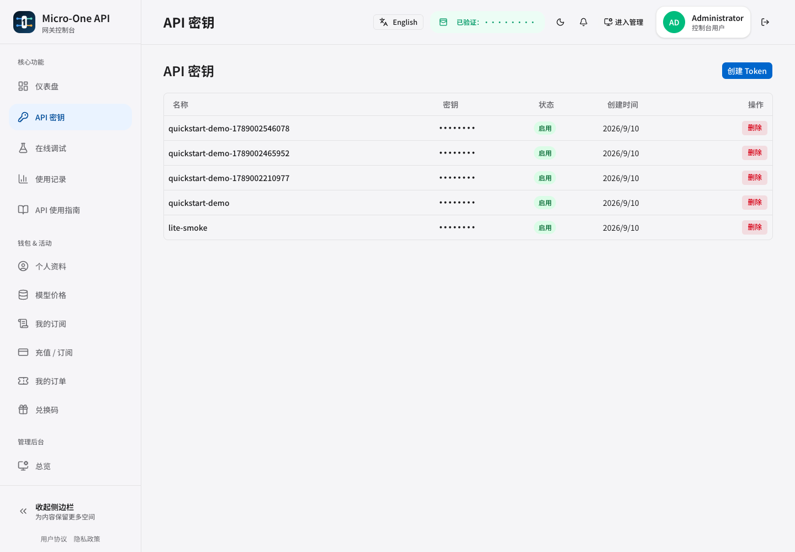
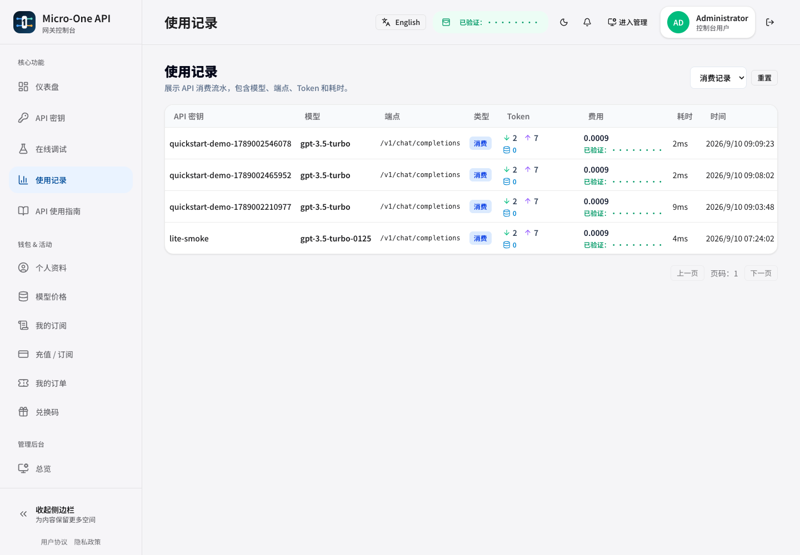
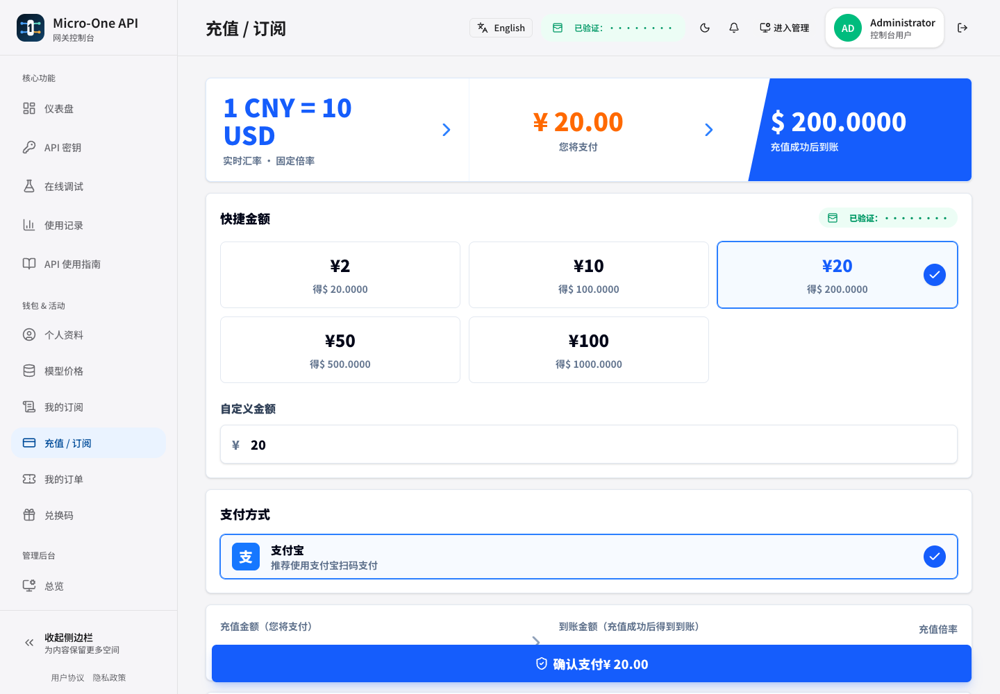
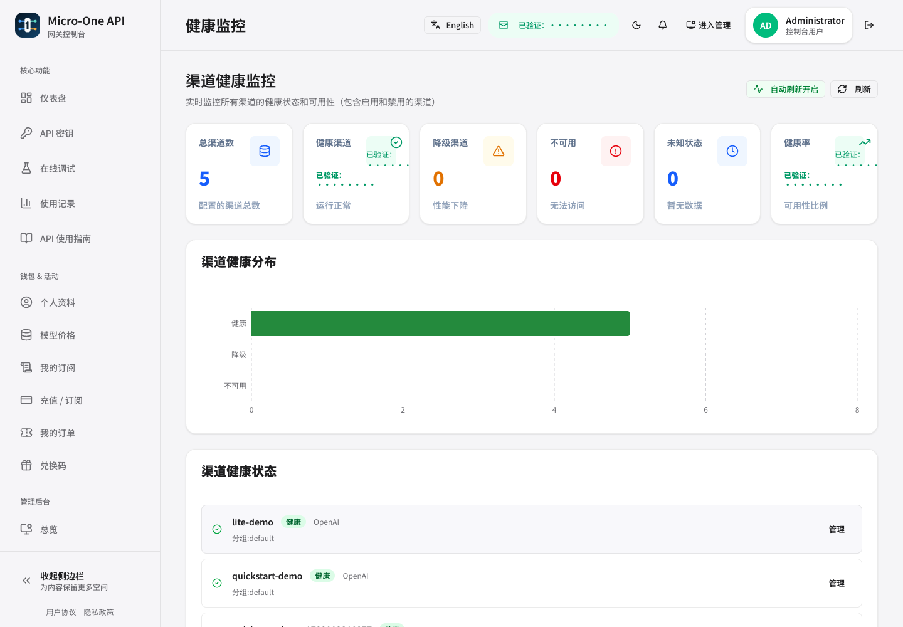
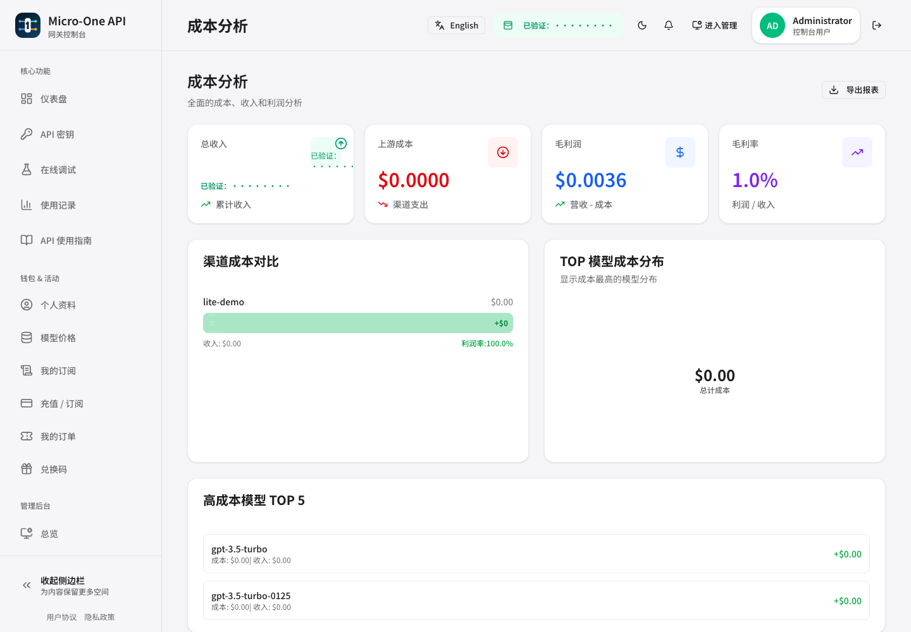
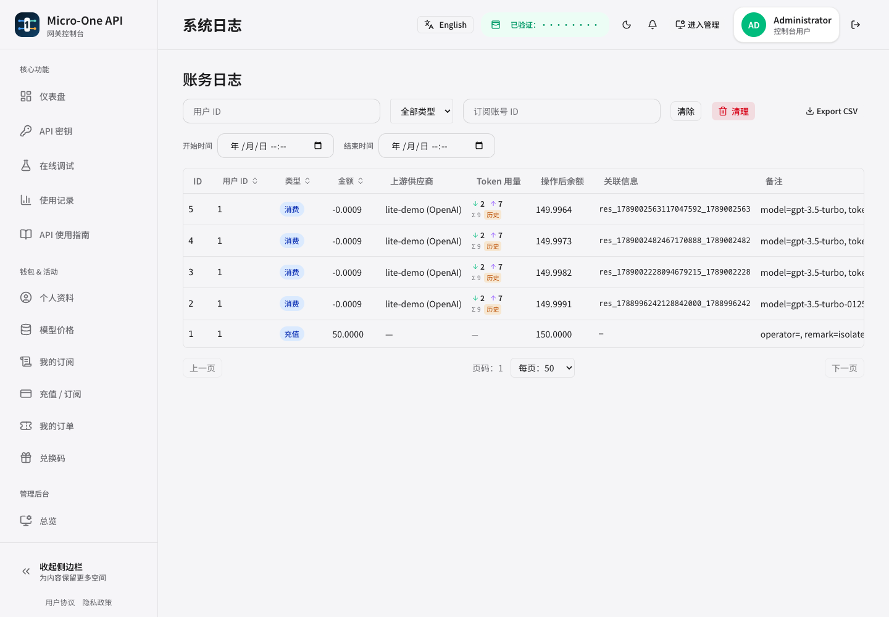
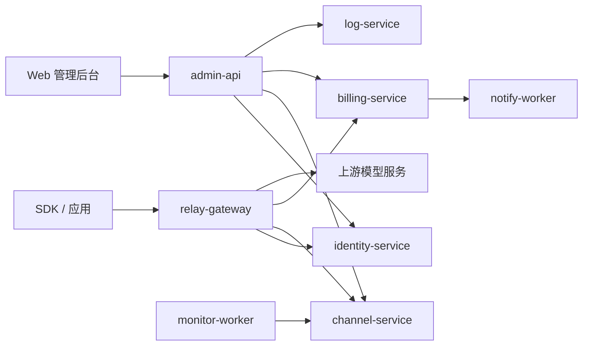

# micro-one-api


`micro-one-api` 是一个基于 Go Kratos 的多服务 AI API 网关与管理系统。项目参考了 [one-api](https://github.com/songquanpeng/one-api) 的多渠道 OpenAI API 分发思路，也参考了 [sub2api](https://github.com/Wei-Shaw/sub2api) 对订阅额度窗口、账号池、限流和用量管理的设计方向，并将核心能力拆分为更清晰的微服务边界。

本项目面向需要统一管理多个上游模型供应商、钱包余额、访问令牌、账务和运营后台的场景。它不是上游服务的替代品，也不提供任何第三方模型账号、订阅或 API Key。

> 📣 **最新发布**：[v0.20.4 发布公告](./docs/releases/release-v0.20.4.md)（修复路由死端触发 channel-service 熔断的生产事故、强化手动分区前置守卫） · [GitHub Release](https://github.com/mengbin92/micro-one-api/releases/tag/v0.20.4)

## 功能概览

- OpenAI 兼容 API 网关：支持 `/v1/chat/completions`、`/v1/models`、`/v1/responses` 以及 embeddings、audio、image、moderations 等 raw relay 路由。
- 多渠道模型分发：支持渠道优先级、同优先级负载均衡、禁用渠道过滤、模型白名单和模型映射。
- 多供应商适配：支持 OpenAI-compatible 渠道，并包含 Anthropic、Gemini、Azure、VoyageAI 等 provider 适配器；DeepSeek、Moonshot、Groq、Tongyi、OpenRouter、SiliconFlow、Ollama、Doubao 等按 OpenAI-compatible 方式转发。
- 用户与令牌管理：支持用户鉴权、令牌状态、过期时间、余额检查、模型权限和用户角色控制。
- 钱包与账务：提供金额预扣、释放、结算、ledger、兑换码、支付订单和用量记录等能力。
- 订阅套餐与用量查询：支持订阅套餐购买、续费、退款/冲正、购买时套餐快照，以及 API Key 鉴权的 `/v1/subscription/usage` 查询（额度、已用量、剩余额度和下次刷新时间）。
- 订阅账号治理：支持订阅账号本地额度、fixed daily/weekly 重置、账号恢复、额度告警、单用户单 active 订阅约束和多副本幂等治理记录。
- 模型管理系统：提供独立的模型管理后台，支持按账户配置模型映射、通配符模型匹配、模型别名管理、使用统计分析、缓存优化等功能，彻底解决多渠道模型管理复杂性。
- 国内订阅账户支持：新增对智谱 GLM、MiniMax、Kimi 等国内平台订阅账户的支持，包括动态模型发现、配额状态查询、路由恢复探测等能力。
- 成本与利润分析：`billing_ledgers` 记录上游成本，账本聚合支持收入/成本/毛利维度，可按模型、渠道、用户、Token、时间下钻。
- 多维用量聚合：用量统计改为 SQL `GROUP BY` 聚合（按用户/渠道/模型/Token/分组/小时|日），告别 admin 抽样估算。
- 对账与告警：`RunReconciliation` 覆盖账户余额、渠道用量、ledger/log 双写一致性；差异通过 `notify-worker` 投递通知（可配置收件人）。
- 成本健康 dashboard：管理后台展示成本/毛利/渠道余额健康指标；用量统计与账本支持缓存 token（`cache_read_tokens`）与命中率展示。
- 管理后台：提供 React/Vite 前端和 `admin-api` BFF，用于管理用户、令牌、渠道、订阅套餐、订单、兑换码、用量和系统配置。
- 监控与日志：提供健康检查、Prometheus metrics、业务日志聚合、监控 worker 和通知 worker；对账任务与渠道健康探测暴露运行次数、耗时和失败原因指标。
- 部署形态：支持本地开发、Docker Compose 和 Kubernetes 部署。

## 界面预览

以下截图来自测试账号或经过脱敏的管理页面。API Key 未展示；渠道名称、用户标识和账务流水已替换为演示内容，运营金额已替换或模糊处理。

| 用户仪表盘 | Token 管理 |
|:---:|:---:|
|  |  |
| 用量记录 | 充值与订阅套餐 |
|  |  |
| 渠道健康监控 | 成本分析 |
|  |  |
| 账务日志 | |
|  | |

## 适合谁 / 不适合谁

| 适合 | 不适合 |
|------|--------|
| 需要自托管统一入口，管理多个 OpenAI-compatible 或专用 provider 渠道的团队 | 只需要单机、单用户、单上游转发，希望一个二进制零配置启动的场景 |
| 需要用户、Token、钱包、订阅、账务、用量、成本和运营后台的内部平台或 SaaS 团队 | 希望项目直接提供上游模型账号、订阅、API Key 或代替第三方模型服务的用户 |
| 需要 Docker Compose / Kubernetes 部署，并希望按服务边界扩展和审计的工程团队 | 不准备维护 MySQL、Redis、多服务部署和监控体系的轻量个人用途 |
| 已获得上游服务合法授权，需要在组织内部做统一鉴权、调度和成本治理的使用者 | 试图绕过上游访问限制、账号规则、计费规则或服务条款的用途 |

## 架构



请求路径以 `relay-gateway` 为入口，鉴权、渠道选择和账务结算分别由对应服务负责；管理前端通过 `admin-api` 聚合管理接口，监控与通知 worker 处理异步运营任务。

当前仓库按 Kratos 服务边界组织：

| 服务 | 职责 |
|------|------|
| `relay-gateway` | OpenAI 兼容 HTTP 网关，负责鉴权、选路、金额预扣、上游转发和响应透传 |
| `admin-api` | 管理端 BFF，并托管或代理管理前端静态资源 |
| `identity-service` | 用户、角色、登录鉴权、Token 校验与权限判断 |
| `channel-service` | 渠道、模型、分组、优先级和可用渠道选择 |
| `billing-service` | 钱包余额、账务流水、兑换码、支付订单和扣费结算 |
| `config-service` | 动态配置管理 |
| `log-service` | 业务日志写入、查询和删除代理 |
| `monitor-worker` | 监控任务与告警触发 |
| `notify-worker` | 通知发送 |

目录结构：

| 目录 | 说明 |
|------|------|
| `api/` | gRPC、HTTP 和 OpenAPI 相关 proto 定义及生成代码 |
| `app/` | 子服务大仓（admin/billing/channel/config/identity/log/monitor/notify），各含 `cmd/`、`internal/`、`configs/`、`Dockerfile`、`Makefile` |
| `cmd/` | 根服务入口（`relay-gateway/`、`migrate/`、`admin-reset/`） |
| `configs/` | relay-gateway 配置文件 |
| `internal/` | relay-gateway 业务实现和 `conf` 配置 proto |
| `domain/` | 共享域库（`subscription` 订阅域、`upstream` 上游 provider），跨服务嵌入 |
| `platform/` | 基础设施层（cache/database/grpc/http/logging/metrics/middleware/registry/security/tls/tracing/websocket） |
| `pkg/` | 纯工具包（errors/safecast/safefile/timeout 等） |
| `migrations/` | MySQL schema 迁移 |
| `web/` | 管理后台前端 |
| `deployments/` | Docker、Docker Compose 和 Kubernetes 部署文件 |
| `scripts/` | 构建脚本、部署脚本、架构检查脚本 |
| `docs/` | 部署运维文档 |
| `test/` | 集成测试和端到端测试 |

## 快速开始

### Docker Compose

适合开发、测试和功能验收。

```bash
cd deployments/docker-compose
cp .env.example .env
# 编辑 .env，至少替换数据库、Redis 和服务密钥
docker compose up -d
```

默认需要在 `deployments/docker-compose/.env` 或环境变量中提供：

- `MYSQL_ROOT_PASSWORD`
- `DATABASE_DSN`
- `REDIS_PASSWORD`
- `JWT_SECRET_KEY`
- `SERVICE_TOKEN`
- `ADMIN_TOKEN`

服务启动后可访问：

- 管理后台：`http://localhost:3000`
- Relay API：`http://localhost:8080`
- 健康检查：`http://localhost:8080/healthz`

首次启动时，如果 `users` 表为空，`identity-service` 会创建初始 root 管理员。可通过 `INITIAL_ADMIN_USERNAME`、`INITIAL_ADMIN_EMAIL`、`INITIAL_ADMIN_PASSWORD` 指定；未设置密码时会生成随机密码。生产环境应设置 `INITIAL_ADMIN_PASSWORD_FILE`，服务会把随机密码写入该 0600 私有文件，不会在日志中打印明文。

### 从空环境到首个渠道和 Token

1. 按上面的 Docker Compose 步骤启动服务，确认 `http://localhost:8080/healthz` 返回成功。
2. 打开 `http://localhost:3000`，使用首次启动时配置或生成的管理员账号登录。
3. 进入 **管理后台 → 渠道 → Create Channel**，填写 `Name`、`Provider`、`Base URL`、`API Key`、`Models` 和 `Group`；`Priority`、`Weight` 可先保留默认值。
4. 保存后在渠道列表执行 **Test**，并在 **健康监控** 中确认渠道状态为健康。测试失败时先核对 Base URL 是否包含正确的 API 前缀，以及模型名称是否被上游支持。
5. 进入 **API 密钥 → Create Token**，输入用途名称（例如 `quickstart`）。新 Token 只会完整显示一次，应立即复制并安全保存。
6. 使用新 Token 验证 Relay：

```bash
export API_TOKEN='<刚创建的 Token>'
curl -H "Authorization: Bearer ${API_TOKEN}" \
  http://localhost:8080/v1/models
```

返回模型列表后，即完成从空环境部署到首个渠道和 Token 的最短链路。生产环境不要把上游 API Key、用户 Token 或管理员密码写入文档、命令历史和版本库。

### 本地开发

生成 proto 和构建：

```bash
make proto
make build
```

运行核心三服务的内存/本地链路：

```bash
make run-all
```

手动运行单个服务：

```bash
make run-identity
make run-channel
make run-relay
```

构建管理前端：

```bash
make web-dist
```

完整部署说明见 [docs/deployment.md](./docs/deployment.md)。

### 升级到 v0.20.4

v0.20.4 是 v0.20.3 之后的 **PATCH 生产稳定性版本**（7 个提交，`3ea0a6f` → `d96b3c0`）：修复无可用渠道 / route dead-end 以 `codes.Unknown` 穿越 gRPC 后被 relay 侧 circuit breaker 计为失败，导致 channel-service 整体熔断且无法自愈的生产事故；手动 ledger / logs 分区脚本增加迁移治理、`078` 与 claim 覆盖硬前置检查；nightly E2E 修复 export 竞态并建立 2026Q3 P3 观察基线。**无 API 破坏性变更、无数据库迁移、无 proto/应用配置变更**。仅 relay-gateway 需要重新部署。详见 [docs/releases/release-v0.20.4.md](./docs/releases/release-v0.20.4.md)。

### 升级到 v0.20.3

v0.20.3 是 v0.20.2 之后的 **PATCH 质量门禁版本**（7 个提交，`c366dd9` → `a338a1c`）：CI 新增真实 MySQL / Postgres migration smoke（fresh、repeat no-op、状态审计、失败注入）；修复 compose MySQL healthcheck 过早 healthy 与 admin users export E2E React Router 异步提交竞态；建立 P3-0 季度观察基线并补充 relay-gateway 延迟分位数、429/502 与熔断面板。**无 API 破坏性变更、无数据库迁移、无 proto/应用配置变更、无服务运行时代码变更**，生产服务无需重新部署。详见 [docs/releases/release-v0.20.3.md](./docs/releases/release-v0.20.3.md)。

### 升级到 v0.20.2

v0.20.2 是 v0.20.1 之后的 **PATCH 补强版本**（5 个提交，`3cde415` → `538f80e`）：管理后台新增「上游成本」页面（渠道 / 订阅账号 / 全局裸模型每 1M tokens 采购价、缓存读取价格、legacy 键迁移），服务端支持可选价格显式清空并拒绝负数；对账脚本新增 ledger ↔ dedupe claim 双向覆盖完整性检查。**无 API 破坏性变更、无数据库迁移、无 proto/配置变更**。受影响范围：admin-api（含管理前端 web/dist）与运维侧 `scripts/reconcile` 工具。详见 [docs/releases/release-v0.20.2.md](./docs/releases/release-v0.20.2.md)。

### 升级到 v0.20.1

v0.20.1 是 v0.20.0 之后的 **PATCH 修复版本**（2 个提交，`5c89752` → `64a6ed6`）：升级管理前端传递依赖 nanoid 3.3.17 → 3.3.18 修复 CVE-2026-67213（随机 ID 生成死循环 DoS，仅构建期依赖、不进入运行时 bundle）；归档 v0.19–v0.20 执行记录（`docs/design/v0.19-v0.20-execution-record.md`）并确立 v0.21 路线图为唯一规划入口。**无 API 破坏性变更、无数据库迁移、无 proto/配置变更、无运行时行为变化**，服务端无需重新部署。详见 [docs/releases/release-v0.20.1.md](./docs/releases/release-v0.20.1.md)。

### 升级到 v0.20.0

v0.20.0 是 v0.19.1 之后的 **MINOR 功能版本**（10 个提交，`47e619e` → `79108d5`）：接通 relay-gateway HTTP 入口请求 / 延迟指标（`NewHTTPMetricsMiddleware` 挂载最外层、路径低基数归一、`/healthz` / `/metrics` 不计入）；为 RANGE 分区后的 `billing_ledgers` 新增非分区全局 dedupe claim 表（**迁移 `078`**，`CreateLedgerInTx` 同事务先 claim 后 insert，冲突统一 409；修复分区边界表达式 / 分区名比较 / 财务分区误自动 DROP）；修复 admin 表格 URL 筛选快速连续变更的 stale-closure 竞态；修复 nightly compose E2E / Playwright smoke（卷路径、locators、pb.go 生成、SERVICE_TOKEN）。**无 API 破坏性变更、包含数据库迁移 `078`**；`partition.tables` 字段 deprecated（旧值可解析、运行时忽略）。受影响服务：relay-gateway、billing-service、log-service、admin-api（含前端）。详见 [docs/releases/release-v0.20.0.md](./docs/releases/release-v0.20.0.md)。

### 升级到 v0.19.1

v0.19.1 是 v0.19.0 之后的 **PATCH 工程收尾版本**（1 个提交，`23d6c8e`），落地 v0.19 路线图 P2：工具链版本固定（`scripts/tool-versions.env` 唯一版本源固定 buf / wire / gosec / govulncheck / gitleaks / syft / go-licenses，`make init` 与 `security-*` 不再使用 `@latest`，新增 `make tools-upgrade-check`；前端 `.nvmrc` 24 + engines 对齐 CI）、`make clean` 扩展（显式、幂等）、新增 `make verify` 聚合门禁（unit / race / architecture / migration-check / frontend，与 `ci.yml` 对齐）与 compose/migrate 前置检查；热点文件拆分评估结论为维持触发式。**不含任何生产代码变更、无 API/数据库/proto/配置变更、无运行时行为变化**，无需重新部署。详见 [docs/releases/release-v0.19.1.md](./docs/releases/release-v0.19.1.md)。

### 升级到 v0.19.0

v0.19.0 是 v0.18.4 之后的 **MINOR 稳定化版本**（4 个提交，`c0ddf36` → `27485b7`），不含新产品功能：为协议转换链路建立显式兼容性契约矩阵（注册表 + 覆盖断言，新增路径漏注册即失败），为迁移体系补上静态一致性门禁（`make migration-check`：重复前缀硬失败 + ownership 覆盖 + postgres/sqlite 镜像强制，SQLite fresh/incremental 生命周期自动化），CI 新增 integration job 与 nightly compose e2e / Playwright smoke，并补齐 xgrpc / resilience / auth / crypto / tracing / timeout 基础设施单测；唯一生产代码改动是 `platform/tracing` 的 OTLP 裸 `host:port/path` 路径归一化修复。**无 API 破坏性变更、无数据库迁移、无 proto 变更、无配置变更**，无强制重新部署需求。详见 [docs/releases/release-v0.19.0.md](./docs/releases/release-v0.19.0.md)。

### 升级到 v0.18.4

v0.18.4 是 v0.18.3 之后的 **PATCH 修复版本**（1 个提交，`29e875d`），修复 admin 运营后台「高消耗渠道」排行把订阅账号流量误渲染为「已删除渠道」的问题：渠道排行改为 `["channel", "subscription_account"]` 双维度请求并在 service 层先剔除订阅账号行再截取 Top-N，同时为全部 Top-N 排行补上不依赖 SQL 返回顺序的确定性 quota 降序排序；前端概览页新增「高消耗订阅账号」排行卡片（排行区 4 列 → 5 列）。**无 API 破坏性变更、无数据库迁移、无 proto 变更、无配置变更**。受影响服务为 admin-api（含管理前端 web/dist）。详见 [docs/releases/release-v0.18.4.md](./docs/releases/release-v0.18.4.md)。

### 升级到 v0.18.3

v0.18.3 是 v0.18.2 之后的 **PATCH 测试收口版本**（2 个提交，`a21970a` + 矩阵补齐），**不含任何生产代码变更，无运行时行为变化**：将发布后落在 develop 上的 Anthropic fallback tool 测试对齐收口进 tag，并补齐 fallback 路径的 web_search 兼容性最小矩阵（请求 history `web_search_call` 丢弃、非流式 / 流式 `server_tool_use`/`web_search_tool_result` blocks 静默丢弃且文本与终止事件不受干扰），与 apicompat 侧 OAuth 层用例一一对应。**无 API 变更、无数据库迁移、无 proto 变更、无配置变更**；生产运行 v0.18.2 的用户无需为本版重新部署。详见 [docs/releases/release-v0.18.3.md](./docs/releases/release-v0.18.3.md)。

### 升级到 v0.18.2

v0.18.2 是 v0.18.1 之后的 **PATCH 修复版本**（7 个提交，`759181f` → `8b40b63`），核心是修复 Kimi K3 等 Anthropic 兼容上游联网搜索导致 codex 端「Search results for query: …」文本无限粘连、多轮对话崩溃的 bug：完全静默丢弃 `server_tool_use` / `web_search_tool_result` content blocks（codex 不支持对应 output item 类型），并在 OAuth relay 路径（`ClaudeOAuthAdaptor`）的 `convertResponsesToAnthropicTools()` 中跳过 web_search tools——此前仅 fallback 路径剥离 tool 标识符，OAuth 路径仍触发上游服务端联网搜索。同时完成 v0.18 P4 可观测性闭环：`xgrpc.UnaryClientMetricsInterceptor` 接入全部 gRPC dial 点并在真实流量下回填 BASELINE；新增 relay 下游 gRPC 熔断器 `resilience` 配置段（env-gated 默认关闭，生产已开启，`circuit_breaker_state` 4 下游 closed / trips=0）。**无 API 破坏性变更、无数据库迁移、无 proto 变更**。受影响服务为 relay-gateway、channel-service、identity-service、billing-service、monitor-worker。详见 [docs/releases/release-v0.18.2.md](./docs/releases/release-v0.18.2.md)。

### 升级到 v0.18.1

v0.18.1 是 v0.18.0 之后的 **PATCH 修复版本**（3 个提交，`e6c1673` → `0ebe48a`），核心是修复两个影响生产可用性的缺陷：（1）Token 创建默认配额 bug——前端仅发送 `{name}` 时 `unlimited_quota` 被解析为 `false`（bool 零值），Token 以永久耗尽状态写入、首次使用即被 `TOKEN_EXHAUSTED` 拒绝；（2）identity → relay 错误码链路映射错误——`ErrTokenExhausted` 映射为 gRPC `NotFound` → HTTP 401，误导客户端将有效但耗尽的 key 当作错误 key（修正后：耗尽 → 429、禁用 → 403、子网 → 403）；同时完成 v0.18 P2 工程卫生（C2 MySQL `RowsAffected==0` 幂等更新误判修复、C5 billing commit/reserve + admin-api gRPC 客户端 Prometheus 指标补齐、C4 分区触发文档化）。**无 API 破坏性变更、无数据库迁移、无 proto 变更**。受影响服务为 identity-service、relay-gateway、admin-api、billing-service。详见 [docs/releases/release-v0.18.1.md](./docs/releases/release-v0.18.1.md)。

### 升级到 v0.18.0

v0.18.0 是 v0.17.1 之后的 **MINOR 功能版本**（4 个提交，`fd09278` → `636fdd4`），完成 v0.18 路线图 P0 并修复 P1 首周期发现：admin 资金写路径的**请求级幂等**（方案 B，DB 唯一键）。购买（`PurchaseSubscription`）与充值（`TopUpQuota`）的钱包扣款/充值 ledger 携带基于 `(user_id, request_id)` 的显式去重键，复用 `billing_ledgers.ledger_dedupe_key` 既有全局唯一索引作为闸门——并发同键重复请求整笔事务回滚，钱包绝不被扣两次（关闭 M6 已知边界 #1，仓库此前唯一已知的资金正确性开放项）；同时顺带修复存量 bug：购买扣款 ledger 回退到不含 user_id 的 legacy 键导致同一 group 的第二次购买（即使不同用户）唯一键冲突失败；并修复 P1 对账首周期（C6）发现的卡单检测误报（余额订单被当卡单）。**无数据库迁移、无新增配置项**；API additive（两份 proto 新增 `request_id` 字段）；重复请求返回 HTTP 409。受影响服务为 admin-api、billing-service（含前端购买流程）。详见 [docs/releases/release-v0.18.0.md](./docs/releases/release-v0.18.0.md)。

### 升级到 v0.17.1

v0.17.1 是 v0.17.0 之后的 **PATCH 修复版本**（3 个提交），核心是修复上游 SSE 流卡死导致连接泄漏的生产问题：OpenAI / Anthropic / Azure / Gemini provider 的 `streamClient` 此前为裸 `&http.Client{}`（无超时），上游流式响应 stall（建立连接后停止吐字节不断开）时 `io.Copy` 无限阻塞、仅靠请求 context deadline 兜底。本版本新增滑动 idle 超时（`stream_timeout.go`）：ResponseHeaderTimeout 约束响应头等待，`streamIdleReadCloser` 在有字节到达时重置 idle 计时器、连续 timeout 无字节才主动断开——活跃长流式响应不受影响。同时收尾 P3 性能基线文档与 jsonx 最终决策（amd64 上 sonic 双向胜出，保留 pkg/jsonx 不回退，纯文档），修复 TODO.md 相对路径错误导致的 CI markdown 链接检查失败。**无 API 破坏性变更、无数据库迁移、无 proto 变更、无新增配置项**。受影响服务为 relay-gateway。详见 [docs/releases/release-v0.17.1.md](./docs/releases/release-v0.17.1.md)。

### 升级到 v0.17.0

v0.17.0 是 v0.16.0 之后的 **MINOR 功能版本**（14 个提交），完成 v0.17 路线图 P0（工程收尾）与 P1（运营闭环）两项交付并补齐发布门禁：修复两个前端依赖安全漏洞（nanoid CVE-2026-67213、js-yaml GHSA-5p4m-2wfm-xmqj，code-scanning #270/#269）；修复 Docker CI 的 **9 服务 × 2 架构（18 job）矩阵**（原 include+platform 组合被 GitHub Actions 折叠为仅 notify-worker 2 job，现显式计算 9×2 笛卡尔积，CI run 244 全量 22 job 全绿）；新增 `make test-race` 并接入 CI、charge 后监控告警、一键对账与发布后强制失败验证脚本；升级 12 个 Actions 到 Node 24 与 CodeQL v4；加固 gross-profit 指标口径、统一 Grafana dashboard；并为 P3 性能基线与 jsonx 决策补充可复现证据。**无 API 破坏性变更、无数据库迁移、无 proto 变更**。受影响服务为全部后端服务（主要为 admin-api、relay-gateway、billing-service）。详见 [docs/releases/release-v0.17.0.md](./docs/releases/release-v0.17.0.md)。

### 升级到 v0.16.0

v0.16.0 是 v0.15.3 之后的 **MINOR 功能版本**（7 个提交），标志着 v0.11.0 路线图收尾阶段（P0–P3）全部完成：routing-ops 双源指标降级（Prometheus → relay-gateway `/metrics` 直采）作为唯一面向用户的新功能（Prometheus 故障时 admin-api 自动降级，`partial=false`），P1 契约加固补齐同优先级精确回退 + 并发 active 唯一约束的确定性回归测试（7 条），cache-creation 计费从 observe 切换为 charge 的生产闭环（2026-08-06），以及 6 个服务 conf 包测试、billing_model TODO 清理、v0.16 路线图文档整合等工程卫生。**无 API 破坏性变更、无数据库迁移、无 proto 变更**；新增 1 个可选配置项 `RELAY_METRICS_ENDPOINT`，`prometheus/common` 从 indirect 提升为 direct。受影响服务为 admin-api。详见 [docs/releases/release-v0.16.0.md](./docs/releases/release-v0.16.0.md)。

### 升级到 v0.15.3

v0.15.3 是 v0.15.2 之后的 **PATCH 版本**（3 个提交），内容为内部重构与代码规范，**无对外行为变更**：将全仓库 JSON 序列化统一收敛到 `pkg/jsonx` 单一封装层（底层 sonic `ConfigStd`，保持 `encoding/json` 语义——HTML 转义、map key 排序、字符串拷贝），第一步迁移 52 个非测试文件的 `encoding/json`→`jsonx`（含升级 sonic 至 v1.15.2，唯一保留 `bodylimit.go` 因依赖 sonic 未暴露的类型断言），第二步替换 53 个热点文件的直接 `sonic.*`/`sonic.ConfigStd.*` 调用、补齐 `jsonx.Get` 与 `AGENTS.md` JSON 策略章节，第三步一次纯机械 `gofmt -w` 收尾 50 个不规范文件。**无 proto 变更、无数据库迁移、无新增配置项**。受影响服务为全部后端服务（触达面广但均为等价替换）。详见 [docs/releases/release-v0.15.3.md](./docs/releases/release-v0.15.3.md)。

### 升级到 v0.15.2

v0.15.2 是 v0.15.1 之后的 **PATCH 修复版本**（3 个提交），全部位于 relay-gateway：修复 v0.15.1 渠道统计去噪因 `applyPlanInputs` 赋值顺序反转而完全失效的回归（订阅流量重新跳过 channel 维度统计、cost key 恢复正常）；修复订阅来源 Anthropic 协议上游（如 kimi）流式响应的三个缺陷——`data:` 无空格行被静默丢弃、上游中途断连缺 `[DONE]` 哨兵、`message_start` 前关闭无终止事件——导致 codex 报 "stream disconnected before completion"；并将 `response.completed` 之后的 `response.failed` 守卫补齐到 adaptor 路径。**无 API 破坏性变更、无数据库迁移、无新增配置项**。受影响服务为 relay-gateway。详见 [docs/releases/release-v0.15.2.md](./docs/releases/release-v0.15.2.md)。

### 升级到 v0.15.1

v0.15.1 是 v0.15.0 之后的 **PATCH 修复版本**（2 个提交）：收尾订阅变更链路的 M6 缺陷——换组用量窗口仅在真正跨组时重置（同组改套餐保留已跑用量，避免丢数据与免费刷新配额），并为 `ChangeSubscription` 增加行锁串行化（`SELECT ... FOR UPDATE`）防止并发变更互相覆盖写回；同时让 relay-gateway 跳过订阅来源流量的 channel 维度用量统计（合成 ChannelID 导致 channel-service 刷 "channel not found" 告警噪声）。**无 API 破坏性变更、无数据库迁移、无新增配置项**。受影响服务为 relay-gateway、admin-api、billing-service。详见 [docs/releases/release-v0.15.1.md](./docs/releases/release-v0.15.1.md)。

### 升级到 v0.15.0

v0.15.0 是 v0.14.0 之后的 **MINOR 功能版本**：闭合订阅账号 weight 反馈回路（channel selector 的 per-process inflight 计数首次接入 relay 实际占用，`loadFactor` 取 `max(local, crossReplica)`，选择不再堆叠在忙账号）；打通审计平台 actor / request-id 提取（relay-gateway 与 admin 退款 / identity 登录的敏感操作审计记录从此可归因，mutable `*actorHolder` 解决 Go 不可变 request 导致 actor 为空的问题）；修复前端 4 个 npm 依赖漏洞（hono ReDoS、undici 注入/desync、fast-uri host 混淆、brace-expansion DoS）并移除弃用的 TS `baseUrl`。**无 API 破坏性变更、无数据库迁移**；新增 1 个 additive proto 字段与内部 gRPC 方法 `RecordSubscriptionAccountSlot`。受影响服务为 relay-gateway、channel-service、admin-api、identity-service。详见 [docs/releases/release-v0.15.0.md](./docs/releases/release-v0.15.0.md)。

### 升级到 v0.14.0

v0.14.0 是 v0.13.3 之后的 **MINOR 版本**：为订阅续费链路补齐 `renewal_strategy` 可观测字段（迁移 `077`，additive，MySQL/sqlite/postgres 三驱动），修复 admin 延长订阅的并发写 clobber（窄字段写 `expires_at`+`renewal_strategy`）与过期订阅延长后未恢复 active 的缺陷，为 Redis 故障态并发语义补充多副本 fail-open 断言（M9/H11/M8），并完成 code-review L 系列核验（审查清单基本收官）。**包含数据库迁移**（`077`，additive 加列默认空串，滚动升级安全）；无 API 破坏性变更。受影响服务为 admin-api、billing-service。详见 [docs/releases/release-v0.14.0.md](./docs/releases/release-v0.14.0.md)。

### 升级到 v0.13.3

v0.13.3 是 v0.13.2 的 **PATCH 修复版本**：修复订阅购买完成的幂等性漏洞（claim-before-fulfil，admin 完成流程先 claim 再 fulfil，M10 资金相关）、relay-gateway 将上游限流（429/423/529）误计为故障导致断路器误开 503 的问题、admin 补偿失败时的错误信息透出与卡单检测，以及 CI 矩阵输出格式 / 构建缓存 / 多架构 Docker Hub 推送的全面加固。**无 API 破坏性变更、无数据库迁移**。受影响服务为 admin-api、billing-service、relay-gateway。详见 [docs/releases/release-v0.13.3.md](./docs/releases/release-v0.13.3.md)。

### 升级到 v0.13.1

v0.13.1 是 v0.13.0 的 PATCH 版本，修复 identity-service 调用 billing-service gRPC 时未携带 `SERVICE_TOKEN`，导致用户账单、日志、余额和支付订单等接口返回 gRPC 鉴权错误的问题。无数据库迁移、无 API 破坏性变更；部署时需保证 compose 中 identity/channel/billing/log/monitor/notify 都注入非空 `SERVICE_TOKEN`。详见 [docs/releases/release-v0.13.1.md](./docs/releases/release-v0.13.1.md)。

v0.13.0 是 v0.12.0 发版后的生产加固版本：完成身份 Token 哈希存储（`key_hash`）、会话撤销、Token 子网限制、gRPC SERVICE_TOKEN 认证、计费幂等与资金原子性、订阅有效期兜底、SSE/流式稳定性、SSRF 与上游错误收敛、admin 错误信息脱敏等修复；新增 `identity.v1.ConsumeTokenQuota` RPC 与 `client_ip` additive proto 字段。**包含数据库迁移**（`072`–`076`，均 additive，按 per-service schema 执行；`070` 同步改为 MySQL 幂等写法）；无 API 破坏性变更。开发者需执行 `make init && make proto` 重新生成代码。详见 [docs/releases/release-v0.13.0.md](./docs/releases/release-v0.13.0.md)。

### 升级到 v0.12.0

v0.12.0 是 v0.11.0 发版后的生产加固与功能补全版本：落地代码评审报告的全部 CRITICAL/HIGH/MEDIUM/LOW 缺陷，采纳 sub2api 对比的四项更优实现（边缘桶归一、分桶成本持久化、请求级排除集+预计算候选顺序、负载感知选择接线），新增 Prometheus + Grafana 可观测性监控栈，并修复订阅账号创建三层 bug、amd64 FMA 计费漂移、渠道模型注册表自动同步等问题。**包含数据库迁移**（`070`–`071`，均 additive、幂等可重入；迁移归属已在 `ownership.yaml` 中补全）；新增监控容器（prometheus + grafana），如不需要可注释；新增可选 `PROMETHEUS_URL` 配置。无 API 破坏性变更，proto 字段全为 additive；开发者需执行 `make init && make proto` 重新生成代码。详见 [docs/releases/release-v0.12.0.md](./docs/releases/release-v0.12.0.md)。

### 升级到 v0.11.0

v0.11.0 是功能版本，聚焦 cache_creation 全链路计费（解析 → 日志 → 账本 → 计费，默认 observe 观察）、模型规范 ID 治理（canonical 唯一约束 + 合并/未定价审计）、用户售价与上游成本分离、统一路由可观测性（订阅账号 weight 语义、选择/回退记录、运营视图与告警）和模型配置导入导出。**包含数据库迁移**（`067`–`069`，均 additive）；**068 可能因数据冲突失败，必须先运行 canonical preflight 并合并重复模型后再应用**；cache_creation 默认 observe 不改变扣费，核对账单后切 charge。开发者需执行 `make init && make proto` 重新生成代码。详见 [docs/releases/release-v0.11.0.md](./docs/releases/release-v0.11.0.md)。

### 升级到 v0.10.2

v0.10.2 是问题修复版本，聚焦统一 API-key 渠道与订阅账号的模型路由（订阅账号不再硬编码为兜底，改为按 `priority`/`weight` 同层竞争）、新增 `upstream_model_id` 列以精确映射每个上游的真实模型 ID，并修复 GLM 等 Anthropic 兼容上游对 Responses 自定义工具 `input_schema: null` 返回 422 的问题。**包含数据库迁移**（`066_add_upstream_model_ids.sql`，新增列 + 幂等回填，必须执行 `make migrate`）；无 API 破坏性变更，仅新增 proto 字段与一个内部 gRPC 方法；开发者需执行 `make init && make proto` 重新生成代码。升级前请备份 `model_channel_mapping` / `model_subscription_mapping`，详见 [docs/releases/release-v0.10.2.md](./docs/releases/release-v0.10.2.md)。

### 升级到 v0.10.1

v0.10.1 是 v0.10.0 的补丁版本，聚焦修复国内订阅账户（智谱 GLM / MiniMax / Kimi）路由无法命中、上游模型 ID 在大小写不敏感匹配时丢失，以及 gosec / Dependabot 安全告警。**没有 API 破坏性变更，也没有数据库迁移**；开发者拉取后需执行 `make init && make proto` 重新生成代码；已配置国内订阅账户的环境升级后路由将正确命中。详见 [docs/releases/release-v0.10.1.md](./docs/releases/release-v0.10.1.md)。

### 升级到 v0.10.0

v0.10.0 是重大功能版本，主要引入独立模型管理系统和国内编程计划订阅账户支持。包含新增业务表迁移、多个新增 API 端点和 Web 前端界面。**包含数据库迁移**，必须执行 `make migrate`；开发者需执行 `make init && make proto` 重新生成代码；升级后建议清除浏览器缓存。详见 [docs/releases/release-v0.10.0.md](./docs/releases/release-v0.10.0.md)。

### 升级到 v0.9.3

v0.9.3 是基础设施升级版本：全量切换到 Kratos v3，proto 生成从 protoc 迁移到 buf，并修复 admin-api 订阅管理、日志 Flush 与用量日志端点记录问题。**没有 API 破坏性变更，也没有数据库迁移**；开发者拉取后需执行 `make init && make proto` 重新生成代码（pb.go 不入库），使用自有 compose 文件的环境需为 admin-api 补 `SUBSCRIPTION_SCHEMA`。详见 [docs/releases/release-v0.9.3.md](./docs/releases/release-v0.9.3.md)。

### 升级到 v0.9.2

v0.9.2 修复启用 schema 隔离 + 异步 Billing 后的 token 扣费异常：在 `oneapi_billing` schema 通过视图暴露 `system_options` 供 billing-service 加载定价配置。已启用 schema 隔离的环境需执行 `make migrate` 应用 `061` 增量迁移（幂等）并重启 billing-service；未启用 schema 隔离的环境无需任何动作。详见 [docs/releases/release-v0.9.2.md](./docs/releases/release-v0.9.2.md)。

### 升级到 v0.9.0

v0.9.0 引入异步 Billing（Phase 2.1）与 schema 隔离（Phase 2.4），新增数据库迁移。升级前请阅读 [docs/releases/release-v0.9.0.md](./docs/releases/release-v0.9.0.md) 与 [v0.9.1](./docs/releases/release-v0.9.1.md) 中的迁移与配置说明。

### 升级到 v0.8.0

v0.8.0 是 v0.7.2 之后的 MINOR 版本，新增 API 指南页与 CC Switch 导入，并将管理后台前端从 `go:embed` 改为 `ADMIN_WEB_ROOT` 运行时提供。**没有 API 破坏性变更，也没有数据库 schema 变更**；但重新部署 admin 镜像时需确保前端构建产物存在并设置 `ADMIN_WEB_ROOT`（admin Dockerfile 已默认设置为 `/web`）。详见 [docs/releases/release-v0.8.0.md](./docs/releases/release-v0.8.0.md)。

### 升级到 v0.7.2

v0.7.2 是 v0.7.1 之后的 PATCH 版本，无 API 或数据库 schema 破坏性变更。Compose 改为由一次性 `migrate` 服务显式执行迁移，旧数据卷升级前应先备份并按需登记 brownfield baseline。详见 [docs/releases/release-v0.7.2.md](./docs/releases/release-v0.7.2.md)。

### 升级到 v0.7.1

v0.7.1 是 v0.7.0 之后的 PATCH 版本,**不涉及数据库迁移和 API 破坏性变更**。升级步骤为重建镜像并滚动重启,无需执行 SQL 迁移。详见 [docs/releases/release-v0.7.1.md](./docs/releases/release-v0.7.1.md)。

> docker-compose 部署请注意:log-service 和 billing-service 现在强制要求 `SERVICE_TOKEN` 环境变量,缺失会导致 compose 启动失败。

### 升级到 v0.7.0

v0.7.0 是 Kratos 大仓结构迁移版本，**不涉及数据库迁移和 API 破坏性变更**。升级步骤为重建镜像并滚动重启，详见 [docs/releases/release-v0.7.0.md](./docs/releases/release-v0.7.0.md)。

> v0.6.0 及更早版本的数据库迁移说明见 [docs/releases/release-v0.6.0.md](./docs/releases/release-v0.6.0.md)。

## API 示例

### 健康检查

```bash
curl http://localhost:8080/healthz
```

### 模型列表

```bash
curl -H "Authorization: Bearer ${API_TOKEN}" \
  http://localhost:8080/v1/models
```

### 订阅用量查询

```bash
curl -H "Authorization: Bearer ${API_TOKEN}" \
  http://localhost:8080/v1/subscription/usage
```

该接口返回当前用户订阅状态、日/周/月额度、已用量、剩余额度和下次刷新时间。详细字段见 [docs/design/subscription-usage-api.md](./docs/design/subscription-usage-api.md)。

### Chat Completions

```bash
curl -X POST http://localhost:8080/v1/chat/completions \
  -H "Content-Type: application/json" \
  -H "Authorization: Bearer ${API_TOKEN}" \
  -d '{
    "model": "gpt-4o-mini",
    "messages": [
      {"role": "user", "content": "Hello"}
    ]
  }'
```

流式响应：

```bash
curl -X POST http://localhost:8080/v1/chat/completions \
  -H "Content-Type: application/json" \
  -H "Authorization: Bearer ${API_TOKEN}" \
  -d '{
    "model": "gpt-4o-mini",
    "messages": [
      {"role": "user", "content": "Hello streaming"}
    ],
    "stream": true
  }'
```

## 配置要点

常用环境变量：

| 变量 | 说明 |
|------|------|
| `CONF_PATH` | 服务配置文件路径，例如 `configs/config.yaml` |
| `MODELS_PATH` | relay-gateway 模型映射配置路径；本地可设为 `configs/models.yaml` |
| `DATABASE_DSN` | MySQL 连接字符串 |
| `REDIS_ADDR` / `REDIS_PASSWORD` | Redis 地址与密码 |
| `JWT_SECRET_KEY` | 用户登录和鉴权相关密钥 |
| `SERVICE_TOKEN` | 服务间 HTTP 调用令牌 |
| `ADMIN_TOKEN` | 管理 API 兼容鉴权令牌 |
| `LOG_MEMORY_MODE` | 允许 log-service 无数据库时使用内存日志，仅用于开发/测试 |
| `LOG_RETENTION_DAYS` | log-service 业务日志保留天数 |
| `IDENTITY_GRPC_ENDPOINT` | identity-service gRPC 地址 |
| `CHANNEL_GRPC_ENDPOINT` | channel-service gRPC 地址 |
| `BILLING_GRPC_ENDPOINT` | billing-service gRPC 地址 |
| `RELAY_HTTP_ADDR` | relay-gateway HTTP 监听地址 |
| `RELAY_PROVIDER_TIMEOUT` | 上游 provider 请求超时 |
| `CHANNEL_HEALTH_FAILURE_THRESHOLD` / `CHANNEL_HEALTH_COOLDOWN` | 渠道自动熔断阈值和冷却时间；默认连续 3 次上游失败后跳过 5 分钟 |
| `CHANNEL_HEALTH_CHECK_ENABLED` / `CHANNEL_HEALTH_CHECK_INTERVAL` / `CHANNEL_HEALTH_CHECK_TIMEOUT` | monitor-worker 定时渠道 `/models` 健康探测开关、间隔和单次超时 |
| `CHANNEL_HEALTH_ALERT_ENABLED` | 渠道健康状态首次进入 `unavailable` 时是否投递通知 |
| `CHANNEL_HEALTH_ALERT_NOTIFY_TYPE` | 渠道不可用告警通知类型，支持 `event` / `webhook` / `email` / `wecom` / `dingtalk` / `feishu` / `slack` |
| `CHANNEL_HEALTH_ALERT_RECIPIENTS` | 渠道不可用告警目标，JSON 数组；webhook/event 可填 URL 或留空走 `NOTIFY_WEBHOOK_URL`，email 填邮箱，IM 通道留空走对应配置 |
| `SUBSCRIPTION_USER_RPM_LIMIT` | relay 订阅用户 RPM 限制；默认 `0` 表示关闭，避免无配置时误限流 |
| `RATE_LIMIT_REQUESTS_PER_SECOND` / `RATE_LIMIT_BURST` | 网关限流参数 |
| `CORS_ALLOWED_ORIGINS` | CORS 允许来源 |
| `ADMIN_WEB_ROOT` | admin-api 使用的外部前端构建目录 |
| `NOTIFY_GRPC_ENDPOINT` | channel 健康告警和 billing 对账告警投递目标（notify-worker gRPC）；留空则不投递通知 |
| `RECON_ALERT_ENABLED` | 是否启用对账差异告警（`true`/`false`） |
| `RECON_ALERT_NOTIFY_TYPE` | 对账告警通知类型，支持 `event` / `webhook` / `email` / `wecom` / `dingtalk` / `feishu` / `slack` |
| `RECON_ALERT_RECIPIENTS` | 对账告警目标，JSON 数组；webhook/event 可填 URL 或留空走 `NOTIFY_WEBHOOK_URL`，email 填邮箱，IM 通道留空走对应配置 |
| `RECON_ALERT_INTERVAL` | 对账任务执行间隔，例如 `1h`、`30m` |
| `NOTIFY_WEBHOOK_URL` | notify-worker 默认 webhook 投递地址 |
| `NOTIFY_SMTP_HOST` / `NOTIFY_SMTP_PORT` / `NOTIFY_SMTP_USER` / `NOTIFY_SMTP_PASS` / `NOTIFY_SMTP_FROM` | notify-worker 邮件投递配置 |

Prometheus 指标通过各服务 `/metrics` 暴露。订阅系统新增 `micro_one_api_subscription_quota_checks_total`、`micro_one_api_subscription_usage_records_total`，relay 订阅账号路径新增 `micro_one_api_relay_subscription_adaptor_requests_total`、`micro_one_api_relay_subscription_failover_total`、`micro_one_api_relay_runtime_blocks_total`、`micro_one_api_relay_upstream_passthrough_total`、`micro_one_api_relay_codex_quota_snapshots_total`、`micro_one_api_relay_codex_quota_used_percent`。v0.6.0 起，订阅账号治理还暴露额度重置、账号恢复和额度告警相关指标，详见 [docs/runbooks/subscription-account-ops-runbook.md](./docs/runbooks/subscription-account-ops-runbook.md)。

更多配置见 [.env.example](./.env.example) 和 [docs/deployment.md](./docs/deployment.md)。

## 测试

```bash
# 单元测试和不依赖外部服务的集成测试
make test

# 指定模块测试
make dev-test-identity
make dev-test-channel
make dev-test-provider

# Docker Compose 端到端测试
make test-e2e
```

## 安全提醒

- 生产环境必须替换 `JWT_SECRET_KEY`、`SERVICE_TOKEN`、`ADMIN_TOKEN`、数据库密码和 Redis 密码。
- 不要将真实上游 API Key、订阅凭证、支付私钥或管理员密码提交到仓库。
- 建议生产环境开启 HTTPS，并按需启用 mTLS、IP 过滤、限流和密钥轮换。
- 管理后台和 Relay API 应分别配置访问控制，不建议直接裸露在公网。
- 使用第三方模型、API、订阅或账号池时，应确认你拥有合法授权，并遵守对应服务条款。

## 免责声明

本项目仅作为 AI API 网关、渠道调度、钱包账务管理和微服务架构实践工具提供。使用者应自行确保部署、配置、账号来源、API Key 来源、调用内容、支付能力和数据处理行为符合适用法律法规及第三方服务条款。

项目维护者不提供任何第三方模型服务、订阅账号、API Key 或绕过访问限制的能力，也不对使用者因滥用、违规接入、账号封禁、额度损失、数据泄露、业务中断或其他后果承担责任。

完整免责声明见 [DISCLAIMER.md](./DISCLAIMER.md)。

## 致谢

- [one-api](https://github.com/songquanpeng/one-api)：提供了多渠道 OpenAI API 管理与分发系统的设计参考。
- [sub2api](https://github.com/Wei-Shaw/sub2api)：提供了订阅转 API、账号池、订阅额度窗口和限流管理等场景参考。
- [go-kratos/kratos](https://github.com/go-kratos/kratos)：提供了微服务框架与工程实践基础。

## 许可证

本项目使用 [MIT License](./LICENSE)。
