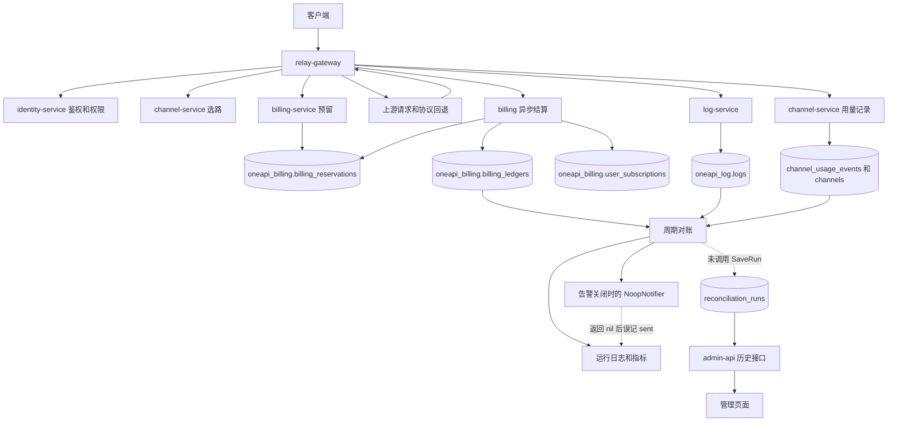

# 项目数据流程闭环分析与解决方案

更新：2026-09-19，线上只读验证版。本版本替代前一版静态推断。

- 仓库：`/Users/neo/vscode/mengbin/micro-one-api`，本地 HEAD：`9bb871eb`。
- 线上核查时间：2026-09-19 05:38 至 05:53 UTC，即北京时间 13:38 至 13:53。
- 方法：SSH、容器状态、脱敏配置、MySQL 只读事务、Redis 查询、Prometheus 指标、管理端 GET 接口。
- 本轮没有部署、重启、修改业务数据、调用手工对账 POST、发送通知或发起付费模型请求。
- 报告不包含密码、令牌、用户输入或上游响应正文。请求样本使用 SHA-256 前 12 位关联。

## 1. 核心结论

**当前主请求的结算和用量落库链路正常工作；已确认未闭环的重点是“对账执行 -> 历史落库 -> 管理页面”与告警状态表达。另有少量真实历史日志缺口，以及不一致的对账时间口径。**

固定 24 小时窗口内检查了 538 条已提交请求：预留、消费账本、消费日志、渠道用量记录均存在，结算金额和用量一致。538 条都有订阅归属、请求快照和快照哈希。这仅覆盖该窗口和这些已提交请求，不等于全部入口、支付场景和崩溃恢复都已验证。

线上 billing 已累计执行 149 次有差异的对账，历史表却是 0 行；管理接口返回 `200 / success=true / runs=[] / total=0`。本地代码有 `SaveRun` 实现但没有调用点，与线上症状吻合。

优先修复应是接通已有写入和回读路径、纠正差异口径与通知状态。没有证据支持把整条计费链路判为未实现，也不应立即以重构消息基础设施代替具体修复。

## 2. 分析过程与证据边界

| 步骤 | 实际检查 | 结果 |
| --- | --- | --- |
| 确认部署 | 九个业务容器、MySQL、Redis、指标抓取 | 服务运行，10 个 Prometheus target 均 up；服务更新批次不同，镜像没有 revision 标签。 |
| 找权威落点 | information_schema、容器 schema 配置 | 生产按服务分库；billing 的 users/channels/logs 是跨库视图。 |
| 关联真实请求 | reservation_id -> ledger.reference_id / channel_usage_events；request_id -> logs | 固定窗口 538 条已提交请求完整。 |
| 验证后续任务 | 对账日志、历史表、指标、管理 API | 执行存在，但历史行及管理列表为空，形成可重复失败的检查。 |
| 排除其他解释 | legacy schema、告警开关、Redis consumer group | 旧对账表也为空；告警关闭；当前网关无事件积压。 |
| 收敛历史差异 | 对齐日志保留范围，再关联未匹配请求 | 大部分计数差来自时间范围不同；仍有两条保留期内缺日志的历史请求。 |
| 回到代码定位 | SaveRun、Notifier、聚合 SQL、DTO 转换 | 找到未调用写入、空通知假成功、全量对账和差异序列化遗漏。 |

按仓库 diagnosing-bugs 技能建立的红色反馈是：近期对账完成日志存在，但历史表为零。检查脚本已在线上执行并输出 FAIL。本轮是诊断与方案交付，没有修复业务代码，所以 FAIL 是预期结果。

本次利用现存业务轨迹，没有通过停 DB、杀 worker 或重放扣费请求进行线上故障注入。本地缺陷与线上症状一致，但未提取生产二进制源码，不能声称二者逐字相同。

## 3. 线上实际数据流



订阅用量更新有当前快照/订阅归属与对账指标支持；本轮没有重建每个订阅的完整历史窗口计数。异步提交日志只代表入队，最终结算以数据库关联为准。

配置更新另有独立路径：

```text
identity/channel/subscription 权威事务
  -> 同事务 routing_change_outbox
  -> routing.changed Redis Stream
  -> 每个 relay 进程独立 consumer group
  -> 鉴权/渠道缓存失效
```

## 4. 已验证正常的部分

### 4.1 计费与用量主链路

固定窗口：`[2026-09-18 05:36:37, 2026-09-19 05:36:37) UTC`。窗口终点距查询至少十分钟，避开正在结算的请求。

| 检查项 | 结果 |
| --- | ---: |
| committed reservation | 538 |
| 缺 consume ledger | 0 |
| 缺 consume log | 0 |
| actual_cost 与消费账本金额合计不符 | 0 |
| 账本与消费日志 quota 不符 | 0 |
| prompt/completion token 不符 | 0 |
| 应记录渠道用量但缺 channel_usage_event | 0 |
| 渠道事件 quota 与账本 quota 不符 | 0 |
| 有 subscription_id / request_snapshot / snapshot_hash | 538 / 538 / 538 |
| 超过十分钟仍为 reserved/committing/releasing | 0 |

账本按 reference_id 聚合，金额使用 SUM(amount)，用量使用 MAX(quota)，避免双资产结算重复计算一个请求。quota 是历史用量口径，不能直接当作货币金额。

示例请求哈希 `675d09969dab`：2026-09-19 05:36:35.361 UTC 创建，committed，actual_cost=640，账本、消费日志、渠道事件各一条；其他九条抽查同样完整。

05:49 附近 billing 指标：async_queue_size=0、async_dropped_flushes_total=0、async_missing_reservation_id_total=0、async settlement count=1541。这证明当前进程有真实结算活动，不证明断电后不会丢任务。

relay 最近三小时最多 3000 行日志样本出现 140 次 Responses -> Chat 回退成功及 140 次异步提交，说明线上确实使用协议回退路径。上游初次请求的告警不能直接当作最终请求失败率。

### 4.2 路由事件与分库

- routing.changed 有 25 条事件。
- 当前 relay hostname 为 eb73c3d34f14；对应 consumer group 的 entries-read=25、pending=0、lag=0。
- 另两个旧进程 group 的 lag 为 12、14，不能据此判断当前网关断链。
- identity/channel/billing 的 outbox 当前均零行。代码会清理已投递记录，空表不是“从未发布”的证据。
- 未主动修改路由并验证生效时间；目前只证明已有事件已被当前 group 消费到末尾。
- oneapi_billing.logs 是 oneapi_log.logs 的视图；channels/users 同理指向 channel/identity 权威表。相同行数不能当作独立双写证据。

## 5. 已确认断点与解决方案

### F1 / P1：对账运行没有写入历史表

**线上证据：** 05:52:41 UTC 复核：最近三小时 3 次 completed 日志，指标累计 149 次 discrepancy；新旧两张 reconciliation_runs 表均为空；管理 API 实测：

```json
{"data":{"runs":[],"total":0},"message":"","success":true}
```

**代码证据：**

- app/billing/internal/data/reconciliation_run_repo.go:62 实现 SaveRun。
- app/billing/cmd/billing/wire.go:129 注入 runStore。
- app/billing/internal/biz/reconciliation.go:589 直接返回 result。
- 全仓库检索 `\.SaveRun\(` 无调用点。
- reconciliation.go:613 的 ListReconciliationRuns 只读取 runStore。
- web/src/pages/admin/ReconciliationPage.tsx:115 从管理历史接口取数据。

**原因与影响：** 写库能力存在，但执行路径没有调用。后台反复检查，管理页面与概览没有结果，运行审计不完整。

**修复：** 在统一 RunReconciliation 用例完成处调用 SaveRun，设置 RunID，让周期和手工调用共享此处。保存失败明确呈现失败，不能只记 completed。进一步将失败/部分检查未完成的运行持久化，记录覆盖范围和错误，避免跳过检查被当作无差异。

**验收：** 一次运行产生一条历史和非零 RunID，管理列表/详情可读；保存失败可见；job/service 不重复保存。

### F2 / P1：告警关闭，仍记录“已发送”

**证据：** RECON_ALERT_ENABLED=false，间隔 1h。最近三小时 3 次 alert sent，通知新增为零。通知表有 95 条 sent 历史，最后创建于 2026-09-13 09:14:47 UTC。

**原因：** app/billing/cmd/billing/wire.go:191 默认注入 NoopNotifier；biz/notifier.go:17 丢弃通知并返回 nil；reconciliation_job.go:179 因 nil 返回而记 sent。空实现不是 nil，因此任务的 nil 判断不会跳过它。

**修复：** 关闭时不投递，报告 disabled/skipped。真实 CreateNotification 成功只记 accepted/queued，最终 sent 来自 notify-worker，并保留 notification_id/run_id 关联。重新启用告警属于运营配置决定；本次没有开启或发送消息。

**验收：** disabled 无 sent；enabled 有通知行关联；失败显示 queued/retry/failed 的真实状态。

### F3 / P1：全生命周期账本与保留期日志直接对账

**证据：** 05:46 日志显示 ledger_count=55305、log_count=24868，差 30437。账本最早为 7 月 22 日，消费日志最早为 8 月 19 日。按现存日志起点对齐，05:49 的计数为 24876 个账本请求、24874 条消费日志。

**原因：** app/billing/internal/data/reconciliation_repo.go:115 和 :136 做无时间约束聚合；app/log/cmd/log/retention.go:13 存在定期清理，默认保留 30 天。当前数据库时间范围差已确认；未把默认值当作已核实的全部历史清理原因。

**修复：** 定义共同的 [start,end)、日志可用范围和结算宽限期。按 request/reservation 分类 missing、duplicate、value_mismatch、expired_by_retention、not_yet_settled。历史累计核对使用稳定归档或明确期初基线，不与裁剪后的明细直接相减。

**验收：** 过期清理不制造当前账务告警；窗口内真漏写、重复与金额错误仍能检出。

### F4 / P1：两条保留期内真实的历史消费日志缺口

2026-09-05 01:23:30.550、01:23:32.579 UTC 的请求已 committed，有 consume ledger，无对应 request_id 的 consume log。请求哈希为 1a829ea2cd49、417ffa2bcc7b，账本 quota 均为 96。

**判定：** 缺口已确认；原因可能在历史调用、传输或清理，现有证据无法进一步归因。它们不在最新 24 小时窗口内，不得归咎于当前队列。

**方案：** 固化样本并核对历史部署/日志；以权威字段设计可审计、幂等的日志修补。禁止重放扣费或重发上游请求。增加提交记录与日志的反连接检查，确认失败模式后再选择 outbox/持久重试。

**验收：** 只补日志，不新增扣费或账本；重复执行无副作用，保留补偿来源。

### F5 / P1-P2：渠道历史基线与删除策略不完整

渠道 1 的 used_quota 比消费账本聚合多 17,935,970，两次采样差额相同。渠道 6、7 在当前 channels 已不存在，却仍有 117/259 条账本记录，用量为 7,201,365/15,522,680，发生于 7 月至 8 月上旬。最新 24 小时渠道事件与账本一致。

**方案：** 建立可追溯的期初基线与归档标记，保留已删除资源的历史身份；区分“资源删除”与“用量漏记”。渠道 1 差额原因未知，不能直接覆盖累计值或补扣。

### F6 / P1：对账差异在存储和 DTO 回读中丢失类别

这是本地代码确认的缺陷风险；线上对应四类指标当前为零，尚无实例可验证。

reconciliationRecordsFromResult/applyReconciliationRecords，以及 service 中 reconciliationRunToProto 只处理 account/channel/log。用例已有 subscription、receivable、refund、stuck issuance 四类；即使接上 SaveRun，其余类型仍可能在序列化或回读中消失。

**方案：** 补齐 biz -> 持久 JSON -> biz -> proto -> admin -> 前端的类型和字段覆盖。proto 通过 make api 生成。确保 discrepancy_count 与明细一致，定义未知类型的兼容行为。

**验收：** 七类差异分别通过保存、读取、API 转换回归，总数和内容均不丢失。

## 6. 待验证风险与前版纠正

| 项目 | 事实和边界 | 后续验证 |
| --- | --- | --- |
| 内存队列恢复 | 当前积压/dropped 为零，仍有进程崩溃窗口 | 在隔离环境验证实际用量与结算恢复，再决定持久任务设计。 |
| Redis 持久性 | aof_enabled=0，RDB 状态 ok；路由 outbox 有清理策略 | 评估 RDB 回滚与 SQL delivered_at 的不一致，选择 AOF/重放/启动重载。未观察到丢事件。 |
| 通用事件总线 | EVENT_BUS_BACKEND 未设置，默认进程内；独立 routing.changed 已使用 Streams | 明确哪些 topic 要求跨进程。channel.changed/config.changed 无 key 不单独证明断链。 |
| 旧 consumer group | 两个旧 group 有 lag，活跃 group lag=0 | 按实例存活判断并制定有界回收；本次未删除 group。 |
| 版本可追溯 | 无 OCI revision 标签，服务更新批次不同 | 发布保存 commit、镜像摘要、配置和迁移版本。 |
| 报表 nil DB 分支 | 只有 data/db 指针为空才返回空结果；实际查询错误会返回 | 前版将其等同数据库宕机吞错的说法过强，撤回该判断。 |
| 支付/退款 | 当前仅一笔 7 月 paid/issued 余额订单，近 7 天无支付样本 | 无法证明订阅购买、退款、续费全部正常，需专门验证。 |

前版关于“缺少幂等、缺少 outbox、缺少对账、缺少端到端测试”的泛化建议不能当作已证实事实。仓库和生产已有这些能力；本轮重点是上述具体断点及覆盖缺口。

## 7. 实施顺序与验收

| 阶段 | 范围 | 验收 |
| --- | --- | --- |
| 第一批 | SaveRun 调用、失败状态、完整差异编码和 DTO | 一次运行一条可查历史；七类往返不丢；失败不伪装成功。 |
| 第一批 | 通知 wiring、任务日志与关联 ID | 关闭不写 sent；受理与送达分离；保持现有开关意图。 |
| 第二批 | biz 时间窗、data 查询、管理端覆盖范围 | 排除保留期和异步宽限影响，仍检出历史两个缺口。 |
| 第二批 | 差异清单、历史基线、只补日志的方案 | 无重复扣费，无上游重放，修复前后可审计。 |
| 第三批 | 隔离故障注入、Streams 和结算恢复 | 故障恢复后最终状态可查，不重复扣费。 |

遵循现有 service DTO 转换、biz 用例、data repo 分层。不要在 service 直接写历史表，也不需要为这些缺陷引入新的通用框架。

测试至少覆盖：周期/手工调用不重复写；保存失败与部分检查失败可见；七类差异往返；disabled/queued/sent/failed；日志过期与渠道归档；隔离环境上游成功后进程退出的恢复。

## 8. 可重复检查和交付物

只读检查脚本：`docs/runbooks/data-flow-readonly-check.sh`。

在项目根目录使用 .env 已确认的部署地址执行：

```bash
ssh "$DEPLOY_REMOTE_SERVER" bash -s < docs/runbooks/data-flow-readonly-check.sh
```

脚本只查询 DB、容器配置和日志、GET 对账历史；凭据不输出。MySQL 显式只读并限制单条查询时长。针对“有执行但历史始终为空”输出 FAIL 并返回 1。有历史行只能排除这个特定故障，不能替代逐次落库验收。

05:52:41 UTC 的复核摘要：

```json
{
  "completed_logs_3h": 3,
  "reconciliation_history_rows": 0,
  "alert_sent_logs_3h": 3,
  "notification_rows_3h": 0,
  "recon_alert_enabled_env": "false",
  "stale_reservations_over_10m": 0,
  "admin_history_read": {
    "http_status": 200,
    "success": true,
    "total": 0,
    "returned_rows": 0
  },
  "history_check": "FAIL"
}
```

原始脱敏结果与镜像摘要：`docs/runbooks/evidence/data-flow-readonly-2026-09-19.json`。

538 条请求的固定窗口核对 SQL：`docs/runbooks/data-flow-window-check.sql`。这是历史观测窗口；日志过期后再运行可能出现缺失，不能直接解释为新的生产故障。

本报告保留固定窗口，避免把不同秒的总量直接相减。全生命周期计数差不能当作最新请求漏单。线上全部检查只读；业务修复、部署、历史补偿、告警开启与故障注入尚未执行。
