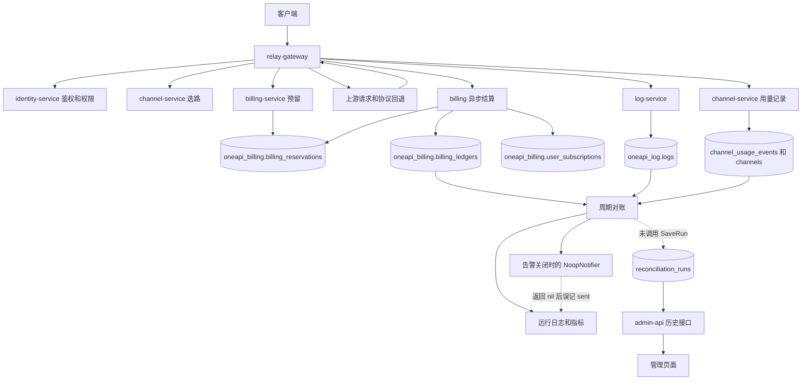

# 项目数据流程闭环分析与解决方案

更新：2026-09-20，线上只读验证、覆盖复审与桌面 `data` 五份文档逐项核对版。保留各轮观测的时间边界。

- 仓库：`/Users/mengbin/vscode/neo/micro-one-api`；首轮代码基线 `9bb871eb`，复审 HEAD `3c4ef306`（其新增内容仅为首轮审计文档）。
- 首轮线上核查：2026-09-19 05:38 至 05:53 UTC，即北京时间 13:38 至 13:53；复审为 11:44 至 11:58 UTC，即北京时间 19:44 至 19:58。
- 桌面文档核查补充采样：2026-09-19 22:37:39 UTC，即北京时间 2026-09-20 06:37:39；用于核实通知回读、canonical 灰度配置和来源字段完整性，未重新执行全部故障检查。
- 方法：SSH、容器状态、脱敏配置、MySQL 只读事务、Redis 查询、Prometheus 指标、管理端 GET 接口。
- 本轮没有部署、重启、修改业务数据、调用手工对账 POST、发送通知或发起付费模型请求。
- 报告不包含密码、令牌、用户输入或上游响应正文。请求样本使用 SHA-256 前 12 位关联。

## 1. 核心结论

**原文没有覆盖所有已识别的数据流。近期普通渠道请求的账务、消费日志和用户订阅记账有正常样本，但不能外推到上游订阅账号、gRPC 入口、有限额度 Key、通知送达与故障恢复。复审新增 F7–F18，其中线上进一步确认了上游订阅账号用量事件缺失、monitor-worker 渠道巡检持续失败。**

**桌面五份文档并非全部属实，也并非此前已全部覆盖。** 逐项核对后新增 F19–F22，补全 F8、F14、F15 及模型健康决策边界；§9 保存每份文档的问题、建议与本文落点。明确撤回“ledger/log 没有交叉对账”“通知无人回读”“对账历史已经落库”等判断；canonical 也不是全局停留在 observe。新采样确认：通知管理 GET 正常，canonical 已配置限定来源的 charge；近期 260 条 `glm-5.3` 消费账本缺上游模型标识，而同窗口 Kimi 的两个来源字段均完整。

固定 24 小时窗口内检查了 538 条已提交请求：预留、消费账本、消费日志、渠道用量记录均存在，结算金额和用量一致。538 条都有订阅归属、请求快照和快照哈希。这仅覆盖该窗口和这些已提交请求，不等于全部入口、支付场景和崩溃恢复都已验证。

线上 billing 已累计执行 149 次有差异的对账，历史表却是 0 行；管理接口返回 `200 / success=true / runs=[] / total=0`。本地代码有 `SaveRun` 实现但没有调用点，与线上症状吻合。

复审的另外两项线上结果：历史上 33,442 条上游订阅账号 committed 请求均没有账号额度事件，其中 28,357 条 actual_cost 大于零；monitor-worker 的 ListChannels RPC 持续返回 Unavailable。前者与当前异步结算旁支缺少回写的代码吻合，但不能将所有历史缺口归因于当前版本；后者是正在发生的巡检断点。

优先接通具体写入、恢复和回读路径，再修正状态与对账口径。本报告是有证据边界的覆盖清单，不是“所有运行分支已验证正确”的证明。P1 表示影响账务完整性、额度约束或运维发现能力；P2 表示产品结果、统计或审计表达缺口。

## 2. 分析过程与证据边界

| 步骤 | 实际检查 | 结果 |
| --- | --- | --- |
| 确认部署 | 九个业务容器、MySQL、Redis、指标抓取 | 服务运行，10 个 Prometheus target 均 up；服务更新批次不同，镜像没有 revision 标签。 |
| 找权威落点 | information_schema、容器 schema 配置 | 生产按服务分库；billing 的 users/channels/logs 是跨库视图。 |
| 关联真实请求 | reservation_id -> ledger.reference_id / channel_usage_events；request_id -> logs | 固定窗口 538 条已提交请求完整。 |
| 验证后续任务 | 对账日志、历史表、指标、管理 API | 执行存在，但历史行及管理列表为空，形成可重复失败的检查。 |
| 排除其他解释 | legacy schema、告警开关、Redis consumer group | 旧对账表也为空；告警关闭；当前网关无事件积压。 |
| 收敛历史差异 | 对齐日志保留范围，再关联未匹配请求 | 大部分计数差来自时间范围不同；仍有两条保留期内缺日志的历史请求。 |
| 回到代码定位 | SaveRun、Notifier、聚合 SQL、DTO 转换 | 找到未调用写入、空通知假成功、全量对账和差异序列化遗漏。 |

按仓库 diagnosing-bugs 技能建立的红色反馈是：近期对账完成日志存在，但历史表为零。检查脚本已在线上执行并输出 FAIL。本轮是诊断与方案交付，没有修复业务代码，所以 FAIL 是预期结果。

本次利用现存业务轨迹，没有通过停 DB、杀 worker 或重放扣费请求进行线上故障注入。本地缺陷与线上症状一致，但未提取生产二进制源码，不能声称二者逐字相同。

复审采用“入口 -> 权威写入 -> 派生写入/消费 -> 查询展示 -> 失败恢复 -> 删除/保留”的覆盖标准。证据分为：**线上确认**（实际聚合、配置或指标）、**代码确认**（具体调用缺失/错误处理可定位，尚未在线触发）、**待验证**（只有配置、样本或故障覆盖不足）。表空、指标未出现、开关关闭本身都不等同故障。此次是文档覆盖审计，技能中的故障注入、代码修复和回归构建阶段不适用；未自动构建，未声称已完成故障场景验收。

## 3. 线上实际数据流



订阅用量更新有当前快照/订阅归属与对账指标支持；本轮没有重建每个订阅的完整历史窗口计数。异步提交日志只代表入队，最终结算以数据库关联为准。

配置更新另有独立路径：

```text
identity/channel/subscription 权威事务
  -> 同事务 routing_change_outbox
  -> routing.changed Redis Stream
  -> 每个 relay 进程独立 consumer group
  -> 鉴权/渠道缓存失效
```

## 4. 已验证正常的部分

### 4.1 计费与用量主链路

固定窗口：`[2026-09-18 05:36:37, 2026-09-19 05:36:37) UTC`。窗口终点距查询至少十分钟，避开正在结算的请求。

| 检查项 | 结果 |
| --- | ---: |
| committed reservation | 538 |
| 缺 consume ledger | 0 |
| 缺 consume log | 0 |
| actual_cost 与消费账本金额合计不符 | 0 |
| 账本与消费日志 quota 不符 | 0 |
| prompt/completion token 不符 | 0 |
| 应记录渠道用量但缺 channel_usage_event | 0 |
| 渠道事件 quota 与账本 quota 不符 | 0 |
| 有 subscription_id / request_snapshot / snapshot_hash | 538 / 538 / 538 |
| 超过十分钟仍为 reserved/committing/releasing | 0 |

账本按 reference_id 聚合，金额使用 SUM(amount)，用量使用 MAX(quota)，避免双资产结算重复计算一个请求。quota 是历史用量口径，不能直接当作货币金额。

示例请求哈希 `675d09969dab`：2026-09-19 05:36:35.361 UTC 创建，committed，actual_cost=640，账本、消费日志、渠道事件各一条；其他九条抽查同样完整。

05:49 附近 billing 指标：async_queue_size=0、async_dropped_flushes_total=0、async_missing_reservation_id_total=0、async settlement count=1541。这证明当前进程有真实结算活动，不证明断电后不会丢任务。

relay 最近三小时最多 3000 行日志样本出现 140 次 Responses -> Chat 回退成功及 140 次异步提交，说明线上确实使用协议回退路径。上游初次请求的告警不能直接当作最终请求失败率。

### 4.2 路由事件与分库

- routing.changed 有 25 条事件。
- 当前 relay hostname 为 eb73c3d34f14；对应 consumer group 的 entries-read=25、pending=0、lag=0。
- 另两个旧进程 group 的 lag 为 12、14，不能据此判断当前网关断链。
- identity/channel/billing 的 outbox 当前均零行。代码会清理已投递记录，空表不是“从未发布”的证据。
- 未主动修改路由并验证生效时间；目前只证明已有事件已被当前 group 消费到末尾。
- oneapi_billing.logs 是 oneapi_log.logs 的视图；channels/users 同理指向 channel/identity 权威表。相同行数不能当作独立双写证据。

### 4.3 复审新增的反向关联与订阅记账核对

11:58:17 UTC 补充快照使用独立窗口 `[2026-09-18 11:48:17, 2026-09-19 11:48:17) UTC`，与首轮 538 条样本不是同一批次。

| 检查项 | 结果及含义 |
| --- | --- |
| reservation 路径 | 438 committed、7 released，均为普通渠道；无上游订阅账号或 grpc_ 前缀样本。 |
| 消费日志反向关联 | 438 条 consume log，无找不到 committed reservation 的记录；按 user_id/request_id 分组，无重复组。 |
| 用户订阅窗口明细 | 438 条预留具有正 subscription_accounting_usd；全部找到 subscription_window_charges，订阅归属一致。 |
| 实际订阅入账金额 | 438 条均与 `SUM(consume.subscription_cost) / 10000 × 冻结的 RateMultiplier` 一致，冻结倍率缺失为零。预留的 subscription_accounting_usd 是估算值，不能与实际入账直接相减后判差异。 |
| 监控、账号用量、通知、支付等 | 见 F7、F9、F12–F17；未采样的分支没有被这 438 条“顺带验证”。 |

本次补充 SQL 显式指定了跨表 reservation_id 的相同 COLLATE：线上 billing_reservations 使用 utf8mb4_0900_ai_ci，subscription_window_charges 使用 utf8mb4_unicode_ci，直接等值 JOIN 会报 1267。这里仅处理审计查询的兼容性，不代表已发现业务写入失败，也未修改表结构。SQL 错误必须呈现 UNKNOWN，不能转换成“0 差异”。

## 5. 已确认的线上断点、代码缺口与解决方案

### F1 / P1：对账运行没有写入历史表

**线上证据：** 05:52:41 UTC 复核：最近三小时 3 次 completed 日志，指标累计 149 次 discrepancy；新旧两张 reconciliation_runs 表均为空；管理 API 实测：

```json
{"data":{"runs":[],"total":0},"message":"","success":true}
```

**代码证据：**

- app/billing/internal/data/reconciliation_run_repo.go:62 实现 SaveRun。
- app/billing/cmd/billing/wire.go:129 注入 runStore。
- app/billing/internal/biz/reconciliation.go:589 直接返回 result。
- 全仓库检索 `\.SaveRun\(` 无调用点。
- reconciliation.go:613 的 ListReconciliationRuns 只读取 runStore。
- web/src/pages/admin/ReconciliationPage.tsx:115 从管理历史接口取数据。

**原因与影响：** 写库能力存在，但执行路径没有调用。后台反复检查，管理页面与概览没有结果，运行审计不完整。

**修复：** 在统一 RunReconciliation 用例完成处调用 SaveRun，设置 RunID，让周期和手工调用共享此处。保存失败明确呈现失败，不能只记 completed。进一步将失败/部分检查未完成的运行持久化，记录覆盖范围和错误，避免跳过检查被当作无差异。

复审补充：`reconciliation.go:366` 的账户最新账本读取错误直接 continue；订阅、退款、发放检查的若干 repo 错误也只告警/跳过，最终仍可返回 result,nil。完整落库之外还必须保存每个检查项的 completed/skipped/failed、扫描数量及原因；否则“discrepancy=0”可能只是没有完成检查。

**验收：** 一次运行产生一条历史和非零 RunID，管理列表/详情可读；保存失败可见；job/service 不重复保存。

### F2 / P1：告警关闭，仍记录“已发送”

**证据：** RECON_ALERT_ENABLED=false，间隔 1h。最近三小时 3 次 alert sent，通知新增为零。通知表有 95 条 sent 历史，最后创建于 2026-09-13 09:14:47 UTC。

**原因：** app/billing/cmd/billing/wire.go:191 默认注入 NoopNotifier；biz/notifier.go:17 丢弃通知并返回 nil；reconciliation_job.go:179 因 nil 返回而记 sent。空实现不是 nil，因此任务的 nil 判断不会跳过它。

**修复：** 关闭时不投递，报告 disabled/skipped。真实 CreateNotification 成功只记 accepted/queued，最终 sent 来自 notify-worker，并保留 notification_id/run_id 关联。重新启用告警属于运营配置决定；本次没有开启或发送消息。

**验收：** disabled 无 sent；enabled 有通知行关联；失败显示 queued/retry/failed 的真实状态。

### F3 / P1：全生命周期账本与保留期日志直接对账

**证据：** 05:46 日志显示 ledger_count=55305、log_count=24868，差 30437。账本最早为 7 月 22 日，消费日志最早为 8 月 19 日。按现存日志起点对齐，05:49 的计数为 24876 个账本请求、24874 条消费日志。

**原因：** app/billing/internal/data/reconciliation_repo.go:115 和 :136 做无时间约束聚合；app/log/cmd/log/retention.go:13 存在定期清理，默认保留 30 天。当前数据库时间范围差已确认；未把默认值当作已核实的全部历史清理原因。

**修复：** 定义共同的 [start,end)、日志可用范围和结算宽限期。按 request/reservation 分类 missing、duplicate、value_mismatch、expired_by_retention、not_yet_settled。历史累计核对使用稳定归档或明确期初基线，不与裁剪后的明细直接相减。

**验收：** 过期清理不制造当前账务告警；窗口内真漏写、重复与金额错误仍能检出。

### F4 / P1：两条保留期内真实的历史消费日志缺口

2026-09-05 01:23:30.550、01:23:32.579 UTC 的请求已 committed，有 consume ledger，无对应 request_id 的 consume log。请求哈希为 1a829ea2cd49、417ffa2bcc7b，账本 quota 均为 96。

**判定：** 缺口已确认；原因可能在历史调用、传输或清理，现有证据无法进一步归因。它们不在最新 24 小时窗口内，不得归咎于当前队列。

**方案：** 固化样本并核对历史部署/日志；以权威字段设计可审计、幂等的日志修补。禁止重放扣费或重发上游请求。增加提交记录与日志的反连接检查，确认失败模式后再选择 outbox/持久重试。

**验收：** 只补日志，不新增扣费或账本；重复执行无副作用，保留补偿来源。

### F5 / P1-P2：渠道历史基线与删除策略不完整

渠道 1 的 used_quota 比消费账本聚合多 17,935,970，两次采样差额相同。渠道 6、7 在当前 channels 已不存在，却仍有 117/259 条账本记录，用量为 7,201,365/15,522,680，发生于 7 月至 8 月上旬。最新 24 小时渠道事件与账本一致。

**方案：** 建立可追溯的期初基线与归档标记，保留已删除资源的历史身份；区分“资源删除”与“用量漏记”。渠道 1 差额原因未知，不能直接覆盖累计值或补扣。

### F6 / P1：对账差异在存储和 DTO 回读中丢失类别

这是本地代码确认的缺陷风险；线上对应四类指标当前为零，尚无实例可验证。

reconciliationRecordsFromResult/applyReconciliationRecords，以及 service 中 reconciliationRunToProto 只处理 account/channel/log。用例已有 subscription、receivable、refund、stuck issuance 四类；即使接上 SaveRun，其余类型仍可能在序列化或回读中消失。

**方案：** 补齐 biz -> 持久 JSON -> biz -> proto -> admin -> 前端的类型和字段覆盖。proto 通过 make api 生成。确保 discrepancy_count 与明细一致，定义未知类型的兼容行为。

**验收：** 七类差异分别通过保存、读取、API 转换回归，总数和内容均不丢失。

### F7 / P1：异步结算没有回写上游订阅账号额度和会话窗口

**线上确认：** `BILLING_ASYNC_ENABLED=true`。`subscription_account_quota_events` 为 0 行；按 reservation_id 关联历史已提交的上游订阅账号请求，33,442 条全部缺事件，范围为 2026-07-26 至 2026-09-13，其中 28,357 条 actual_cost>0。复审 24 小时窗口没有这类请求，当前 3 个账号也均未配置本地额度/会话额度上限，所以不能据此声称正在发生额度超限。

**代码确认：** `internal/server/http_billing.go:249` 的 async 分支只记录普通渠道、模型和 Key 用量便返回；`recordSubscriptionAccountQuotaUsage` 与 `recordSubscriptionSessionWindowUsage` 仅在同步结果分支调用。`app/billing/internal/biz/async_billing.go:423` 的 worker 只调用账务提交管线，无 channel 账号额度 RPC 或会话窗口回写；异步任务/计费 DTO 也未携带会话窗口所需的完整上下文。

**影响与方案：** 用户购买的订阅（`user_subscriptions`）和上游订阅账号（`subscription_accounts`）必须分开核查。前者事务内记账不代表后者闭环。由权威结算完成结果驱动幂等回写，持久化账号、reservation、会话标识及窗口；同步/异步共用去重规则。明确账号成本采用客户结算金额还是供应商成本，不能直接把 token quota 当美元。历史补齐须按发生时间归档，不能把旧请求灌入今天的额度窗口。

**验收：** 同步、异步、重复投递各只产生一条账号额度事件；会话窗口计入一次；回写服务不可用后可恢复；账号限额确实影响后续选路。当前历史缺口是观测事实，不以当前代码反推全部历史根因。

### F8 / P1：结算受理、日志受理与后续失败恢复没有形成持久闭环

**代码确认，故障触发尚未在线验证：**

- `AsyncBillingUsecase.runCommitPipeline`（`app/billing/internal/biz/async_billing.go:423`）提交出错仅增加 dropped 指标并记警告，没有重入队/持久失败任务。上游已成功的请求可能仍停在预留状态，随后由过期清理释放；“stale reservation=0”不能证明实际用量已经结算。
- `app/log/internal/biz/batch_writer.go` 的 `IngestLog` 成功表示内存入队；`flush`/`Flush` 取走批次后写入失败便丢弃。网关三次 IngestLog RPC 重试无法补偿受理之后的 DB 失败；正常退出 drain 也不能保证强杀/断电恢复。
- `internal/server/http_billing.go:398` 的普通渠道用量已使用 reservation_id 去重并重试三次，但最终失败只记日志。它与 billing 提交不是同一事务，也无持久补偿；模型统计、健康回传有类似的尽力写入边界。
- 同步 post-forward 分支同样存在断点：`internal/server/orchestrator.go:566–574` 在上游响应完成后，Commit 错误会关闭响应、设置 HTTP 402 并返回 `MarkPostForwardError`，后续 LogUsage 也不会执行。禁止重试上游是正确的，但没有独立持久结算补偿。RPC 错误可能发生在 billing 已提交之后，不能一概认定“必然没扣费/账本永久缺失”；应先查询 reservation 再幂等恢复。已发送响应后的提交路径也只有错误日志（`http_billing.go:94–110`）。
- 现有周期对账含真实 ledger/log 聚合比较，但没有将逐请求缺项登记为可领取、可重放、可查询的修复任务。本文只读 SQL 是诊断工具，不是后台修复器。`wire.go:252` 另以一分钟启动 CleanupJob，释放过期预留不等于补结算已服务用量，也不能把恢复时间简单等同一小时对账间隔。
- `platform/events/events.go` 的 `TopicQuotaReserved/Committed/Released`、`TopicRelayFinished` 目前仅有常量定义，没有对应生产/消费调用。它们不是已经上线的结算结果事件；增加内存 Publish 也不能替代持久输入、幂等消费和失败回读。usage semantic verdict 亦为尽力回传，RPC 失败只记日志（`http_billing.go:471`），应纳入所需派生结果的完成状态。

**线上边界：** 当前队列和 dropped 指标为零，复审窗口 438 条 consume log 均关联 committed reservation，重复请求日志组为零；首轮两个真实日志缺口的根因仍未知，不能归到这些分支。只以 committed reservation 为起点检查，会漏掉“上游成功但最终被释放”的请求，因此增加日志/执行结果反向关联检查。

**方案与验收：** 将“已受理、已结算、派生数据完成、待重试/待人工”分开；对必须完整的数据保存可恢复的输入和幂等键，使用现有事务/outbox 边界补偿。隔离环境覆盖入队后退出、提交 DB 失败、日志 DB 失败、channel RPC 耗尽重试；恢复后扣费、日志、渠道事件分别恰好一次。不可仅靠释放所有过期预留达到“无积压”。

### F9 / P1：有限额度 API Key 的扣减没有请求级幂等和跨服务补偿

**代码确认：** `internal/server/http_billing.go:324` 在账务受理/提交后最多三次调用 ConsumeTokenQuota；`api/identity/v1/identity.proto:186` 只有 user_id/token_id/amount，没有 reservation_id 或幂等键。`app/identity/internal/data/data.go:847` 每次调用直接增减 tokens 计数。若服务器扣减成功但回包丢失，重试可能再扣；三次均失败则仅本机暂时封禁，未保存欠记用量。异步入队后先扣 Key，最终账务失败也没有回滚关联。

**线上边界：** 12 个 Key 全部为 unlimited_quota=1。成功的 ConsumeTokenQuota RPC 计数不能证明有限额度正确；本轮未修改 Key 或制造超限请求。

**方案与验收：** 引入稳定的请求/结算标识，在 identity 事务中登记扣减去重记录；明确按“实际服务用量”还是“成功账务结算”扣额度，并据此对齐失败/释放场景。验证回包丢失、重试、重启和多网关时扣减一次，持久失败可补偿；本机短期封禁只是保护措施。

### F10 / P1：gRPC ChatCompletion 没有走完整的 HTTP 请求结算后续流程

**代码确认：** gRPC 服务已在 `internal/server/grpc.go:27` 注册；`internal/service/relay.go:143` 忽略 CommitQuota 的错误和业务 success，继续回包；RecordChannelUsage 没有 reservation_id。此入口未调用消费日志写入和 Key 额度扣减，提交也未传入 HTTP 路径的完整 token 分桶、来源账号与 usage envelope。不能以 HTTP 协议回退的成功样本证明它闭环。

**线上边界：** 复审窗口 grpc_ 前缀的 reservation 为零；这只排除该窗口内已创建预留的 gRPC 样本，不证明端口不可访问或历史无调用。

**方案与验收：** 复用现有 executor/用例层的生命周期能力，保持 service 只做边界转换；若产品不支持此入口，明确禁用其注册/暴露。启用时必须覆盖成功、客户端取消、提交失败和重试，确保 reservation、账本、消费日志、渠道事件与 Key 用量关联完整。

### F11 / P1：Redis Streams 的 pending 消息没有自动重领调用

**代码确认：** `platform/events/streams.go:143` 只读 `>` 新消息；handler 失败不 ACK 是正确的，但 `ClaimPending`（:337）在非测试代码中没有调用点。失败事件留在 PEL 后，不会被该消费循环再次读取。当前 routing.changed 也使用这个 StreamEventBus，因此它不是只影响未启用的通用事件总线。

**线上边界：** 首轮当前 relay group pending=0、lag=0，没有已发生的卡住样本；两个旧 group 的 lag 仍不能混同活跃进程故障。Redis AOF 关闭与本项是两种不同风险：一个是存储恢复，一个是失败消息处理。

**方案与验收：** 在消费者生命周期接入有界重领、退避、失败计数及不可处理事件隔离；使重放幂等，并明确 stream 裁剪、outbox 清理、consumer group 回收的共同保留边界。隔离验证 handler 第一次失败后无需新业务变更即恢复，消费者退出后可接管 pending；不能只验证新事件被 ACK。

### F12 / P2：用户订阅到期提醒被丢弃，扫描失败没有可见结果

**代码确认：** `domain/subscription/biz/expiry_checker.go:48` 的 Tick 返回 ExpiryNotification；Run 在 :37/:43 使用 `_, _ = c.Tick(ctx)`，既不消费提醒也不处理错误。billing 确实启动了 Run（`app/billing/cmd/billing/wire.go:267`），所以问题不是未启动任务。到期状态更新已存在，不应把整个到期处理判为未实现。

**线上边界：** 4 个 active、1 个 revoked；无超过一小时仍 active 的过期订阅，无未来 24 小时到期样本，无法在线验证提醒送达。

**方案与验收：** 将提醒提交至 notify，按 subscription_id/到期时间/提醒阶段去重，保存 notification_id；扫描错误应有任务状态与指标。验证到期前提醒、续费后的去重变化、已过期状态转换、扫描失败重试；状态变更、鉴权生效和提醒三项分别验收。

### F13 / P1-P2：monitor-worker 渠道巡检持续失败，规则 CRUD 也没有评估消费链路

**线上确认：** 补充快照中 `channel_health_check_runs_total{status="error"}=4952`，对应 ListChannels 的依赖指标为 `Unavailable=4952`；30 分钟 increase 约 6.05（Prometheus 外推值，表示持续失败，不是精确执行次数）。relay 对 channel 的健康回传另有成功样本，不能代替 monitor 主动巡检。线上 monitor 没有 CHANNEL_GRPC_ENDPOINT，两端 SERVICE_TOKEN 均存在且相同；读取其实际 `/configs/config.yaml` 得到 `endpoint: ${CHANNEL_GRPC_ENDPOINT:-127.0.0.1:9002}`，确认落在容器内 loopback 默认值。

**配置与代码：** `app/monitor/configs/config.yaml` 默认 endpoint 为 `127.0.0.1:9002`；`deployments/docker-compose/docker-compose.yml:347` 的 monitor 环境未设置 CHANNEL_GRPC_ENDPOINT。在分容器部署中会指向 monitor 自身。`ChannelHealthChecker.CheckOnce` 遇列表失败只记 error 指标返回；`record` 丢弃回写错误，`app/monitor/internal/data/channel_probe_adapter.go` 连业务 success=false 也返回 nil，因此即便选路地址修好，仍须验证探测结果真实落地。

**另一个功能边界：** `oneapi_monitor.health_checks` 与 `alert_rules` 均为空。MonitorUsecase/Service 提供健康上报及规则 CRUD，当前 wiring 仅启动渠道巡检；仓库未找到消费 alert_rules 的评估器，也没有将该表规则同步至 Prometheus 的路径。渠道巡检写 channel 状态，不写 health_checks。空表本身不是漏写证据，但“保存自定义规则 -> 评估 -> 告警”尚未接通；已有 Prometheus 规则是独立体系。

**方案与验收：** 优先将 monitor 指向 `channel-service:9002`，按配置变更流程生效；此次未部署。随后验证成功巡检、依赖错误、探测失败、回写失败各自可见，健康状态更新可读。明确是否支持数据库自定义规则；支持则接评估和通知，不支持则在产品上说明仅存储/未启用，不能显示为生效规则。

### F14 / P1：通知“sent”没有完整的下游接受验证及重复发送约束

**代码确认：** 除 F2 的 NoopNotifier 外，`app/notify/internal/biz/sender.go:332` 的 sendJSONWebhook 仅检查 HTTP 2xx，没有校验通知平台响应体的业务成功结果；随后 DispatchOnce 标记 sent。loop 的 `DispatchOnce` 错误被忽略，故查询 pending 或 MarkSent 失败可能没有任务错误信号。`listPendingDB` 是普通查询，没有 processing/租约领取；并行 worker 或“外部发送成功、MarkSent 失败/进程退出”会再次发送。

**线上边界：** 现有 95 条 wecom/sent，retry_count 均为零，无 pending/failed 样本。它们只证明本地状态，未保存平台回执，不能倒推 95 条均已送达或均未送达。当前只有一个 notify-worker，多实例重复是待触发风险。

**方案与验收：** 按具体 sender 验证业务接受结果，保留脱敏回执/错误分类；区分 queued、平台 accepted 与可证明的 delivered，不能假设所有渠道提供送达回执。引入领取租约、稳定通知键与可操作的失败队列，记录扫描/状态回写错误。验收 HTTP 200 但业务失败、非 2xx、状态写失败、多 worker、重启；对不支持幂等的外部渠道明确重复可能，不能承诺 exactly-once。

**桌面报告纠正：** 通知结果已有管理端回读。`app/admin/internal/server/http.go:716` 注册 HTTP 代理，`:4013` 转发至 notify `/v1/notifications`；`web/src/components/NotificationPanel.tsx:151/:163` 查询该列表，AppNavigation 挂载面板。补查生产 GET `/api/admin/notifications?page=1&page_size=1` 返回 HTTP 200、total=95、一条 sent。仅搜索 gRPC 方法名会漏掉这条路径。另有独立功能边界：HTTP `PUT .../{id}/status` 明确返回 501（`:4059`），前端也注明不提供已读操作；gRPC UpdateNotificationStatus 存在不代表网页支持更新，更不能用它伪造外部送达。

### F15 / P2：模型统计只记录成功路径，错误率与统计完整性缺少闭环

**代码确认：** `internal/server/http_billing.go:240` 对失败请求提前返回；两个 recordModelUsage 调用都传 false，模型 error_count 没有终态失败输入。`app/channel/internal/biz/model.go:650` 将 GetModelByID 的所有错误当作“未注册、跳过”返回 nil；不仅不存在模型，DB 查询失败也可能被吞掉。模型统计接口没有请求幂等键，写失败只告警，缺少可重建的请求级关联。

**补充统计口径：** `app/channel/internal/data/model.go:873` 更新日聚合时直接设置 `avg_latency=po.AvgLatency`，保存的是本次上报值，不是该日所有请求的加权平均。这与 `model_health_states` 的 total_latency/request_count 平均算法不同，不能混为一张表。重复上报还会再次增加 request/token/error 计数，现有聚合无法定位或撤销具体重复事件。

**线上边界：** model_usage_stats 有 162 行、54,266 次累计请求，error_count 合计为 0。这与成功路径代码一致，但不表示线上从无失败；也不能将上游一次失败后回退成功算成终态失败。该表累计范围不同，不能直接减去日志/账本总行数。

**方案与验收：** 定义用户请求终态与上游尝试两种统计口径；成功/失败各记录一次，未注册模型与存储错误分开。按同一模型映射、日期时区、保留窗口和过滤条件与权威记录核对；需要重建/重试时提供去重键。用累计耗时/有效样本数计算平均，或明确改称最近耗时。验证失败后回退成功、最终失败、未注册模型、repo 故障、重复投递和不同样本数的平均值。

### F16 / P2：config-service 写入/发布没有接到运行配置应用

**代码确认：** `app/config/internal/biz/config.go:79/:90` 在 DB 写入后 Publish(config.changed)，忽略发布错误；全仓库非测试代码没有这个 topic 的 Subscribe 调用，也没有业务服务通过 config-service 的 GetConfig 加载运行配置的调用点。因此其 CRUD 成功不等于动态配置已应用；只切换 EVENT_BUS_BACKEND 不能补出消费者。

**线上边界与纠正：** oneapi_config.configs 为 0 行，目前无配置变更漏生效样本。管理端 system_options 是另一条路径：billing 的 `PricingConfigRepo.GetPricingConfig` 经跨库视图读取它，`BillingUsecase.pricingConfig` 在业务计算中调用；identity 也直接读取其使用的系统选项。因此不得宣称后台所有价格/开关变更均不生效。billing 动态价格读取出错会回退启动配置，这一降级应被观测和注明来源，而不是静默展示“已应用”。

**方案与验收：** 对每个配置键声明权威存储、消费者、刷新方式及 applied_revision；需要 config-service 动态生效的键接发布确认/消费/重载，其余明确重启生效或仅存储。隔离验证配置提交后各实例实际使用的版本、发布失败后的恢复，以及新请求用新配置、已预留请求继续使用冻结快照。

### F17 / P1：支付回调丢失后的收敛依赖用户查询，退款边界未纳入闭环验收

**代码确认：** `app/billing/internal/biz/payment.go:357/:451` 仅 GetOrderByTradeNo 会查询 pending 的支付宝订单并更新状态；查询上游出错返回原订单，不暴露查询失败。ListOrders 只读本地表，当前 billing 后台任务没有 pending 支付订单的主动核验扫描。回调丢失且用户不再查询时，外部支付结果与本地订单缺少自主收敛路径。正常 MarkOrderPaid 已把订单、余额/订阅发放放在同一事务内，不应重新建议“补事务”或认定正常回调必然重复发放。

**边界：** `refund.go` 实现的是退款到站内钱包并撤销/缩短/保留权益，没有调用支付平台原路退款接口；应将“站内冲正完成”和“外部退款完成”分开。旧订单缺 subscription_id 时，refundSubscriptionID 最后回退到当前 active 订阅，可能与原订单不对应，不能自动以新订阅替代历史归属。

**线上样本：** 仅一笔余额 paid/issued 订单；无订阅支付、退款、钱包购订阅 receipts；有一笔兑换记录。应收款 2,020 条均 settled，逾期额和清偿额合计均为 2,020，只证明当前汇总状态，未完成每笔“透支 -> 充值/兑换 -> 核销 -> 账本”关联验收。

**方案与验收：** 增加有界 pending 查询/重试及查询错误状态；统一交易号关联支付、发放、冲正、权益和外部退款（仅当产品支持原路退款）。隔离验证丢回调、重复回调、无人查询、发放失败、旧订单归属不明、充值核销应收及退款后缓存失效。只读审计不得调用订单详情 GET 作为无副作用检查，因为它可能触发查单和资产发放。

### F18 / P1：OAuth 刷新成功但凭据持久化失败，仅保留进程内副本

**代码确认，线上未证实触发：** `domain/upstream/credential/base_token_provider.go:105` 在上游已轮换 token、Store 失败时缓存新凭据并返回成功；随后有效缓存命中只返回 token，不重试 Store。缓存过期或进程重启后会再次 Lookup 持久库中的旧凭据；对已轮换失效的 refresh token，恢复链可能中断。文件中的“下次 resolve 会重试”日志不能替代实际的持久重试路径。

**方案与验收：** 明确“上游轮换 -> 安全持久保存 -> 缓存/其他实例生效”的恢复责任；保存失败要有可恢复状态、退避重试和账号告警，凭据不得进入通用事件、审计报告或普通日志。用假的 OAuth 服务验证 refresh 成功/Store 失败、缓存过期、进程退出及并发刷新，证明后续使用的是最新凭据。当前 3 个账号未发现过期 expires_at，不代表覆盖这一失败窗口。

### F19 / P2：failover 各次尝试缺少持久的根请求关联

**代码确认：** `internal/server/orchestrator.go:499–506` 首次使用外层请求 ID，后续 attempt 重新生成 RequestID；保留这个行为是必要的，否则可能复用前一次尚未释放、绑定另一渠道的 reservation。当前 ExecutorRequest、billing reservation 和消费日志没有贯穿全部尝试的 `root_request_id/attempt_number`；日志 DTO 有 request_id，没有 reservation_id。现有链路是 attempt request_id -> reservation -> ledger/channel_usage_event，不能单次查询稳定还原一次外部请求的所有失败、释放和最终成功尝试。

**边界与方案：** 这是持久关联和审计缺口，不证明 failover 重复扣费。保留 attempt 级计费幂等键，另传根请求 ID、attempt ID/序号、reservation_id，并关联最终 outcome、日志和选路事件。不要将根 ID 直接替换现有 `(user_id, request_id)` 预留键。

**验收：** 首次失败、释放失败、第二次成功以及进程重启后，能按根 ID 查到所有尝试及各自账务终态；同一尝试重放不会重复扣费。当前生产未做故障重试实验。

### F20 / P2：选路审计只落运行日志，缺少受控的请求级回读

**代码确认：** `internal/biz/selection_recorder.go:51–119` 的 MetricsSelectionRecorder 写 Prometheus 和 zap，包含 request_id、来源、候选类型、选路/fallback 原因，但没有把这类事件写入可通过管理 API 查询的记录。当前没有专门的选路事件列表/详情读取链路。

**纠正与边界：** “完全无法事后查询”过强：在运行日志保留期内可以检索结构化记录。真正缺少的是明确的保留保证、权限范围，以及与 F19 根请求/尝试/结算的稳定关联；不能因为未进 log-service 就推导记录从未存在。若产品只承诺运维日志排障，应明确此范围，而不把它标成持久业务审计已完成。

**方案与验收：** 确定审计需求后，可利用现有日志存储和查询能力，或建立独立事件投影；不强制使用某个 topic/表名。按同一根请求查询计划、终态、fallback 原因与结算引用，并验证保留清理、查询权限、写入失败可见性；不保存令牌或请求正文。

### F21 / P2：部分前端查询、展示和导出与后端能力不一致

以下均为当前代码确认；本轮未操作生产浏览器，不能保证宿主机 `/opt/web/dist` 与工作区构建相同。

| 项目 | 实际行为与证据 | 补齐方式与验收 |
| --- | --- | --- |
| 缺健康数据的展示 | `web/src/pages/admin/channel-health-summary.ts:7` 默认 healthy，ChannelsPage 仅据 unhealthy 决定是否展示异常横幅；`ChannelHealthPage.tsx:69–80` 则按 disabled/unknown 处理。不是每次都显示相反文字，但缺数据分类确实不一致。 | 统一缺数据及禁用状态的含义，明确 unknown 与健康率分母；对同一缺字段样本两页给出一致解释。 |
| 管理账本排序/导出 | `LogsPage.tsx:178–198` 在用户选择排序时向列表和 CSV 都传 sort/order，`:258` 还会对当前页 `sortRows`。`app/admin/internal/server/http.go:3570/:3589` 两个 handler 均不消费排序参数。 | 当前页排序有效，全局分页排序未生效，CSV 未应用同一排序；原文“无条件传参、CSV 没传排序”不准确。明确排序范围；若支持全局排序，贯通 DTO/usecase/repo 并用允许字段映射，验证跨页与导出一致。 |
| 成本分析导出 | `CostAnalysisPage.tsx:256–258` 点击只弹“开发中”toast，没有生成文件。 | 实现该页面对应筛选和成本维度的导出，或将不可用状态明确展示。现有 `/log/export` 是账本 CSV，不能直接等同成本报表。 |
| 订单页旧管理员判断 | `web/src/pages/OrdersPage.tsx:208–209` 仍用 localStorage.adminToken 选择管理员订单接口；`web/src/lib/api.ts:58–77` 的管理员请求已使用用户 session token，非测试代码无 adminToken 写入方。 | 新会话不会设置此键，旧浏览器残值却可能使分支为真，因此不是严格“恒 false”。按产品保留用户订单页/独立管理订单页或按角色明确分流，验证普通用户、管理员和旧存储残值；不把前端判断当授权。 |

另外两项不作为已证实缺陷：Dashboard 的“近 7 天”是与 `app/identity/internal/server/http.go:603` 固定窗口一致的标签，没有承诺可切换；UsagePage 明示展示 API 消费流水，提供 consume/全部，充值与退款另有订单入口。可作为时间范围选择、细分流水筛选的产品增强，不能据此说数据没有写入或查询不到。

### F22 / P2：近期部分普通渠道账本缺上游模型标识，来源审计与语义反馈不完整

**线上确认：** 2026-09-19 22:37:39 UTC 采样，固定窗口 `[2026-09-18 22:27:39, 2026-09-19 22:27:39) UTC` 共 438 条 consume ledger、438 个 reservation；source_kind 缺失 0、contract v1=438、canonical_present=438、pricing_config_hash 缺失 0，但 upstream_model_id 缺失 260。缺值均为 channel 1 / glm-5.3（260/260）；同渠道 kimi-k3 的 178 条两个来源字段均完整。

**历史与当前分开：** channel 1 的 Kimi 全历史 3,566 条中，source_kind 空 81、upstream_model_id 空 85，最后一次上游模型空值为 2026-08-31 01:14:21 UTC。桌面引用的 Kimi 缺值确有历史依据，但不能描述成近期 Kimi 仍未修复；本轮发现的是另一个模型的当前覆盖缺口。

**代码含义与边界：** `http_billing.go:206–207` 透传来源字段，`http_usage_log.go:22/:39` 从 plan/channel 提取；`http_adaptor.go:1158–1173` 明确允许未配置映射覆盖时上游模型为空，使用旧成本键，这是现存兼容设计，不能将每个空值直接判为传输丢字段。`billing.go:2284` 先查精确来源成本键，再回退旧渠道/公开模型键和模型键；`reportUsageSemanticVerdict` 在上游模型为空时直接返回（`:487`）。因此确认的是精确来源审计与潜在语义隔离反馈的覆盖边界，不是已证明少扣/多扣；本轮也未证明这些样本发生 ambiguous。具体属于有意兼容、映射未覆盖还是执行路径遗漏，仍需结合发布版本和计划快照定位。

**方案与验收：** 在最终执行来源确定时保存实际上游模型标识，透传预留/提交/日志/语义反馈；合法直通应明确记录实际发出的模型，不能按现价或当前映射臆造历史。逐入口、模型映射和 failover 覆盖字段完整率；验证精确成本键与明确兼容回退。历史未知字段保留未知并附证据，不能盲目回填或冲正。

## 6. 待验证风险与前版纠正

| 项目 | 事实和边界 | 后续验证 |
| --- | --- | --- |
| 内存队列恢复 | 当前积压/dropped 为零；代码已确认写失败丢任务，见 F8 | 分开验证任务受理、结算完成和派生数据持久完成。 |
| Redis 持久性 | aof_enabled=0，RDB 状态 ok；路由 outbox 有清理策略 | 评估 RDB 回滚与 SQL delivered_at 的不一致，选择 AOF/重放/启动重载。未观察到丢事件。 |
| 通用事件总线 | EVENT_BUS_BACKEND 未设置，默认进程内；独立 routing.changed 已使用 Streams | config.changed 无消费者见 F16；channel.changed 在 channel 进程内有缓存失效和模型探测订阅，不能一概判错；Streams 失败重领见 F11。 |
| 旧 consumer group | 两个旧 group 有 lag，活跃 group lag=0 | 按实例存活判断并制定有界回收；本次未删除 group。 |
| 版本可追溯 | 无 OCI revision 标签，服务更新批次不同 | 发布保存 commit、镜像摘要、配置和迁移版本。 |
| 报表 nil DB 分支 | 只有 data/db 指针为空才返回空结果；实际查询错误会返回 | 前版将其等同数据库宕机吞错的说法过强，撤回该判断。 |
| 支付/退款 | 当前仅一笔 7 月 paid/issued 余额订单 | F17 已展开回调缺失、发放、钱包冲正、旧订单归属和应收核销，仍无订阅支付/退款线上验收样本。 |
| 上游快照/被动健康新鲜度 | 3 条 account_quota_snapshots，最后更新 9 月 13 日；近期上游订阅账号无流量 | 被动数据不更新可能只是无请求；不得据此判采集损坏。页面应显示采样时间/过期状态；主动探测与被动回传分别验收。 |
| 模型探测的最终结果 | channel.changed handler 启动 detached goroutine 后返回，探测错误在部分调用点被忽略 | `subscription_model_probe.go:175/:199` 的事件处理成功不等于探测、models/映射更新完成；需单独验证失败可见、重试及启动扫描覆盖。 |
| 模型健康与选路 | model_health_states 已采集/展示；`app/channel/internal/biz/channel.go:436` 的 SelectChannel 用渠道 SelectableAt、能力和 usage semantic block 筛选，没有读取模型健康表 | “模型健康 -> 自动路由抑制”尚未实现，但属于待设计能力，不证明现有渠道熔断没生效。先定义失败分类、来源+模型键、TTL、半开与恢复，不能未经评估直接过滤所有不健康模型。 |
| 多入口遥测覆盖 | retry、订阅 adaptor、WebSocket 有各自健康调用点（`retry.go:809`、`http_adaptor.go:256`、`openai_ws_forwarder.go:626`），生产模型健康表已有数据 | 原文引用的旧 hybrid 漏记不能当当前全表为空。gRPC 确认缺项见 F10；按入口/终态做行为矩阵，单纯 grep 新文件是否出现 recorder 不能证明正确调用、去重及失败语义。 |
| 资源删除与历史身份 | F5 已有已删渠道对应历史账本；用户/Key/账号也有删除入口 | 按快照/归档身份核对历史关联，不要求删除业务主体时连删账务；删除/撤权后各实例缓存失效仍需变更实验。 |
| 保留期、去重与容量 | logs 有保留清理；`log_ingest_dedupe_claims` 的清理边界与 logs 不同 | `app/log/internal/data/data.go:445` 删除日志不删除去重 claim。合法清理后重放同一 dedupe_key 不会自动补回日志；补偿必须识别保留期/已有 claim。账本、claims、通知、统计与快照另定容量和保留要求。 |

前版关于“缺少幂等、缺少 outbox、缺少对账、缺少端到端测试”的泛化建议不能当作已证实事实。仓库和生产已有这些能力；本轮重点是上述具体断点及覆盖缺口。

### 6.1 数据流覆盖清单

下表按责任边界盘点，不以表数量或“存在 RPC”判断闭环。✓ 仅表示表中声明的范围有证据，不能代表整类场景全部通过。

| 数据流 | 权威数据/消费落点 | 本轮结论 | 对应条目/剩余验收 |
| --- | --- | --- | --- |
| HTTP 普通渠道成功结算 | reservation -> ledger -> log/channel_usage_events | ✓ 首轮窗口逐请求完整；补充窗口反向日志完整 | F3–F5、F8；失败/崩溃与反向孤儿检查。 |
| HTTP 流式、回退、取消、WS/raw/adaptor | 共享 HTTP 提交入口、usage envelope | 有协议回退历史，未逐入口/终态覆盖 | F8；必须保留上游实际已服务的用量，不能只测完整成功响应。 |
| 根请求、尝试与选路审计 | root -> attempt -> reservation -> 日志/选路结果 | attempt 键已存在，持久根关联和管理查询不足 | F19、F20；运行日志有内容不等于受控业务审计。 |
| gRPC 模型请求 | RelayGrpcService -> billing/channel | 代码存在旁支遗漏，窗口无样本 | F10。 |
| 用户订阅消费 | 冻结请求快照 -> subscription_window_charges -> 用量窗口 | ✓ 补充窗口 438 条明细与订阅账本一致 | 跨日/周/月、倍率变更、撤销后延迟结算及双资产拆分仍待验证。 |
| 上游订阅账号及会话限额 | billing 完成 -> account quota event/Redis 会话窗口 | 历史事件缺失，异步回写无消费者 | F7。 |
| API Key 有限额度 | relay -> identity.tokens | 无请求去重/持久补偿，生产只有无限 Key | F9。 |
| 充值、兑换、透支核销 | payment/redeem -> wallet/ledger/receivables | 有既有事务和幂等；小量支付/兑换及应收汇总样本 | F17，核对每笔来源与余额/账本，不能只看总额。 |
| 订阅购买、续费、换档、退款 | order/commerce receipt -> subscription/entitlements -> routing outbox | 有实现；无订阅支付、换档、退款线上样本 | F17；下周期换档在续费时应用，不将 metadata pending 一概判为漏执行。 |
| 到期状态、提醒、权限失效 | expiry checker -> subscription/notify/鉴权 | 状态任务已接；提醒结果被丢弃 | F12；提醒与访问控制分别验证。 |
| 对账执行、差异、历史、页面 | reconciliation -> run JSON -> DTO -> admin/UI | 已确认落库及四类差异遗漏 | F1、F3、F6；检查失败不能显示为无差异。 |
| 权限、路由、订阅变更广播 | 权威事务/outbox -> routing.changed -> 每进程缓存 | ✓ 首轮当前 group 读到末尾；失败重领未接 | F11；撤权、多实例、Redis 恢复/裁剪和旧 group 清理。 |
| 模型列表/映射同步 | channel.changed -> 探测 -> models/mappings | 同进程消费者存在，探测最终失败缺少覆盖 | §6 模型探测；事件受理与探测完成分开。 |
| 健康状态、禁用、恢复 | 主动 monitor + 被动 relay -> channel/模型健康 | 主动巡检正在失败，被动存在正常记录及 Canceled RPC | F13；被动取消/队列丢样、恢复探测与选路反馈待验证。 |
| 上游余额/额度快照、重置 | 上游响应/探测 -> account_quota_snapshots/账号窗口 | 有历史快照；本地额度重置、恢复/告警开关未显式启用时按默认 false | §6 新鲜度；F7 不得由这些快照代替本地用量事件。 |
| 告警生成及外部通知 | recon/channel/expiry -> notifications -> sender -> admin HTTP/面板 | 通知列表线上可读；F2 假 sent，95 条本地 sent 无平台回执核验 | F12–F14；结果回读存在，HTTP 状态更新明确未实现。 |
| 自定义监控规则 | alert_rules -> 评估 -> notify | CRUD 存在，未接评估，无线上规则 | F13；与文件配置的 Prometheus 规则分开。 |
| 模型统计、运营报表 | 请求结果 -> model_usage_stats / ledger/log 聚合 -> API/UI | 有统计写入；模型失败分母/分子缺口 | F15；报表须按用户、模型、时区、资产及保留范围做同口径核对。 |
| 前端展示、全局排序与导出 | API 分页/筛选 -> 当前页/导出 | 局部口径或功能未接全 | F21；固定范围标签与未承诺的筛选增强另列。 |
| canonical 语义、来源与灰度验收 | envelope -> 来源/价格快照 -> 按来源决策计费 | 已有限定 charge 配置；近期部分模型缺 upstream_model_id | F22、§6.2；旧验收清单不能代替线上配置及来源级证据。 |
| 系统选项、价格、运行配置 | system_options / config-service / env -> 实际消费者 | 部分直读已接；config.changed 无消费者 | F16；不能把三个配置源当作一套热更新机制。 |
| OAuth 凭据刷新 | 上游轮换 -> channel 持久库 -> 本机/其他实例缓存 | Store 失败后仅内存保留 | F18；登录身份绑定与刷新凭据不是同一数据流。 |
| 删除、保留、去重、审计 | 权威记录 -> 快照/归档/日志与 claims | 有保留清理；历史主体和补偿边界仍需定义 | F4、F5、§6；包含运行日志形式的审计记录保留与查询。 |

仍未进行的验证包括：外部支付/退款沙箱、真实通知平台回执、多网关并发、有限 Key、强杀/断网恢复、Redis 数据回滚、跨订阅窗口和线上配置变更。这些保持“待验证”，不从缺样本推导为故障，也不从成功样本推导为全部闭环。

### 6.2 canonical rollout：运行事实与验收文档必须分开

生产 billing 配置为 `BILLING_CANONICAL_USAGE_MODE=charge`、`BILLING_CANONICAL_USAGE_CHARGE_ALLOWLIST=5:k3`、`BILLING_CACHE_CREATION_MODE=charge`。按当前 `BillingUsecase.CanonicalUsageModeFor`（`billing.go:2408`）逻辑，仅指定 subscription account/model 命中 canonical charge，普通渠道和其他来源仍 observe；本轮 438 条均为 channel，不能用它们证明白名单来源的 charge 已验收。relay 上这三个环境键未设置也不等于 billing 的判定未生效。

`docs/runbooks/canonical-usage-48h-acceptance.md` 的七个勾选仍空，且仍称 9 月 4–6 日窗口“尚未结束”。这证明仓库的这份验收记录未收尾/未同步，**不证明没有别处的批准或验收，也不能据此断言生产从未开启 charge**。`BILLING_CACHE_CREATION_MODE` 与 `BILLING_CANONICAL_USAGE_MODE` 是不同开关，不应混写。observe 按 legacy 口径收费并计算 shadow，绝非请求免费；全量 canonical 切换也不是默认正确目标。

后续将生效来源、变更时间、批准依据、SQL/指标原始结果与供应商证据索引对齐，修复 F22 的具体 producer 覆盖，再决定是否扩大灰度。不得自动勾选历史门禁、修改计费开关或冲正历史账。本轮只读核对了配置与字段，未重新执行完整 48 小时验收或读取外部供应商账单。

## 7. 实施顺序与验收

### 2026-09-20 第一批实施状态

已完成代码修复并通过本地聚焦验收：F13 的 monitor 容器地址改为 `channel-service:9002`，探测回写失败会进入日志；F1 的每次对账运行在统一用例出口持久化一次，并记录 `completed`、`partial` 或 `failed` 状态；F6 的七类差异已贯通持久 JSON、billing DTO、admin API 和页面；F8 增加 billing settlement task SQL 表、受理前落库、持续领取、失败重试和重启恢复；F9 使用 reservation 幂等键、数据库冲突忽略和行锁保护有限 Key 扣减；F10 的 gRPC 提交失败不会重放上游，并补齐 reservation 关联的 Key 扣减；同步/异步 billing 的订阅账号回写完成后才结束持久任务，并传递原始发生时间。

本批尚未宣称线上验收完成：需要执行 migration、重启 billing/monitor，并验证 monitor 回写、对账历史回读、异步任务重启恢复、有限 Key 重试和 gRPC 失败终态。会话窗口目前仍由 relay 的本地 Redis 记录，尚未迁移为 billing 可恢复的跨进程派生任务；gRPC 消费日志已接入但仍需隔离环境验证。数据库表只通过本节新增 SQL migration 创建，业务代码不执行建表。

| 阶段 | 范围 | 验收 | 状态 |
| --- | --- | --- | --- |
| 第一批 | F13 monitor 实际依赖地址；F1/F6 SaveRun、部分失败状态、差异编码和 DTO | 主动巡检成功且回写可读；一次对账一条历史，七类往返不丢，失败不伪装成功。 | 代码完成；线上待 migration/重启验收 |
| 第一批 | F7/F8/F9 结算完成事件、账号/会话/Key 回写与失败恢复；F10 入口一致性 | 同步/异步、HTTP/gRPC、重试与重启后分别记账一次；不能通过过期释放掩盖已服务用量。 | 代码完成；失败矩阵和会话窗口仍待验收 |
| 第二批 | F11 pending 重领；F18 凭据持久化补偿 | 暂时失败无需新事件/重新登录即可恢复；多实例重复处理有界且安全。 | 未开始 |
| 第二批 | F2/F12/F14 提醒、通知 wiring 与状态/回执 | 关闭不写 sent；提醒被受理；业务拒绝、扫描/写状态失败可见；保持现有运营开关意图。 | 未开始 |
| 第二批 | F3/F4/F5 时间窗、历史基线、日志补偿与去重/删除边界 | 排除保留期影响，仍检出真缺口；补日志不扣费，不重放上游，旧账号事件不灌入当前窗口。 | 未开始 |
| 第三批 | F15/F16/F17 模型统计、配置应用版本、支付补查和退款边界 | 终态失败统计可核对；配置可确认已应用；丢回调可收敛，站内冲正与外部退款分开验收。 | 未开始 |
| 随结算恢复接入 | F19 根请求/attempt 关联、F22 最终来源标识 | 保留预留幂等语义；多次尝试可追踪，执行来源与账本/日志一致；未知历史不臆造。 | 未开始 |
| 后续产品与审计 | F20 选路回读、F21 前端一致性、§6.2 验收记录 | 明确保留/权限、排序范围与导出内容；灰度配置有对应来源级证据，模型健康自动选路另行设计。 | 未开始 |

遵循现有 service DTO 转换、biz 用例、data repo 分层。不要在 service 直接写历史表，也不需要为这些缺陷引入新的通用框架。

测试至少覆盖：周期/手工调用不重复写；保存失败与部分检查失败可见；七类差异往返；disabled/queued/sent/failed；日志过期与渠道归档；隔离环境上游成功后进程退出的恢复。

复审新增验收至少覆盖 F7–F22 列出的失败窗口；每项修复都须同时覆盖生产者、消费者和结果查询，不以“添加一个写函数/一个指标/一次成功调用”作为闭环完成。

## 8. 可重复检查和交付物

只读检查脚本：`docs/runbooks/data-flow-readonly-check.sh`。

在项目根目录使用 .env 已确认的部署地址执行：

```bash
ssh "$DEPLOY_REMOTE_SERVER" bash -s < docs/runbooks/data-flow-readonly-check.sh
```

脚本只查询 DB、容器配置和日志、GET 对账历史；凭据不输出。MySQL 显式只读并限制单条查询时长。针对“有执行但历史始终为空”输出 FAIL 并返回 1。有历史行只能排除这个特定故障，不能替代逐次落库验收。

05:52:41 UTC 的复核摘要：

```json
{
  "completed_logs_3h": 3,
  "reconciliation_history_rows": 0,
  "alert_sent_logs_3h": 3,
  "notification_rows_3h": 0,
  "recon_alert_enabled_env": "false",
  "stale_reservations_over_10m": 0,
  "admin_history_read": {
    "http_status": 200,
    "success": true,
    "total": 0,
    "returned_rows": 0
  },
  "history_check": "FAIL"
}
```

原始脱敏结果与镜像摘要：`docs/runbooks/evidence/data-flow-readonly-2026-09-19.json`。

538 条请求的固定窗口核对 SQL：`docs/runbooks/data-flow-window-check.sql`。这是历史观测窗口；日志过期后再运行可能出现缺失，不能直接解释为新的生产故障。

复审脚本：[data-flow-coverage-check.py](runbooks/data-flow-coverage-check.py)；脱敏结果：[data-flow-coverage-2026-09-19.json](runbooks/evidence/data-flow-coverage-2026-09-19.json)。执行方式：

```bash
ssh "$DEPLOY_REMOTE_SERVER" python3 - < docs/runbooks/data-flow-coverage-check.py
```

脚本固定本次采样的 24 小时窗口并留出十分钟结算宽限，输出路径分类、反向日志关联、订阅窗口实际金额、账号额度事件、支付/应收/订阅/通知聚合、配置开关及指标。SQL 每项显式只读、最长 5 秒；各查询独立事务，不能将不同查询时刻的全生命周期总量强行作差。没有样本时 SUM=NULL 保留为未知/不适用，不当作通过；SQL/指标读取失败输出 UNKNOWN。成功运行仅表示收集完成，没有输出整套系统 PASS。

11:44:13 UTC 再运行原只读脚本仍得到 `history_check=FAIL`，3 次 completed、历史 0 行、关闭告警却 3 次 sent。11:58:17 UTC 补充快照的 18 项 SQL 均执行成功；其核心结果为：438 条用户订阅窗口与账本一致、33,442 条历史上游账号请求缺额度事件、monitor ListChannels 累计 4,952 次 Unavailable 且近 30 分钟继续增长。各项含义和限制分别见 §4.3、F7、F13。

本报告保留固定窗口，避免把不同秒的总量直接相减。全生命周期计数差不能当作最新请求漏单。线上全部检查只读；业务修复、部署、历史补偿、告警开启与故障注入尚未执行。

桌面报告专项只读脚本：[desktop-data-claims-check.py](runbooks/desktop-data-claims-check.py)；北京时间 9 月 20 日采样结果：[desktop-data-claims-2026-09-20.json](runbooks/evidence/desktop-data-claims-2026-09-20.json)。执行方式：

```bash
ssh "$DEPLOY_REMOTE_SERVER" python3 - < docs/runbooks/desktop-data-claims-check.py
```

它只读取三个容器的允许配置键、三项聚合 SQL 和通知列表 GET；保存窗口和镜像摘要，不输出通知内容、收件人或凭据。三项 SQL 均 OBSERVED，通知 GET 为 200。与此前脚本一样，执行成功不代表整条业务链通过验收。窗口为执行时刻减十分钟、向前取 24 小时；以后重跑会产生新窗口，应另存结果，不能覆盖历史证据后仍引用原时间。

## 9. 桌面 data 文档逐项核对索引（2026-09-20）

范围为 `/Users/mengbin/Desktop/data` 当时的全部五份 Markdown；未修改这些源文件。下面逐项覆盖其数据流问题、影响判断及修复建议。**“属实”仅限证据支持的范围；“部分属实”保留真实问题并纠正推论；“不成立”不作为待修缺陷；“设计/待验证”不伪装成已发生事故。** 旧日期的计数、发布版本、工时估计和测试通过声明不能当作本轮观测。

| 编号 | 源文件 | SHA-256 前 12 位 | 基线/关系 |
| --- | --- | --- | --- |
| D1 | `data-flow-closed-loop-review-2026-09-17.md` | `3f65f04381d7` | develop@62672325；以 request outcome 为主线。 |
| D2 | `data-flow-closure-analysis.md` | `1b81314022fb` | 9 月 19 日通用闭环建议，原文明确只做静态审阅。 |
| D3 | `micro-one-api-数据流review-2026-09-17.md` | `582e7ce78b33` | 五个旁路问题及“主链已闭环”判断。 |
| D4 | `micro-one-api-数据流程闭环分析-2026-09-18.md` | `d7511bcf3a96` | 02998de6；B1–B8，含六个前端子项。 |
| D5 | `项目数据流程闭环分析与解决方案.md` | `8cc6d7e330ed` | 与 `3c4ef306:docs/data-flow-closure-analysis.md` 字节相同，首轮线上 F1–F6。 |

### 9.1 D1：request outcome 审查

| 原文位置/断言 | 核实结果与纠正 | 本文覆盖 |
| --- | --- | --- |
| §3.1 分层脚本通过 | 属于原报告旧基线的检查记录；本轮未重跑，不能据此认证全部代码遵守 AGENTS。 | §2；本节分层备注。 |
| §3.2 routing outbox/缓存失效局部闭环 | 属实，同事务生产、发布重试与消费者已存在；发布成功不等于消费完成，pending 恢复仍缺。 | §3、§4.2、F11。 |
| §3.3 请求快照；§3.4 提交局部事务 | 属实，有冻结快照、CAS、账本/订阅事务及本轮成功样本；跨服务后续并未因此闭环。 | §4.1、§4.3、F7–F9。 |
| §3.5 HTTP 生命周期抽象；§3.6 channel reservation 去重 | 属实；普通渠道记录有 reservation 幂等，不能泛称所有统计无幂等。 | F8、F9、F10、F15。 |
| §3.7 聚合对账 | 属实；目前有七类检查，存储回读仍只覆盖部分。 | F1、F3、F6。 |
| §4.1 gRPC 忽略 Commit 错误/业务 success | 属实，仍存在；当前窗口无 gRPC 样本，不声称已有线上漏扣。 | F10。 |
| §4.2 gRPC 没走共同生命周期、缺日志/稳定用量键 | 属实；补充 Key 与 usage envelope 差异。 | F10、F15。 |
| §4.3 commit 后日志/channel/model/account/session/token/semantic verdict 尽力写入 | 属实，各分支后果不同；billing 局部成功不代表全部派生结果成功。 | F7–F9、F15；F8 补 semantic verdict。 |
| §4.4 failover 缺 root_request_id/attempt 关联 | 属实；重试生成新 attempt ID 本身合理，缺的是持久根关联。 | **新增 F19**。 |
| §4.5 model stats 无事件去重、avg_latency=latest | 属实；原主文档只写失败统计/幂等，遗漏平均值语义。 | **补全 F15**。 |
| §4.6 async 队列非持久、崩溃失去结算输入 | 属实的故障风险，当前 dropped=0 不能排除；未在线强杀验证。 | F8。 |
| §4.7 派生用量先于异步权威结算 | 属实；尤其有限 Key 扣减与最终失败无法关联回滚。 | F7–F9。 |
| §4.8 缺逐请求修复闭环 | 属实；现有聚合检查和本文手工只读 SQL 均不等于自动修复任务。 | **补全 F8**、§8。 |
| §4.9 quota/relay finished topic 有定义无生产消费 | 属实；是现状证据，不要求必须复用这些常量。 | **补全 F8**。 |
| §5–7 outcome/outbox、settlement_tasks、model_usage_events、DLQ、版本契约与架构门禁 | 设计建议；目标分别纳入，不把建议表名当成已有实现，也不强制引入新框架。 | F8、F11、F15、F19、§7；共享结果需版本化、稳定键和可恢复消费。 |

D1 §8 的四条分层旁注另行保留：routing_group biz 使用 `channelv1` 的 error reason enum 符合明确例外；channelclient 确实是 gRPC adapter，但它在 data 包导入 DTO，不能以“适配器方向合理”豁免当前 AGENTS 的“data Never DTO”契约，应单独评估边界调整；SystemOptionsRepo 和 PricingConfigRepo 构造器确实返回具体类型，属于接口/接线规范整理。后三者不因此构成已经证实的数据丢失，本轮未修改业务实现。D1 的工时估计、旧脚本 PASS 与推荐表结构均未当作本轮验收。

### 9.2 D2：通用闭环建议

| 原文位置/断言 | 核实结果与纠正 | 本文覆盖 |
| --- | --- | --- |
| 证据表：outbox 同事务、重投递、delivered_at、relay 订阅和 identity/channel 启动 | 属实；现有独立 routing Streams 与通用事件总线需区分。 | §3、§4.2、F11、F16。 |
| 证据表：async 队列满/关闭走同步；nil syncUc/panic 留给对账 | 前半属实；“周期对账可补实际结算”不成立。释放预留无法还原已执行用量，panic 兜底不是持久恢复。 | F8。 |
| 证据表/P0-1：报表 `(nil,nil)` 说明 DB 故障被空成功掩盖 | 推论过强。仅 data/db 指针为空走该分支，实际数据库查询错误会返回；不能用它解释线上连接失败。 | §6 报表 nil DB 纠正。 |
| 编排齐全代表链路已准备好 | 原文亦注明不能如此推断；线上服务 up 未阻止 monitor 依赖持续失败。 | §2、F13。 |
| P0-2 统一 accepted/committed/pending/failed、可查询结算状态 | 有价值的状态设计建议；不能假设现有 reservation 没有状态。重点是异步受理与最终结果/补偿查询。 | F8、F14、§7。 |
| P0-3 稳定请求 ID 与幂等键 | 部分已有：reservation、ledger、channel、log 各有锚点；缺口是 Key、model、根请求与尝试关联。 | F9、F15、F19。 |
| P0-4 所有命令都必须权威/审计/outbox 同事务 | 不作为普遍缺陷判定；需要可靠传播的写入应有事务边界，并非每次业务写入都必须新增 outbox。 | §3、F8、F16、§7。 |
| P1-1/2 持久结算队列、消费者状态机 | 设计建议，回应真实内存任务/批写恢复缺口；任务表或消息实现需结合现有边界。 | F8。 |
| P1-3 routing 消费幂等、重领/DLQ | 部分已有幂等失效语义；pending 重领是真缺口，积压监控不能代替恢复。 | F11、§6 Redis 持久性。 |
| P1-4 可重入 reconciliation/修复审计 | 尚无完整逐请求派生数据修复状态机；已有检查、清理和去重不能被忽略。 | F1、F3–F6、F8。 |
| P2-1/3 统一关联字段、端到端查询 API | 设计建议；现有 trace/request 日志不等于持久根请求/尝试查询。 | F19、F20、§6.1。 |
| P2-2 积压/失败/状态停留告警 | 已有多项指标/告警，不能写成从零缺失；须覆盖具体 pending、dropped、noop 和回写失败。 | F2、F8、F11、F13–F15。 |
| P2-4 版本化 schema；实施顺序/六场景测试矩阵 | 作为契约和隔离验收建议保留，未执行停库、停 Redis、重放扣费等实验。 | §2、§7；路由版本、重复投递、后台恢复与前端状态分别验收。 |

### 9.3 D3：五个旁路问题

| 原文位置/断言 | 核实结果与纠正 | 本文覆盖 |
| --- | --- | --- |
| “主计费已闭环，过期释放即可兜底” | 只能证明局部事务/成功样本，不能证明已服务请求在结算失败后仍收费正确。 | §1、§4、F8。 |
| “monitor 探测、熔断、恢复、通知全闭环” | 静态链路存在，线上 monitor 依赖地址错误且持续失败；通知也未证明平台接受。 | F13、F14。 |
| ledger AggregateUsage -> dashboard 存在 | 属实的读取链路；不外推来源成本、平均值、导出和筛选全部正确。 | F15、F21、F22。 |
| P0-1 没 LogServiceClient，所以 LogInconsistencies 只是 ledger 自校验 | **不成立。** `reconciliation_repo.go:136` 的 GetLogConsumeSummary 读 logs；生产为 oneapi_log.logs 的跨库视图。有真实交叉聚合，问题在范围/保留期及缺逐请求修复。 | F3、F4、F8；不采纳“必须加 log gRPC client 才有对账”。 |
| P0-2 Commit 失败无持久补偿，靠周期释放 | 缺口属实；RPC 错误可能已提交，释放由独立 CleanupJob/过期状态等决定，不是恒等于一小时。 | 补全 F8。 |
| P1 notify 无外部读消费者，运营无法查 | **不成立。** HTTP 代理及 NotificationPanel 已接，生产列表 200/95；仅靠搜索 gRPC 名称漏链。HTTP 状态修改未接是另一能力边界。 | 补全 F14；§8 专项证据。 |
| P2 selection 只有指标/zap，无法事后查询 | 前半属实；运行日志可检索，“完全无法查询”过强。未接稳定业务审计查询/保留。 | **新增 F20**。 |
| P2 batch writer 拒绝后调用方无感知 | 部分属实。队列满会返回错误，relay 有 RPC 重试/日志/指标；真正难补偿的是成功受理后的 flush 失败及进程丢任务。 | F8；不将即时拒绝与后续丢失混写。 |
| 建议补偿队列、回读、selection 入库 | 补偿/审计目标有价值；通知读链无需重复建设，未要求必须新增某个客户端或日志 type。 | F8、F14、F20。 |

### 9.4 D4：B1–B8 及前端六个子项

| 原文位置/断言 | 核实结果与纠正 | 本文覆盖 |
| --- | --- | --- |
| B1 上游成功后 Commit 错误返回 402，无持久补偿 | 属实，但“每次 RPC 错误必漏收、ledger 永久缺失”不成立；存在已提交回包丢失，需查状态。短重试或复用现有内存 async 队列不解决崩溃恢复。 | 补全 F8；禁止重放上游。 |
| B2 历史差异反复出现 | 有历史依据，近期仍有范围/基线噪声和真实日志缺口；213/497/71 是旧指标，不能替代新快照。 | F1–F5。 |
| B2 channels.used_quota 从未写；reconciliation_runs 已落每次结果 | **按当前实现不成立。** RecordChannelUsage 有调用及 reservation 去重；首轮 538 条渠道事件完整。SaveRun 没调用，线上新旧历史表都是 0。 | F1、F5、F8、§4.1。 |
| B2 一次 SQL 校准镜像即可收敛 | 不能直接采纳；先界定保留范围、已删除主体、历史充值/迁移基线和证据，再决定是否补偿。差异归零本身不证明正确。 | F3–F5、§7；本轮未改账。 |
| B3 gRPC 不写消费日志 | 属实；但管理员账本页读 ledger，不是所有页面都读消费 logs。“所有管理/用户页面永远空白”过强；且对账漂移还受该入口是否实际使用影响。 | F10、F21 的账本/导出来源。 |
| B4 多路径遥测容易漏记、旧 hybrid 曾缺失 | 结构性覆盖风险成立，旧故障已有对应代码补点和线上健康数据，不能当作当前仍全空。grep 守门只是提示，行为覆盖才是验收。 | F10、§6 多入口遥测、§6.1。 |
| B5-1 NoopNotifier 静默、建议增加信号 | 属实且线上确认；实际配置为 `Bootstrap.Clients.Notify.Endpoint`，并受 RECON_ALERT_ENABLED 控制，不是原文的 `Bootstrap.Recon.Clients.Notify.Endpoint`。 | F2。 |
| B5-2 monitor SaveHealthCheck/GetLatestHealthCheck 无业务调用方 | 仓库内其他服务未接、生产表空；服务自身已有 HTTP/gRPC 写读接口，不能据此证明无外部客户端或必须删 API。巡检和自定义规则分别核对。 | F13、§6.1；删除仅是设计选项。 |
| B6-a 健康缺字段默认 healthy/unknown 不一致 | 属实；源文件实际在 `web/src/pages/admin/channel-health-summary.ts`，不是 components/admin。 | **新增 F21 第一项**。 |
| B6-b 列表无条件传排序，CSV 不传，后端忽略 | 部分属实：列表/导出均在选择排序后传参；后端忽略，页面只排本页。不能简单说排序完全无效。 | **新增 F21 第二项**。 |
| B6-c “近 7 天”标签不可切换 | 行为属实，缺陷定性不成立；接口与标签一致，是可选产品增强。源文件实际在 pages/DashboardPage。 | F21 末段。 |
| B6-d Usage 仅 consume/全部筛选 | 行为属实，属于增强建议；不能推断充值退款没记录或无入口。源文件实际在 pages/UsagePage。 | F21 末段。 |
| B6-e 成本导出只有开发中 toast | 属实，未产生报表；不能把账本 CSV 直接当同口径成本导出。 | **新增 F21 第三项**。 |
| B6-f Orders 仍读 adminToken，分支恒 false | 旧判断属实，“恒 false”过强，旧浏览器残值可激活。源文件实际在 pages/OrdersPage；管理员已有独立 PaymentOrdersPage。 | **新增 F21 第四项**。 |
| B7 模型健康不参与自动选路 | 现状属实；渠道级健康及 usage semantic 隔离已参与，模型级自动熔断属于独立设计，并非所有健康反馈均无效。 | §6 模型健康与选路。 |
| B8 canonical 全部只观察不收费 | **不成立。** 线上 charge+allowlist=5:k3；其他来源 observe 仍按 legacy 计费。两个计费开关也应区分。 | 新增 §6.2。 |
| B8 七个验收门禁未勾 | 文档事实属实，验收记录需要对齐；未勾不证明从未验收/批准，不自动修改旧验收结论。 | §6.2。 |
| B8 channel 1 Kimi 来源字段仍空 | 历史属实，近期 178 条 Kimi 均完整；新发现 260 条 glm-5.3 缺 upstream_model_id。 | **新增 F22**。 |
| 长期建议删除 BatchLedgerWriter/死 RPC/旧订单分支 | BatchLedgerWriter 生产提交无 Add 调用属实；其丢批次逻辑不能当当前主账本写入的根因。删除需依使用契约决定，不能为“闭环”把闲置旧 writer 接回绕过 CAS。 | F8、F13、F21；代码整理建议另留。 |
| 路线图、遥测统一、故障矩阵、sunset/CI 约束 | 设计/验收建议，按具体断点保留；不认可无证据的固定工时、版本期限或仅靠 grep 即验收。 | §6、§7；本文未构建、未运行这些故障测试。 |

D4 的 Go 1.26 等环境概述是旧基线描述；当前 go.mod 为 1.27。静态文件数量、类型对齐声明或“未发现安全问题”不证明所有财务/额度路径正确；有限 Key 等尚未启用场景仍见 F9。

### 9.5 D5：首轮线上报告

该文件与仓库首轮文档字节一致，其主体已原样纳入再作限定，没有遗漏六个发现。

| 原文项 | 核实/覆盖 |
| --- | --- |
| F1 历史不落库 | 保留 F1；11:44 UTC 复核仍 FAIL。 |
| F2 告警关闭仍记 sent | 保留 F2；与真正 notify 发送/读取 F14 分开。 |
| F3 账本生命周期与日志保留范围不等 | 保留 F3；同时纠正 D3 “无交叉对账”。 |
| F4 两条保留期内日志缺口 | 保留 F4；原因未知，不擅归到批写或 gRPC。 |
| F5 渠道历史基线、删除身份 | 保留 F5；不能据此称当前渠道用量都没写。 |
| F6 七类差异只序列化三类 | 保留 F6；接上 SaveRun 后仍需类型往返验收。 |
| §6 内存、Redis、旧 group、版本、nil DB、支付等风险 | 保留并展开为 F7–F18、§6；空表/无样本不算故障。 |
| §7–8 实施顺序、只读脚本、538 条固定窗口证据 | 保留时间范围与原始结果；新增脚本和采样单列，不覆盖历史观测。 |

本次补充完成的是**五份来源文档中数据流断言和建议的覆盖核对**。仍不能从静态分析和有限线上样本证明系统不存在其他缺陷；§6 与各项验收明确保留未启用入口、跨实例、断电恢复和外部账单/送达证据的边界。
