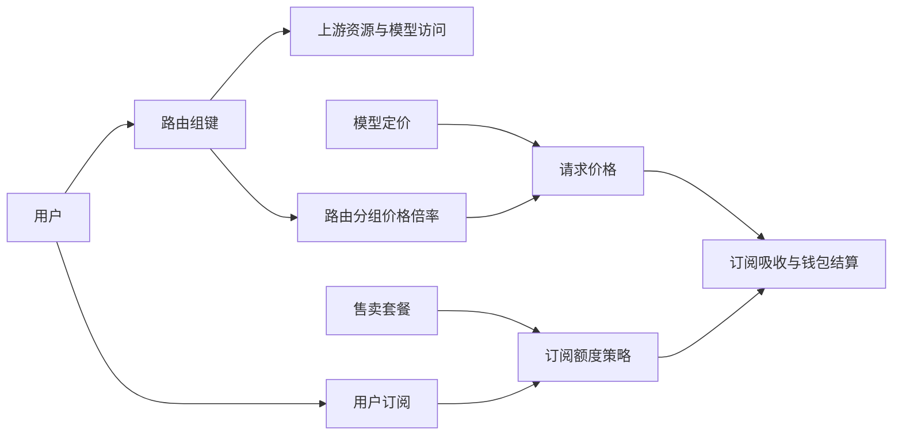

# 分组概念与实现整理

> 日期：2026-09-06 · 基线：`develop@7fce275`（v0.26.6）
> 工作分支：`codex/group-concepts-refactor`
> 状态：兼容整理、统一授权实现及实际数据只读基线已完成；成员关系表尚未迁移，服务尚未部署。

## 1. 结论

项目需要明确区分 **路由分组、路由分组价格倍率、订阅额度策略**。
它们分别回答“可以用哪些上游资源”“请求按什么倍率定价”“订阅能吸收多少费用”。
用户角色控制后台权限，模型分类用于展示，上游账号类型描述凭证，这些都不属于路由分组。

“用户分组”和“渠道分组”使用同一个路由键空间，分别是用户的请求归属和资源的可访问成员关系。
“订阅分组”则是历史命名，产品界面统一称为“订阅额度策略”；其数值 ID 与路由组字符串无关联。
不能用订阅策略的名称匹配路由组，也不能把购买订阅等同于加入 VIP 路由组。

本次先完成不需要数据迁移的整理。现有接口路径、JSON 字段、表名、主键和价格默认值保留，
后续按本文的顺序建立真正的路由组管理与统一授权规则。

## 2. 当前事实源

| 产品概念 | 代码 / 存储 | 基数与职责 | 当前边界 |
|---|---|---|---|
| 用户的路由分组 | identity `User.Group`、`users.group` | 一个用户一个字符串键 | `AuthSnapshot.Group` 供 Relay 选择上游；API Key 继承用户组 |
| 渠道的路由分组 | channel `Channel.Group`、`channels.group` | 一个渠道可属于多个组，字段为 CSV | 生成 `abilities`，管理模型通过渠道成员关系判断可用性 |
| 上游账号的路由分组 | channel `SubscriptionAccount.Group`、`subscription_accounts.group` | 一个账号可属于多个组，字段为 CSV | 生成账号 abilities；与用户订阅额度无关 |
| 订阅账号的模型授权 | `ModelSubscriptionMapping.GroupName`、`model_subscription_mapping.group_name` | 每条映射一个路由组 | 当前注册表路径可单独授予该组访问账号模型的权限 |
| 模型路由规则 | `ModelRouting.GroupName`、`model_routings.group_name` | 在一个路由组内，把模型规则限制到指定候选账号 | 在候选能力集合上进一步筛选，不是订阅策略 |
| 路由分组价格倍率 | `system_options[GroupRatio]`、billing `PricingConfig.GroupRatios` | 组键到倍率的映射 | `/api/group` 实际维护此配置；删除配置不删除用户或资源成员关系 |
| 订阅额度策略 | `SubscriptionGroup`、`subscription_groups` | 数字 ID，日 / 周 / 月额度及消耗倍率 | `Platform` / `SubscriptionType` 当前是描述字段，不在路由上限制平台或模型 |
| 订阅套餐 | `SubscriptionPlan`、`subscription_plans.group_id` | 同一额度策略可包装为多个售卖套餐 | 负责价格、有效期、展示和上下架 |
| 用户订阅 | `UserSubscription`、`user_subscriptions.group_id` | 引用额度策略及有效期、窗口用量 | 分配 / 续费 / 更换策略不修改 `users.group` |

主要代码入口：

- [identity 鉴权快照](../../app/identity/internal/biz/auth.go)：`GetAuthSnapshot`。
- [channel 查询与能力同步](../../app/channel/internal/data/data.go)：`ListSubscriptionAccountAbilities`、`syncAbilitiesTx`、`listRegistrySubscriptionAbilitiesDB`。
- [Relay 计划与会话复用](../../internal/biz/relay.go)：`Plan`、`stickySubscriptionAccountValid`、`ResolveSubscriptionRoutingSource`。
- [billing 定价与双轨结算](../../app/billing/internal/biz/billing.go)：`getGroupRatio`、订阅吸收及钱包结算。
- [订阅领域](../../domain/subscription/README.md)：共享额度策略、套餐、用户订阅的所有权。

额度策略与路由组之间没有箭头。例：用户在 `default`，购买名称为 `vip` 的额度策略，
请求仍使用 `default` 路由及其价格倍率；策略名称相同不会创建路由关联。

## 3. 两种倍率的计算语义

设模型定价得出的请求金额为 `B`，路由组价格倍率为 `R`，本次能被订阅吸收的金额为 `S`，
订阅额度消耗倍率为 `Q`：

- 请求金额按 `C = B × R` 计算，实际实现还包含定点金额转换、最小扣费和取整。
- 订阅最多吸收 `C`；吸收部分的窗口用量增加 `S × Q`。
- 钱包承担未被吸收的 `C − S`，`Q` 不再乘到钱包部分。

例如忽略取整时，模型金额 $1、路由倍率 0.5、额度消耗倍率 2，则请求价格 $0.50；
如果订阅全额吸收，订阅窗口增加 $1.00，钱包扣款为 0。

本次不调整当前价格回退：billing 内建 `default=1`、`vip=0.5`、`svip=0.3`；
有效配置选定后，找不到组键回退为 1。Admin `/api/group` 列出已配置项并补充 `default=1`，
不是 billing 有效配置的完整展示。`Account.GroupRatio()` 也只读内建值。
这些显示口径差异需要在后续统一解析器中解决，不能通过“补全配置”意外修改实际价格。

## 4. 本次已落地的兼容整理

### 4.1 路由成员判断

新增 [domain/routing/group.go](../../domain/routing/group.go)，所有调用方共享以下语义：

- `Groups` 解析遗留 CSV，去掉成员首尾空白与重复项，保留顺序和大小写。
- `ContainsGroup` 只匹配完整成员；`vip` 不匹配 `svip`，不把请求组当成 CSV 或通配符。
- 空成员列表不隐式授予 `default`。默认分配必须发生在明确的创建入口。
- channel 内存能力读取、数据库 abilities 写入、模型探测中的成员解析使用该实现。
- Relay 的 HTTP 会话复用和 Responses 路由恢复使用成员判断，修复账号
  `group="default,vip"` 对请求组 `default` 错误失效的问题；会话缓存键仍按请求组隔离。

这一步没有改写已有 CSV、数据库 SQL 条件、模型映射授权规则，也未统一各数据库的字符排序规则。
SQL 与内存的全部一致性属于下节的迁移任务，不把本次 helper 误认为已经完成授权模型升级。

### 4.2 倍率管理回到 biz

新增 [admin biz/group_pricing.go](../../app/admin/internal/biz/group_pricing.go)：

- DO 为 `RoutingGroupRatio`；`ListRoutingGroupRatios` / `UpsertRoutingGroupRatio` /
  `DeleteRoutingGroupRatio` 明确其配置职责，复用 `SystemOptionsRepo`。
- service 保留 `/api/group` 的旧方法及 `{group, ratio}` DTO，只做 DTO ↔ DO 转换。
- 校验倍率为有限正数，新配置一次只能指定一个路由组；支持旧 `null` 配置安全恢复为空映射。
- 读取存储失败时直接返回错误，避免以前经 `GetOneAPIOption` 静默回退 `{}` 后覆盖已有倍率。
- 删除只移除价格覆盖项，`default` 仍不可删除。该接口不能用来撤销访问权限。

### 4.3 额度策略和产品术语

- 导航、订阅管理、套餐与订单页面把“订阅分组”改称“订阅额度策略”；`group_id` 和接口路径保留。
- 用户、渠道、上游账号、OAuth 和个人资料页面明确标注“路由分组”。
- 额度策略的“计费倍率”改为“额度消耗倍率”；账单审计明确“路由分组价格倍率”。
- 策略页面说明分配订阅不改变路由权限、平台字段不限制模型调用，渠道表单说明多组输入方式。
- 创建额度策略时，在解码前设置默认状态。省略 `status` 默认启用，显式 `status:0` 保持禁用；
  修复原 handler 把两者都强制启用的问题。

## 5. 目标模型与分层

以下为后续实施设计，未在本次分支创建表或增加接口。

| 对象 | 建议模型 | 所有者 |
|---|---|---|
| 路由分组 | `RoutingGroup{ID, Key, DisplayName, Status}`，Key 唯一且不可原地重命名 | channel 的 biz 声明 DO / repo，data 管理表，service 提供版本化 DTO |
| 资源成员关系 | 渠道与账号分别建立 `(resource_id, routing_group_id)` 关系表 | channel，与资源写入及 abilities 同事务维护 |
| 用户路由归属 | identity 保存一个路由组引用；鉴权快照带明确的 `routing_group` | identity 通过接口验证，避免直接读取 channel PO |
| 路由价格规则 | `RoutingGroupPriceRule`，组键 / 组 ID、倍率、版本、有效时间 | billing 拥有有效价格解析与价格快照；Admin 仅管理入口 |
| 订阅额度策略 | 新接口称 `SubscriptionQuotaPolicy`，旧 `SubscriptionGroup` 保持兼容 | 继续由 `domain/subscription` 共享领域拥有 |
| 售卖套餐 | `SubscriptionPlan` 统一承载售卖信息 | 订阅领域；旧策略直接售价先只读兼容，待订单迁移完成再退出 |

路由组的 Key 是业务标识，不是显示名称。重命名采用新建、迁移引用、停用旧组的流程，
不能只修改价格 map 的键。停用组只影响路由准入，不自动暂停订阅或改历史账单。
删除需要确认用户、渠道、账号、模型映射、路由规则均无有效引用；历史审计保留键和快照。

共享 `domain/routing` 只保留纯领域值与规则，不创建新的部署服务，不导入 proto、GORM 或存储客户端。
对外接口通过 `api` 声明，由 `cmd` 连接 repo / usecase / service。新增 DTO 后通过 `make api`，
新增依赖连线后通过 `make all` 生成，不手改生成文件。

## 6. 已发现的遗留差异及实施顺序

### P1：先做只读清点，冻结授权与价格基线

1. 汇总 `users.group`、两个资源 CSV、两个 abilities 表、模型映射、模型路由和 `GroupRatio` 的所有组键。
2. 单独报告空值、CSV 重复、空白、大小写碰撞、含通配字符的键、无价格覆盖的路由组，以及只有价格没有资源的键。
3. 导出“请求组 × 模型 × 上游资源”的有效候选集合，同时记录来源为 legacy abilities 或 registry mapping。
4. 单独列出 `model_subscription_mapping.group_name` 不在账号 CSV 中的映射。当前普通选择可以使用它们，
   会话复用却按账号 CSV 校验；迁移不能直接做集合交集，也不能悄悄扩大账号的全模型访问范围。
5. 比较实际定价、`/api/group` 配置视图、账户接口显示倍率，冻结缺省值和配置优先级。

清点工具必须默认只读，输出数量和可审查差异。未解决的冲突阻止对应记录迁移，不能自动 lowercase 或默认分配。

2026-09-07 经授权完成实际 MySQL 跨 schema 只读清点与复核，授权和价格基线冻结在本机忽略目录。
验证方式和边界见 [验证记录](./group-concepts-validation.md)；切换前应刷新基线以覆盖之后的配置变更。

### P2：统一授权判定，再迁移成员关系

2026-09-07 已完成只读清点工具、实际数据基线与下述第 1 项的本地实现，详见
[清点与授权说明](./group-audit-and-routing-authorization.md)。下一阶段从第 2 项开始，关系表迁移仍未执行。

1. channel 提供统一的 `CanRoute(group, model, source)` 判定，普通选择、模型目录、重试、HTTP sticky、
   Responses / WebSocket 恢复使用同一规则；模型映射保留模型级授权，不自动扩展成账号级全模型授权。
2. 新增路由组及成员关系表；所有方言提供等价迁移、唯一约束和索引。
3. 从清点结果幂等回填，保留现有名字；CSV 成员迁到资源关系，额外模型授权迁到模型级关系。
4. 先双写并影子比较新旧候选集合，差异解释完毕再切读。保留旧 CSV 可回滚，稳定后独立版本退出双写。
5. 新表用精确成员查询替代当前四段 `LIKE` 匹配，消除 `%` / `_` 被当成 SQL 通配符、
   CSV 空白、数据库大小写规则，以及管理列表用整个 CSV 等值筛选造成的不一致。

不能仅仅“转成数组字段”就宣布完成：必须同时验证 abilities 重建、模型探测、导入、缓存失效与会话恢复。

### P3：价格与策略生命周期收口

1. billing 暴露同一个有效价格解析结果给结算和管理展示，包含配置来源与回退依据。
2. 价格修改用版本或比较交换避免整个 `GroupRatio` JSON 的并发读改写丢更新；当前拆层尚未解决该并发问题。
3. 明确请求期间用户换组及策略改倍率的规则；把需要冻结的组键、价格版本和额度策略版本纳入预扣 / 结算快照。
   历史账本不按新价格重算。
4. 额度策略建立名称更新冲突检查、引用检查及禁用 / 删除规则；当前删除缺少对套餐和用户订阅的完整引用保护。
5. 出售统一走套餐，已有策略直接购买及旧订单履约按快照保留。等迁移指标达标后再废弃旧 API 名称。

## 7. 验收与回滚

本次兼容整理的回归覆盖：多路由组与空值、完整成员与跨组隔离、重复成员解析、会话复用、
倍率配置增删和错误读取保护、额度策略显式禁用创建，以及前端中英文术语与构建。
执行结果记录在 [本次验证记录](./group-concepts-validation.md)。

后续授权迁移必须补充：注册表 / legacy 一致候选集合、HTTP / SSE / WebSocket 复用与重试、
三数据库的成员查询一致性、双写事务失败与回滚、订阅购买前后路由不变、两个倍率与分账金额不变。

本分支尚未部署，也没有数据库迁移；生产环境仅执行经授权的只读清点。
将来部署后，回滚对应服务和前端制品即可恢复旧实现；已明确创建为禁用的策略记录属于用户意图，应保留禁用状态。
后续切新成员表的回滚依赖双写旧列，禁止提前删列。
