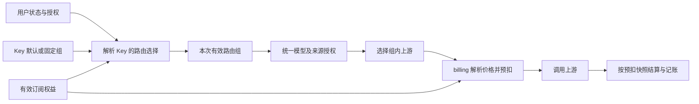

# 分组重设计 v2：以路由分组为入口，连接 Key、资源与订阅权益

> 日期：2026-09-08
> 状态：分阶段实施中；阶段 A、B、C、D、E、F 已完成。详细状态与验证证据见 §8.2；尚未迁移生产数据库或切换运行行为。
> 对照基线：micro-one-api `efacbf7c`、new-api `71c1fd7ca`、sub2api `772a0382f`，均为本机工作副本。
> 本文承接[现有概念与实现整理](./group-concepts-and-implementation.md)。现有实现事实继续以该文及代码为准，后续目标模型、范围和实施顺序采用本提案。

## 1. 设计决策

把**路由分组**升级为有稳定 ID、生命周期、资源成员和使用权限的独立实体，成为运营和用户选用服务的入口。

用户拥有若干组的使用资格，API Key 选择其中一个组，请求按实际选择的组路由和定价；套餐明确声明覆盖哪些组、是否授予这些组的访问权，并引用独立的订阅额度策略。

产品上统一从“分组”查看资源、模型、价格、用户授权和套餐。代码按 channel、identity、billing、subscription 的所有权拆分，通过应用层组合展示。

首期决策如下：

| 问题 | 决策 |
|---|---|
| 用户是否只能有一个组？ | 用户有一个默认组，以及零到多个显式授权组；默认组只负责 Key 的默认选择 |
| Key 能否选择组？ | 支持 `inherit`（跟随默认组）和 `fixed`（固定组）；每次调用重新确认资格 |
| 组是否只容纳一种上游？ | 可以同时包含 API Key 渠道和上游订阅账号；保留当前混合调度能力 |
| 订阅与组如何关联？ | 套餐定义覆盖组和访问权益；用户订阅保存购买时的权益快照 |
| 一个订阅能覆盖几个组？ | 一个或多个，共享该订阅的日、周、月额度窗口 |
| 是否允许多个有效订阅？ | 首期继续每用户一个有效订阅；多订阅叠加单独设计，不直接移除现有唯一约束 |
| 是否自动升级用户组？ | 购买套餐产生有期限的访问权益；默认组由用户或管理员明确设置 |
| 是否支持 Auto？ | 后续提供显式有序候选组策略；`auto` 是 Key 的路由模式，不是数据库中的虚拟组 |
| 是否再建“用户等级组”？ | 首期不增加。采用用户对组的直接授权和可选专属价格；有批量运营需求后再增加授权模板 |

例如，用户可同时拥有 `public-api`、`claude-pro`、`codex-pro` 的资格，分别创建 Claude 和 Codex 的固定组 Key。购买“开发者月包”后，后两个组获得有期限的访问权并共享订阅额度；调用前一个组按该组的结算规则支付。套餐到期按权益来源撤销访问，不改写用户的默认组和其他授权。

## 2. 三个项目的实际差异

以下是本地源码事实，不推定这些版本已在生产运行。

| 维度 | new-api | sub2api | 当前 micro-one-api |
|---|---|---|---|
| 分组身份 | 主要使用字符串键，倍率配置也参与组是否可选的判断 | `Group.ID` 独立实体，含状态、平台及策略字段 | 路由组是字符串；`/api/group` 管理 `GroupRatio` 配置，没有实体注册表 |
| 用户资格 | 全局可用组 + 用户组的增减规则 + 用户自身组 | 普通组区分公开/专属，用户有 `AllowedGroups`；可限制公开组；订阅组检查有效订阅 | `User.Group` 单一归属 |
| API Key | 空组继承用户组、固定组、Auto；可配置有序 Auto 组和跨组重试 | `APIKey.GroupID` 绑定组，创建和运行时检查资格 | Token 没有路由组字段，鉴权返回 `user.Group` |
| 上游成员 | channel CSV，派生 `(group, model, channel)` abilities | `account_groups` 多对多，关系上有 priority | 渠道和账号 CSV；abilities 与模型映射共同参与授权 |
| 定价 | 组倍率；用户组对所用组的倍率覆盖 | 组倍率；用户对组的倍率覆盖，另有高峰和模型定价等策略 | `GroupRatio`；billing 从账户的 `Group` 取价 |
| 订阅 | 套餐可配置升级组、到期回退组；用户订阅保存相关快照 | 订阅引用真实组，网关按用户和组查询订阅 | `SubscriptionGroup` 是额度策略；分配订阅与路由无关联 |
| 组模型与平台 | 通过渠道能力形成可用模型 | 组带平台、模型白名单、模型路由等较丰富配置 | 已有注册表优先、模型级授权、路由收窄和 `CanRoute` |

采用 new-api 的“用户资格与 Key 选组分离”，采用 sub2api 的“组有实体、资源关系和订阅资格”。当前项目继续保留独立额度策略、共享订阅领域库和混合上游调度。高峰倍率、利润筛选、复杂平台专属开关不纳入首期。

特别注意：sub2api 的普通组公开/专属规则和订阅组规则是两条路径，不能概括为“公开组任何用户都能调用”。其订阅组还需要匹配的有效订阅；当前代码也包含组合平台，不能将它概括为所有组都严格单平台。

## 3. 当前实现需要解决的问题

1. **没有组的事实源。** 用户、渠道、账号、模型映射和倍率配置都能出现组名；删除倍率覆盖不会撤销组访问，页面不能准确展示组是否存在、可用或被引用。
2. **用户归属与请求选择耦合。** 用户切组会影响全部 Key，无法给不同应用配置不同资源范围和价格。
3. **路由与定价上下文不足。** `ReserveQuotaRequest` 没有实际路由组；`ReserveQuota` 和两条提交路径按 `account.Group` 取价。增加 Key 选组前必须补齐，否则会错组计费。请求中途用户换组或配置改价也需要明确快照语义。
4. **订阅缺少显式适用范围。** 当前按用户查唯一有效订阅，额度策略的 `Platform` 只是描述字段。仅购买名为 Claude 的策略无法表达“只覆盖 Claude 组”。
5. **资源关系有特殊授权语义。** `model_subscription_mapping.group_name` 可对账号 CSV 之外的组授权单个模型。迁移为普通账号成员会扩大权限，直接取交集会撤销既有权限。
6. **已有基础应继续使用。** 当前分支已实现共享 CSV 解析、`CanRoute`、目录过滤、重试和会话恢复检查，并有只读清点工具。v2 在这些能力上增加实体和请求资格，不另写一套路由规则。

另有两处快照边界：现有 `PricingSnapshot` 只覆盖 `ModelPrice` 路径，且在结算时生成；现有 `PlanSnapshot` 主要冻结套餐标识、额度策略 ID、售价和天数。它们都还不能完整承担 v2 的请求上下文和购买权益快照。

## 4. 产品模型与后台交互

### 4.1 五个名称固定下来

| 产品名称 | 领域名称 | 回答的问题 |
|---|---|---|
| 路由分组，导航可简称“分组” | `RoutingGroup` | 使用哪一批资源及模型？ |
| 用户分组授权 | `UserRoutingGroupGrant` | 这个用户为什么可以用这个组？ |
| Key 路由设置 | `TokenRoutingPolicy` | 这个 Key 的请求选择哪个组？ |
| 订阅额度策略 | `SubscriptionQuotaPolicy` | 一份订阅有多少额度、如何累计窗口用量？ |
| 订阅套餐 / 用户订阅权益 | `SubscriptionPlan` / `SubscriptionEntitlement` | 买到哪些组的资格、费用覆盖范围及有效期？ |

角色继续控制后台操作权限。上游订阅账号继续表示凭证和资源，用户订阅表示客户权益；二者通过实际路由和结算联系，不通过“订阅”二字推导关系。

### 4.2 管理端

增加独立分组列表：名称/键、状态、使用资格、结算方式、价格倍率、模型数量、两类资源数量、有效套餐数量。临时上游故障不把组显示为“已停用”，资源健康单独展示。

分组详情分为六个页签：

| 页签 | 操作与信息 |
|---|---|
| 概览 | 显示名称、不可变键、启停、排序、说明；展示可调用协议和模型 |
| 资源 | 渠道与账号分别多选；展示继承的优先级/权重；模型级额外授权单独标识 |
| 模型与路由 | 有效模型、组白名单、模型到上游映射、现有模型路由规则、授权来源解释 |
| 价格与结算 | 有效倍率、配置来源、版本；钱包/仅订阅/订阅优先；用户专属覆盖入口 |
| 用户授权 | 显式授权、到期时间、来源；订阅权益只读联查；撤销前展示受影响 Key |
| 套餐 | 哪些在售套餐覆盖此组、是否提供访问权、共享额度策略；链接到套餐编辑 |

创建按“基本信息 → 资源与模型 → 使用资格 → 价格与结算”完成，可先保存为禁用草稿。启用前检查结算配置已发布、必需引用可解析；无可用能力时提供明确诊断。

用户编辑页把原“路由分组”改成“默认分组”和“分组授权”。渠道/账号编辑改成实体多选；保留原始模型映射的模型级授权入口。倍率的生效结果统一来自 billing。

### 4.3 用户端

- “可用分组”显示模型、协议、当前价格、资格来源和到期时间；套餐商店另行展示可购买的组，不混为已授权。
- 创建 Key 时，选择“跟随默认分组”或某个具体组；展示结算方式及订阅覆盖情况。
- 订阅页显示“覆盖 Claude Pro、Codex Pro，共享日/周/月额度”，同时说明到期及额度不足的行为。
- 默认组失效时，跟随默认组的 Key 显示“需要重新选择分组”；固定组 Key 保持其原配置。
- 停用组、撤销授权和删除价格覆盖是不同操作，均显示具体影响。

## 5. 领域模型和存储

### 5.1 channel 拥有组及资源授权

`RoutingGroup` 的首期字段：`ID`、`Key`、`DisplayName`、`Description`、`Status`、`AccessMode`、`SortOrder`、`Revision`、创建/更新时间。

- `Status` 为 `enabled / disabled / archived`；新建默认 disabled，由明确启用操作发布。
- `AccessMode` 为 `public / restricted`。public 表示活跃用户获得基础访问资格，付款资格仍按结算策略检查。
- 新键限定 ASCII 字母、数字、`.`、`_`、`-`，保留大小写并按字节精确匹配，最多 64 字符；保留 `auto`。旧键原样导入兼容映射，异常键先报告，不批量小写或截断。
- 数字 ID 是关系引用；Key 稳定且不复用，显示名称可以修改。旧的数值 `subscription_groups.id` 与其完全独立。

| 表或关系 | 关键字段及约束 |
|---|---|
| `routing_groups` | `id` PK；`key` 精确唯一；状态、资格模式、revision |
| `channel_routing_groups` | `(channel_id, routing_group_id)` 唯一；按 group 建反向索引 |
| `account_routing_groups` | `(subscription_account_id, routing_group_id)` 唯一；按 group 建反向索引 |
| `model_subscription_mapping` 扩展 | 增加 `routing_group_id`；保留模型、账号、启用状态、优先级、上游模型名及旧 `group_name` |
| `model_routings` 扩展 | 增加 `routing_group_id`；规则继续只收窄既有候选 |
| 组模型限制 | `model_access_mode=all_authorized / allowlist`；白名单引用公开模型标识或已校验模式 |

资源关系只表示候选资源归属。注册表模型仍按映射启用状态授权，legacy 模型仍按现有精确/通配及回退规则计算；组白名单在其结果上进一步收窄。`all_authorized` 不代表开放所有模型；`allowlist` 加空列表表示禁止全部，避免把空列表误当无限制。

额外模型映射保持独立存在，允许“账号不是组成员，但某个模型明确授权给该组”。详情页显示该来源，不能为了关系完整性补一个账号全模型成员。

首期保留原资源和模型映射的优先级、权重解析。后续如需要 sub2api 式组内优先级，再给关系增加 nullable override；空值继承现有值，并定义完整优先级顺序后发布，避免迁移同时改变调度分布。

组可跨上游平台，首期根据实际资源能力派生支持平台/协议。若后续添加 `allowed_platforms`，它是显式限制，迁移默认不限制；不能把旧额度策略的 `Platform` 当作路由限制。

### 5.2 identity 拥有用户授权和 Key 设置

| 表或字段 | 语义 |
|---|---|
| `users.default_routing_group_id` | 默认选择；不独立授予访问资格，兼容期对应 `users.group` |
| `user_routing_group_grants` | `user_id, routing_group_id, source_type, source_ref, starts_at, expires_at, status`；来源键唯一，便于幂等 |
| `users.public_group_access` | `all / explicit_only`；用于限制某些用户自动获得公开组资格 |
| Token 路由字段 | `routing_mode=inherit/fixed`、nullable `routing_group_id`、`revision` |
| 用户授权版本 | `routing_access_revision`，在默认组、永久授权、公开组访问模式改变时更新 |

授权来源首期是 `admin / migration`；有时效的订阅授权由订阅领域持有，运行时合并，避免支付成功后还依赖跨库双写才能获得权益。

同一用户对同一组可能有多个来源。撤销一个来源只撤销该来源；需要立即封禁用户时使用用户停用，需要封禁整组时使用组停用，不以删除某条授权代替总开关。

Key 规则：inherit 必须没有固定组 ID；fixed 必须有一个有效组 ID。不允许用空 ID 代表 Auto 或错误时退回 default。创建时校验组和资格，运行时再次校验；保存配置本身不构成授权。

自助修改默认组只能从当前可用组中选择；注册默认组由服务端配置确定，客户端提交的旧 `group` 字段不能生成管理员授权。兼容期旧管理员“修改用户组”操作以单组迁移命令处理：同事务更新默认组和对应 migration 来源授权，保留其他独立授权及订阅权益。v2 的“修改默认组”只修改偏好，不增删授权。

### 5.3 billing 拥有组的价格与结算策略

`RoutingGroupBillingPolicy` 包含 `RoutingGroupID`、`BillingMode`、`PriceRatio`、`Version`、生效时间。每次变更产生不可变版本，更新活动版本用比较交换，避免覆盖整个 `GroupRatio` JSON 导致丢更新。

| 结算方式 | 规则 |
|---|---|
| `wallet_only` | 全部请求费用从钱包支付，订阅不参与 |
| `subscription_only` | 必须有覆盖该组的有效订阅，额度不足拒绝；不自动扣钱包 |
| `subscription_first` | 有覆盖订阅时先吸收，剩余由钱包承担；无覆盖订阅时可用钱包，但仍必须具有组访问资格 |

用户专属倍率作为独立可选覆盖 `(user_id, routing_group_id, version)`，覆盖组基础倍率，不与基础倍率再相乘。首期可以只开放基础倍率，但解析器和审计来源需能扩展。

新配置要求有限正数；金额继续采用项目现有定点单位、最小扣费与取整。暂不增加零价语义。倍率存储和传输应保留稳定精度，迁移以现有函数逐条对比实际结果，不在此任务顺便替换整个金额计算体系。

### 5.4 订阅领域拥有购买权益和额度

新领域命名使用 `SubscriptionQuotaPolicy`；旧 `SubscriptionGroup`、旧表及旧 API 先保持兼容。额度策略继续只拥有窗口限额和额度消耗倍率。

新增关系：

| 对象 | 关键字段 |
|---|---|
| 套餐权益 | `plan_id, routing_group_id, grants_access`；唯一 `(plan_id, routing_group_id)` |
| 订阅权益快照 | `subscription_id, routing_group_id, grants_access`，附权益版本和来源订单 |
| 订阅计费范围 | `coverage_mode=selected_groups / legacy_all_authorized` |
| 套餐快照 v2 | 原字段 + quota policy 版本/限额/倍率快照 + 覆盖组 ID/键 + grants_access + 版本 |

一条套餐权益总是声明“此组费用可由该订阅覆盖”，`grants_access` 再声明是否提供组访问资格：

- `true`：购买后同时获得该组的有期限资格，适合专属订阅组。
- `false`：只提供费用覆盖，用户仍需公开资格或管理员授权，适合已有访问权的额度包。

覆盖关系并不改变组的结算模式；wallet_only 组不应加入新套餐的费用覆盖范围。套餐保存和购买预检都验证这一条件。

`selected_groups` 要求至少一个明确组 ID；新套餐、直接分配订阅都使用此模式。`legacy_all_authorized` 仅用于旧订阅、旧套餐和旧支付订单兼容：在组允许订阅结算的前提下，覆盖用户本来就可使用的组，**不授予任何额外组访问权**。

订阅的多个覆盖组共用同一 `subscription_id` 的日/周/月窗口。首期维持 `uniq_user_subs_active_user_id`；不能把同一份额度复制到每个组，再分别累计。

支付履约在现有订阅事务中写入订阅与权益快照，按照订单幂等。退款、撤销、过期同步改变订阅资格；请求按 `starts_at <= now < expires_at` 和 status 判断，不依赖扫描任务先执行。

同一有效订阅续期只允许“额度策略版本 + 覆盖组集合 + grants_access”相同的权益合同，延长到期时间并保持已用额度。合同不同走明确的更换套餐流程，在事务中替换权益并按现有更换语义处理窗口；旧版仅按 quota policy ID 判断同组的逻辑需要升级。已过期后再购买按当前代码的新建订阅语义处理，历史行保留。

新合同版本不回写已购买权益。旧订阅暂用 `legacy_live` 额度策略语义，保留其当前随策略变更的行为；将其冻结为版本快照必须作为明确的产品迁移。未支付旧订单缺少权益范围时使用 legacy 语义履约，不能按今天套餐名称猜测范围。

## 6. 一次请求如何执行



### 6.1 访问、模型和支付分别判断

对于已通过用户/Key 状态、期限、IP、Key 模型限制等基础检查的请求：

```text
group = fixed ? token.routing_group_id : user.default_routing_group_id

public_access = group.access_mode == public
                AND user.public_group_access == all
explicit_access = 至少一个当前有效的用户授权
subscription_access = 有效订阅权益包含该组 AND grants_access

can_access = group.enabled
             AND (public_access OR explicit_access OR subscription_access)

can_route = can_access
            AND Key 模型权限通过
            AND 组模型限制通过
            AND channel.CanRoute(group, client_model, source) 通过

can_pay = billing 按该组结算模式、订阅覆盖、剩余额度和钱包预扣成功
```

路由规则不能产生用户资格，默认组引用也不能产生资格。组停用的拒绝优先于其他授权。资格读取出错返回错误，不以“查不到订阅”等同“没有订阅”后悄悄扣钱包。

### 6.2 贯穿全链路的上下文

增加纯 DO `ResolvedRoutingContext`，至少包含用户 ID、Token ID、组 ID/键、Token 路由模式、用户授权版本、组 revision、订阅权益版本和选组来源。用于内部 RPC 和审计的 DTO 在各自 service 边界转换。

Relay 将实际组 ID/键送入预扣；billing 自己解析该组的价格及结算策略，重新检查所引用订阅的有效性和覆盖范围。外部 Header、Body 中的 `group`、倍率、订阅 ID 都不能直接形成已授权上下文。

预扣保存：组 ID/键、路由上下文版本、结算模式和策略版本、**完整的计价输入快照**、额度消耗倍率和策略版本、具体 subscription ID、权益版本、窗口标识、订阅/钱包冻结量。`CommitQuota` 和异步消费根据 reservation 读取；不再查当前 `users.group` 来为此请求重新定价。

完整计价快照既涵盖 ModelPrice 的 token bucket 单价，也涵盖 ModelRatio/CompletionRatio 等旧路径所用参数。v1 快照继续可读，v2 使用新版本；旧记录没有证据就保持未记录，不能用当前配置补造历史证据。

相同 `(user_id, request_id)` 重试必须核对组、模型和路由上下文摘要。不同上下文复用同一幂等键返回冲突，防止取回另一组的预扣。请求尚未发往上游时若需改组，必须使用明确的 attempt 及旧预扣释放流程，见第 10 节。

### 6.3 两种倍率继续各司其职

设 `B` 为模型基础费用，`R` 为有效路由组价格倍率，`Q` 为订阅额度消耗倍率，`S` 为订阅实际吸收费用：

```text
C = B × R
订阅窗口增加 = S × Q
钱包扣款 = C − S
```

wallet_only 时 `S=0`；subscription_only 时必须能支付全部 `C`；subscription_first 时按额度和钱包拆分。实际执行沿用现有单位转换、最低扣费和舍入规则。

例：基础费用 $1，组倍率 0.5，额度消耗倍率 2，则请求费用 $0.50。全额吸收时窗口消耗 $1；若只能吸收 $0.30，窗口增加 $0.60、钱包扣 $0.20。共享多个组时，每笔费用分别按实际组取 R，然后进入同一个订阅窗口。

价格或额度倍率在请求期间变化，已创建的预扣继续使用快照。并发冻结应保存每条预扣的 accounting USD，按各自 Q 求和；不能把所有旧冻结的 USD 乘以最新 Q。跨窗口、撤销、换套餐、退款按原 reservation 的订阅及窗口归属释放/结算，不转扣新订阅。

subscription_only 还需要真实的额度硬边界：仅冻结一个经验估算值无法保证流式实际费用不超限。上线此模式前须针对支持的协议基于输入、最大输出和工具计价保守冻结，或具备原子追加冻结及停止继续生成的边界；无法界定费用上界的端点先不支持此模式。不得用未授权的钱包透支兜底。已准入请求结算原冻结权益，新请求按最新状态拒绝。

### 6.4 缓存、重试和长连接

- 静态组/模型能力、用户授权、订阅权益分别带版本缓存；缓存有效期不得越过权益到期时间。
- 组和资源变更、用户授权/默认组变更、Token 改组、订阅更换/撤销均发失效事件；采用事务 outbox 与单调 revision，乱序事件不能覆盖较新状态。
- 撤权完成后，新请求、每次重新发往上游的重试及新 WebSocket 逻辑请求需要刷新相应权限版本；敏感准入失败关闭。TTL 只是兜底，不能把“事件最终到达”描述成即时撤权。
- 准入读取 identity 的权威授权版本、channel 的当前组/资源版本，以及订阅领域的当前权益状态；可用批量轻量 RPC/查询复用读取，但不以本地旧版本自证有效。缓存命中仅复用匹配当前版本的内容，outbox 负责提前淘汰。其延迟需要纳入上线压测。
- HTTP sticky、Responses 恢复、WebSocket 会话关联包含用户/Token 身份和实际组 ID；继续用当前 `CanRoute` 校验具体模型及 source kind/id。
- 已开始生成的 SSE/WS 逻辑请求按原预扣完成结算；同一连接中的下一条逻辑请求重新准入。撤销事件可关闭空闲连接，不逐 token 查询数据库。
- `/v1/models` 使用同一资格及组模型规则，目录不随瞬时健康或额度波动隐藏模型；使用资格与“目前是否能付款”分别展示。

## 7. 所有权与接口落点

### 7.1 服务职责

| 所有者 | 写入与业务规则 |
|---|---|
| channel | RoutingGroup、资源成员、模型授权、组白名单；候选集及 `CanRoute` |
| identity | 用户默认组、公开组访问模式、管理员授权、Token 路由设置、主体鉴权快照 |
| billing | 组结算策略、组/用户倍率、价格解析、预扣上下文、账本和对账 |
| `domain/subscription` | 额度策略、套餐覆盖范围、用户订阅权益快照、生命周期与窗口规则；仍为共享库 |
| admin biz | 管理操作编排和组合查询；组合调用各所有者，不直接跨服务读 PO |
| Relay biz | 合并主体、组与权益资格；选组、调用现有模型/来源授权、传递预扣上下文 |

`domain/routing` 放纯值对象与资格组合规则，避免 admin 和 Relay 复制资格判定。identity 返回主体与其本地授权事实，subscription 返回有效权益，channel 返回组与能力事实；共享纯函数完成同一组判定。各服务通过 biz 声明的窄接口获取远端 DO，由 data 实现 RPC 适配，cmd Wire 注入。

Key 创建、修改和可用组查询由 admin biz 编排资格检查，identity 的内部写接口只接受受信服务调用并验证主体与本地字段约束；实际调用仍完整准入。检查到写入间发生撤权不会让 Key 获得访问。若未来开放直连 identity 的用户管理 API，必须接入相同编排，不把内部保存接口暴露为绕过入口。

不让 identity 为每次鉴权读取订阅数据库，也不新增订阅微服务。当前 billing account repo 已直接查询 users，是现有边界事实；本次不扩大这种跨表依赖，组价改为来自已解析请求上下文。

跨服务无数据库外键、无假定跨 schema 事务。组新建先 disabled，价格配置通过 billing 发布，再在 channel 启用。失败保留可继续编辑的草稿；每个所有者独立事务和幂等键，admin 显示哪一步成功。业务逻辑不继续增加在 server handler 中。

### 7.2 契约建议

| 所属 API | 新增或扩展 |
|---|---|
| `api/channel/v1` | RoutingGroup CRUD、成员更新、可用模型/引用诊断；Select/CheckRoute 增加组 ID，兼容旧组键 |
| `api/identity/v1` | AuthSnapshot 增加默认组、授权事实、Token 路由设置及 revision；Key 创建/修改契约；用户组授权管理 |
| `api/billing/v1` | 组结算策略/价格查询管理；Reserve 增加路由上下文，返回其摘要；账单增加实际组与价格证据 |
| admin 用户 API | `GET /api/v1/routing-groups/available`，返回资格来源、模型摘要、有效价格和覆盖情况 |
| admin 管理 API | `/api/v1/admin/routing-groups`；详情下资源、授权、计费和引用检查分别提交到所有者 |
| 订阅 API | 新增 `quota_policy_id`、coverage 和 grants_access；旧 `group_id` 只继续表示额度策略 ID |

列表按仓库规范实现 filtering/ordering/pagination，更新使用 field mask 和 expected revision。新 proto 字段追加编号，字段 presence 明确；旧字段不复用、不改类型，生成物通过 `make api` / `make all` 更新。

组 ID 与旧键同时传入时必须匹配；不同则拒绝，不能任选一个。旧 `AuthSnapshot.group` 在旧调用路径保持原语义，新增结构承担 v2；v2 模式缺失时禁止猜测 fixed/inherit。

`/api/group` 保留为旧价格配置视图，删除仍只删除覆盖项。新组创建必须走实体 API。迁移期价格写入有明确主源：切换前旧配置为主并受控投影，切换后 billing 为主，旧写入口转到 billing 或返回升级提示；新旧两个独立写端不能长期并行互相覆盖。

错误至少区分：组不存在/停用、无访问资格、默认组失效、Key 模型受限、无授权上游、缺少覆盖订阅、订阅额度不足、钱包不足、配置版本冲突和依赖不可用。错误原因在 API enum 声明，由 biz 返回，HTTP/gRPC 转换不掺业务逻辑。

## 8. 兼容迁移方案

### 8.1 逐项映射

| 旧数据 | v2 映射 | 兼容保证 |
|---|---|---|
| `users.group` | 默认组 ID + `migration` 来源授权 | 用户迁移前后保持原组资格；旧用户先 `public_group_access=explicit_only`，不会因公开新组自动扩权 |
| 旧 Token | `routing_mode=inherit` | 继续跟随用户默认组，不批量生成新 Key |
| 渠道/账号 CSV | 两类资源关系表 | 保留所有现有成员及大小写；按有效授权基线处理异常数据 |
| 两类 abilities | 新成员和映射的派生投影 | 不作为唯一事实源；迁移比较有效候选而非只比行数 |
| `model_subscription_mapping.group_name` | 相同映射的 routing_group_id | 保留模型级授权，不补全账号成员 |
| `model_routings.group_name` | routing_group_id | 精确/通配匹配及收窄语义不变 |
| `GroupRatio` 及基础配置 | billing 有效策略的 v1 版本 | 冻结真实有效值与来源；不按 Admin 列表补全配置推导实际价 |
| 现有有路由引用的组 | enabled + restricted + subscription_first | 原用户授权单独回填，保留现有订阅优先与钱包兜底 |
| 只有价格项的组 | disabled 草稿并保留价格兼容记录 | 不凭价格配置自动生成访问资格或可用资源 |
| 旧套餐/订阅/待支付订单 | 原 quota policy ID + legacy 覆盖语义 | 不按名称/平台自动映射新组，不缩小覆盖，不自动授予新资格 |
| 历史账本 | 保留原记录；新字段可空 | 不重算历史价格；未知组标记未记录，不从用户当前组倒推 |

旧用户仍可经明确操作获得额外组授权；该行为属于新产品能力。legacy 订阅的覆盖仍随用户实际获准的组变化，符合当前无路由范围约束的语义；若要改成有限组覆盖，需单独迁移其合同。

### 8.2 实施阶段与上线闸门

| 阶段 | 交付内容 | 进入下一阶段的条件 |
|---|---|---|
| A：刷新基线 | 扩展现有 group-audit，清点用户、资源、模型授权、有效价格及订阅引用 | 异常与授权差异有明确映射；报告不含凭证 |
| B：建立组事实源 | channel 组及成员表、幂等回填、CSV/新表双写、只读分组详情 | MySQL/PostgreSQL/SQLite 的候选集合与旧路径对齐，事务/重建测试通过 |
| C：补全请求计费上下文 | identity 默认组/授权事实；Relay 仅用 inherit；billing 保存完整请求快照，所有提交路径读取 | 原组请求金额、分账、Key 额度和会话回归一致；明确测试改价/换组在途行为 |
| D：开放固定组 Key | 用户多组授权、available API、固定组表单、模型目录和审计 | 固定组实际路由=预扣组=账单组；撤权和停用及时生效 |
| E：订阅权益与结算模式 | 套餐范围、访问权益、合同快照、生命周期、仅钱包/仅订阅等模式 | 支付/续费/更换/退款幂等，共享窗口无重复额度，仅订阅硬额度闸门通过 |
| F：Auto 及高级定价 | 有序候选组、显式跨组规则、用户倍率管理、组内优先级扩展 | 单独完成跨组授权、重试幂等、会话语义和价格测试 |

B—E 构成首个完整产品版本；每阶段可独立交付，但不把“有分组 CRUD”视为重设计已落地。

### 实施进度（2026-09-11）

| 阶段 | 状态 | 完成记录与剩余闸门 |
|---|---|---|
| A | 已完成 | 工具、三方言验证与经授权的真实只读基线完成；两次报告一致、无阻断项，价格发现已有明确处置。见[阶段 A 记录](./group-redesign-v2-phase-a.md) |
| B | 已完成 | 组实体、关系、幂等回填、事务双写、只读接口与页面完成；三方言候选比较、事务回滚及全仓回归通过。见[阶段 B 记录](./group-redesign-v2-phase-b.md) |
| C | 已完成 | identity 默认组/授权事实、inherit 上下文、冻结价格与原订阅窗口结算完成；三方言、在途改价/换组、同步/异步、会话及全仓回归通过。见[阶段 C 记录](./group-redesign-v2-phase-c.md) |
| D | 已完成 | 多组授权、fixed Key、可用目录、实际组账单审计及事务 outbox 完成；三方言、撤权/停用/重试、会话隔离和前后端回归通过。见[阶段 D 记录](./group-redesign-v2-phase-d.md) |
| E | 已完成 | 冻结套餐合同与覆盖组、订阅访问权益、钱包购买/更换/退款事务、wallet_only/subscription_first/subscription_only 结算模式及 embeddings 硬额度边界完成；三方言、过期订阅拒绝、未覆盖组钱包结算与全仓回归通过。见[阶段 E 记录](./group-redesign-v2-phase-e.md) |
| F | 已完成 | 有序候选组、用户专属倍率与组内优先级/权重覆盖完成；三方言、跨组授权/重试幂等/会话语义/价格四组验收及全仓回归通过。见[阶段 F 记录](./group-redesign-v2-phase-f.md) |

A 已于 2026-09-08 刷新：完整生产清点经用户明确授权，两次独立只读事务报告一致，无阻断项。实际报告与构建摘要保存在本机忽略目录，脱敏结论见阶段 A 记录。阶段 B 已于 2026-09-09 完成本地成员回填、双写、候选影子比较与只读页面验收；生产迁移及部署未执行。

C 已于 2026-09-10 完成本地实现与验证：新增 identity 显式回填和请求快照迁移；Relay 仅支持 inherit，同步/异步按预扣价格及原订阅窗口结算。091/092 的三方言全量安装、回填、分账、在途变更、全仓单元和竞态检查通过。三个运行开关默认关闭；启用顺序和排空后回退要求见阶段 C 记录，尚未执行生产迁移或部署。

D 已于 2026-09-11 完成本地固定组 Key、多组授权、目录与账单审计；新增 093 事务 outbox，撤权/停用、重试及会话隔离通过验收。新建 fixed 的 admin 开关默认关闭，生产启用与回退要求见阶段 D 记录。

E 已于 2026-09-11 完成本地实现与验证：新增 094 订阅合同与 095 结算策略迁移；套餐合同冻结覆盖组与额度，购买/续费/更换/退款在 billing 单事务内协调幂等回执与权益 outbox；组级 wallet_only/subscription_first/subscription_only 模式按版本发布，subscription_only 先开放 embeddings 硬额度边界。三方言、过期订阅拒绝准入、未覆盖组按钱包结算、冻结合同不受套餐后续编辑影响及全仓回归通过。`SUBSCRIPTION_ENTITLEMENTS_V2` 等开关默认关闭，生产启用顺序与回退要求见阶段 E 记录。

F 已于 2026-09-11 完成本地实现与验证：新增 096 有序候选组、097 用户专属组倍率（heads+history，替换而非相乘）、098 组内关系优先级/权重覆盖三份三方言迁移。`routing_mode=ordered` 的 Key 携带显式有序组列表，relay 仅在首次发送前按用户顺序因“无候选资源”跨组递进，无资格/结算拒绝/仅订阅额度耗尽一律终止；attempt 以 AttemptOrdinal 唯一编号并冻结候选快照，旧预扣幂等释放后才建立下一 attempt；绑定 Responses/WS 会话通过 BoundGroupID 保持原组，recheck 永不改组。用户倍率版本串进入冻结快照与报价来源，在途请求不受影响。`RELAY_ROUTING_ORDERED`、`ADMIN_ROUTING_ORDERED_KEYS` 开关默认关闭；三方言、跨组授权、重试幂等、会话语义与价格四组验收及全仓回归通过，生产启用顺序与回退要求见阶段 F 记录。

回填使用稳定的旧键→新 ID 映射和进度记录，可中断重跑，唯一约束防止重复。MySQL 显式使用匹配设计的精确排序规则；PostgreSQL、SQLite 也验证大小写、`%`、`_`、空白边界，不能继承原 LIKE 的通配副作用。对发现的遗留差异先隔离并给出迁移报告，不静默放宽或收窄访问。

### 8.3 双写与跨服务发布

channel 的成员关系、旧 CSV、abilities 同数据库事务更新。模型级关系仍双写旧映射字段。不能把两个 SQL 成功当成一个事务，也不能在启动时自动跑全量迁移。

identity 默认组和旧 `users.group` 在其事务中双写。其分组授权与 channel 资源成员属于不同数据库，不做跨库双写；引用通过服务契约验证。快照/投影用 outbox 和 revision 对齐，影子比较只读，不重复预扣或增加用量。

先部署支持新字段的 channel、billing、identity，保留旧契约，再部署 Relay/admin 和前端；最后按服务能力与阶段开关开放 fixed 和新套餐。旧 billing/Relay 可能忽略新字段，因此不只依赖 proto 向后兼容，开启前必须检查能力版本。

### 8.4 回滚边界

在仅 inherit 且使用 legacy 订阅合同阶段，可以回退读取旧字段；按原 CSV 和价格投影恢复旧服务。切换前记录新快照语义的请求，并让在途预扣由理解该版本的 billing 排空。

一旦出现固定组 Key、多组授权或 selected_groups 权益，旧程序无法完整表达这些语义。此后回滚目标必须是“支持 v2 契约、可关闭新增功能”的兼容版本；可以停止创建新 fixed Key/套餐，但仍须服务已有对象。不能把所有 fixed Key 降级为 inherit，也不能让旧 billing 忽略仅订阅模式继续扣钱包。

独立版本中再移除旧字段和双写。删除前满足：所有读写路径已切换、无旧服务、待履约订单和旧预扣已处理、回滚窗口结束、审计可追溯。

## 9. 生命周期规则

- **改显示名称**：不改 ID/Key、不变资源和价格；Key 迁移采用新建目标组、迁移引用、归档旧组。
- **停用组**：拒绝新调用，保留 Key 配置、资源关联、订阅合同和历史账单；在途请求按冻结上下文处理。启用后仍按当前授权判断。
- **公开改专属**：不自动给所有曾使用者补永久授权；提交前展示受影响用户/Key，由现有显式授权及权益决定结果。
- **撤销用户授权**：只撤销指定来源；展示仍可通过哪些来源访问。继承默认组且已无资格的 Key 返回默认组失效。
- **停售套餐/停用额度策略**：阻止新销售或新分配；已购买合同照常履约。要停止现有用户权益，使用明确的订阅撤销动作。legacy_live 策略按旧约定单独标示。
- **修改结算方式**：有有效订阅或待履约订单覆盖时，禁止直接将组改为 wallet_only 或作其他与合同冲突的切换。需要变更时新建目标组/套餐或执行明确的合同迁移；价格版本变更只影响之后建立的预扣。套餐快照不默认承诺永久固定路由价格，售卖页须明确价格和额度消耗倍率是两项规则。
- **归档或删除组**：存在用户默认引用、Key 引用、授权、资源映射、模型路由、在售套餐、有效订阅或待履约订单时禁止硬删除。历史引用用墓碑与快照保留，Key 不复用。
- **跨服务引用检查**：先停用并进入归档准备状态，使所有新引用入口拒绝该组，再汇总各所有者引用；任何依赖查询失败都中止最终归档。首期提供归档，暂不开放硬删除，避免检查后新增引用竞态。

## 10. Auto 的后续设计边界

Auto 使用 `routing_mode=ordered` 和 Token 的显式有序组 ID 列表，不新增名为 auto 的 RoutingGroup。首期不实现组互相指向的 fallback 图，以免环路、跨组范围和权限来源难以解释。

候选按当前用户资格、订阅权益、组状态、Key 模型权限及协议兼容性过滤，保留用户配置顺序。列表为空即拒绝，不回退全局组列表；新授予的组也不会自动加入旧 Key。

默认只允许首次发送前因该组无候选资源而尝试下一个组。每组选取前都执行资格、结算资格和模型检查，按最终组取价；UI 明确提示可能价格。无权访问、预算不足、仅订阅额度耗尽默认终止，不自动切去更贵的组扣钱包。

如未来开放已发送后的跨组重试，必须显式开启并限定可证明安全的失败：未开始返回有效响应、无已执行工具副作用、不会复用另一上游的会话状态。超时且执行结果未知不能直接认为可重放。

每次 attempt 有唯一编号，组和计费快照固定；旧预扣幂等释放后才创建下一 attempt，未知提交状态先查询恢复。整个客户端 request 的最终结算必须幂等，重复消息不产生第二次扣费。已绑定的 Responses/WS 会话默认保持原组与来源，失效时提示新建会话；不自动把上游 response ID 交给另一个组。

## 11. 验收清单

| 范围 | 必须验证的结果 |
|---|---|
| 原用户与旧 Key | 原 default/vip 等候选资源、模型目录、实际金额和订阅分账不变 |
| 固定组 | 同一用户两个 Key 分别选择两个组，路由、账单、价格和缓存正确隔离 |
| 资格 | 未授权组、伪造组字段、停用组、过期权益、撤销后重试/恢复均不能绕过 |
| 模型授权 | registry 拒绝不回退 legacy；额外映射只授予指定模型；组白名单只收窄 |
| 多源资源 | channel 与 subscription account 同数字 ID 不混淆；模型映射 ID 与上游模型名保留 |
| 订阅 | 覆盖/不覆盖、grant_access true/false、三种结算方式、legacy 覆盖逐项测试 |
| 共享额度 | 两组高并发请求共享同一个窗口；冻结、追加、释放不超卖、不重复计入 |
| 价格快照 | reserve 后用户换组/改价/改额度倍率，commit 和异步重试仍使用旧快照 |
| 生命周期 | 支付重放、续期、换合同、退款、撤销、到期、旧待支付订单保持幂等及来源隔离 |
| 金额边界 | 原最小扣费、舍入、cache token 单价、ratio 定价和 per-key 限额均不因路由组迁移改变 |
| 三种数据库 | 唯一约束、精确成员、重复回填、事务失败、索引查询、影子差异一致 |
| 发布回滚 | 新旧服务混部时功能闸门有效；v2 数据不被旧服务误读；在途预扣可排空 |
| 用户界面 | available 列表、价格来源、默认组失效提示、套餐共享额度说明与后端一致 |

实施时 service 用 fake usecase、biz 用 fake repo、data 在实际存储边界验证；新增生成契约后执行仓库生成流程及相关 Go/前端测试。仅文档变更只做文档和引用校验；各阶段的实现与验证记录见 §8.2，不能把尚未执行的验收项记为已通过。

## 12. 源码依据

### 当前项目

- [用户、Token 和 GetAuthSnapshot](../../app/identity/internal/biz/auth.go)：Token 无路由组，返回用户组。
- [路由倍率管理](../../app/admin/internal/biz/group_pricing.go)：`/api/group` 背后的配置职责。
- [统一模型/来源授权](../../app/channel/internal/biz/route_permission.go)、[Relay 选路](../../internal/biz/relay.go)：现有授权和混合调度接入点。
- [billing 预扣和结算](../../app/billing/internal/biz/billing.go)、[billing proto](../../api/billing/v1/billing.proto)：目前按账户组取价，预扣未携带请求组。
- [价格快照](../../app/billing/internal/biz/pricing_snapshot.go)、[异步结算](../../app/billing/internal/biz/async_billing.go)：快照覆盖范围，以及异步提交继续复用同步结算状态机。未接入请求路径的 PreCheck 不属于本次已生效的链路。
- [订阅模型](../../domain/subscription/biz/entity.go)、[套餐快照](../../domain/subscription/biz/plan_snapshot.go)、[单有效订阅约束](../../migrations/059_enforce_single_active_subscription.sql)、[领域边界](../../domain/subscription/README.md)。
- [只读清点与统一授权记录](./group-audit-and-routing-authorization.md)、[既有验证记录](./group-concepts-validation.md)：作为下一次实施前刷新基线的起点。
