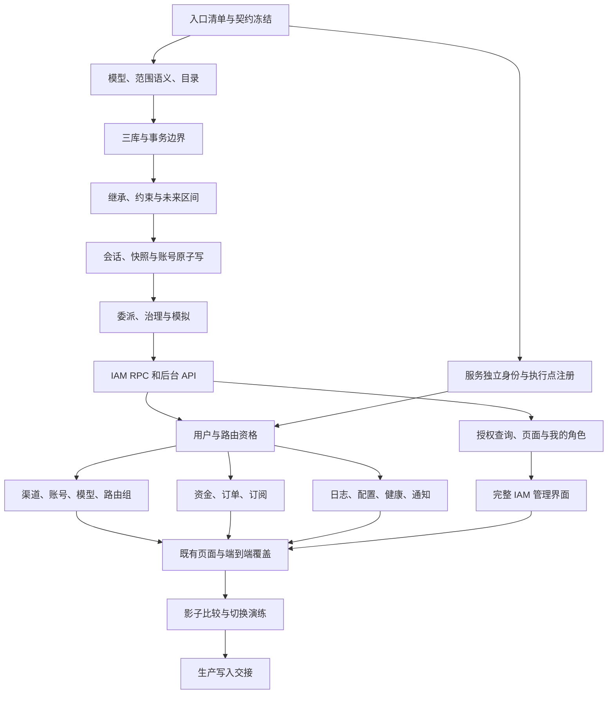

# RBAC 权限管理实施方案

> 日期：2026-09-30
> 状态：P0、A1–A6 已完成；B0–B4 进行中，C1–D1 尚未开始。A2–A6 交付及三库/API 验证证据见第 9.2–9.6 节；B 阶段两批实现与未完成门槛见第 9.7–9.8 节。
> 依据：[完整 RBAC 权限管理设计](./rbac-permission-management.md)。本文件细化实现顺序，不改变其授权语义。
> 规划调查基线：`bf0c7de2`；首批交付复核基线：`951f1686`，工作分支 `codex/rbac-first-delivery`。本批验证记录见第 9 节；2026-10-01 已更新全部生产服务并保持 legacy，见 [生产更新记录](./rbac/a3-legacy-production-deployment.md)，未切换生产授权事实源。

## 1. 交付边界与实施选择

本次完整交付平台 RBAC：目录、角色生命周期、多角色分配、继承、会话激活、操作与数据范围、字段权限、SSD/DSD 与基数、三类委派、解释/模拟、菜单管理、持久化审计和迁移工具。组织仅落实 context、域内约束、按域会话及 RPC/快照契约；组织实体、部门与业务归属在后续按主设计第 12 节交付，当前组织请求拒绝。

采用 Go 固定规则评估与数据所有者的 SQL 过滤；复用 GORM、`pkg/jsonx`、`xdb.RetryTxOnBusy`、现有审计和 React Query/UI。第一版主库权威读取，请求内复用快照；不增加 Casbin、表达式语言、Redis 权限缓存、新 IAM 微服务或通用策略平台。

分阶段开发不等于分阶段开放自定义授权。生产在 A/B/C 阶段保持 `authorization_mode=legacy`，IAM 普通管理写关闭；功能只在隔离验收环境运行 IAM 模式。所有入口、范围和字段规则完成后，才执行 D 阶段交接并开放生产管理。

## 2. 已核对的代码事实

| 当前落点 | 规划含义 |
|---|---|
| `app/identity/internal/biz/auth.go`：`Role`、`IsAdmin/IsRoot`、`SetRole`、JWT 与账号写用例 | JWT 继续认证身份；数值角色仅在 legacy 模式判权，IAM 模式停止以此授权 |
| `app/identity/internal/data/data.go`：共用 Repository；`updateUserDB` 写回 role、邮箱、密码、状态等字段 | 普通资料更新必须改为明确字段写；不能保留一个可绕过 IAM 治理的整行更新入口 |
| `app/identity/internal/biz/bootstrap.go`：bootstrap 直接 `repo.CreateUser`；注册/后台创建/OAuth 另有调用链 | 默认分配落在共用事务入口，不能只改 Register 或单个 service handler |
| `cmd/admin-reset/main.go`：直接 SQL 更新 password_hash/role 或创建 root | CLI 提前识别 cutover/mode；IAM 模式禁止直接 SQL 改角色/凭证，凭证恢复走受保护救援用例 |
| `app/billing/internal/data/account_repo.go`：写 users 的余额/消费字段 | 屏障必须区分身份授权字段写与财务写，明确凭证隔离或暂停结算方案，不能盲目收回所有 users 写权限 |
| `app/identity/internal/data/routing.go`：用户创建/更新已有路由事务；`routing_access.go`：CAS、outbox 与忙重试 | 账号、默认角色、路由事实和成功审计必须复用同一事务，避免嵌套路径分别提交 |
| `domain/subscription/biz/tx.go`、`domain/subscription/data/tx.go` | 沿用 biz 声明事务接口、data 持有实际事务的惯例，不把 GORM 传到 biz |
| `app/identity/internal/server/grpc.go` 与 service：服务凭证和操作者凭证已有转发链 | 将用户操作双重认证扩展至全部管理 RPC；客户端 actor ID 不作为身份依据 |
| `app/admin/internal/server/http.go`、`service/admin.go` | 改造粗粒度 guard 和直接 RPC 路径；新增 IAM 通过 biz 用例与 data RPC 适配器接入 |
| `app/admin/cmd/admin/admin_helpers.go` 的 `newGRPCServer` | 实际启动链另有 gRPC 构造；不能只修改 `internal/server/grpc.go` 后声称覆盖 admin RPC |
| 各业务服务的 `internal/server/http.go`、`grpc.go` | 直接 HTTP、兼容别名和内部 RPC 与 admin 代理同样纳入覆盖，不能假定代理是唯一入口 |
| `platform/database/testutil/scratch.go`、迁移 ownership/dialect manifest | 复用隔离三库测试与迁移治理；不得用生产 DSN 跑验收 |
| `web/src/lib/admin-access.ts`、`account-queries.ts`、`components/AdminRoute.tsx` | 角色等级和五分钟 user-self 缓存不能承担 IAM 授权；新增独立 authorization 查询 |

这些是本机源码检查结果；生产实例、真实账号、服务凭证和部署能力清单留到 D 阶段核验。

## 3. 依赖与工作包

保持主设计 A–D 门槛，先完成授权基础，再按资源闭合执行链，最后交付管理界面与切换。



B2/B3/B4 可以在契约稳定后独立推进；C 阶段可并行开发，但不提前开放生产 IAM 写。每个资源工作包必须同时包含 HTTP/RPC、biz、data、DTO 与对应前端/测试，不能把数据库范围过滤留到统一收尾。

| 工作包 | 交付内容 | 完成门槛 |
|---|---|---|
| P0（首批完成） | 实际入口、用户写入者、业务操作与调用主体清单；旧权限矩阵 | [入口矩阵](./rbac/entry-matrix.csv) 与 [写入者/旧权限](./rbac/account-writers.md)；源码漂移和未知 code 检查通过，执行链接入属于 B 阶段 |
| A1（首批完成） | 固定 DO/DTO、scope 语义、目录与 context 校验 | allow 覆盖与 deny 命中分离；来源不串联；组织拒绝；可执行语义测试通过，目录全部 unbound |
| A2（存储基础完成） | IAM 表、用户版本、事务接口、三库迁移、持久化审计 | 锁/CAS/审计原子；SQLite 忙重试；失败无部分提交；三库约束和重复迁移通过 |
| A3（约束子流程完成） | DAG、SSD/DSD、成员/分配/激活上限、未来区间预检 | 含继承、去重、半开区间和未来窗口；变更导致现存冲突时拒绝并给清单 |
| A4（会话/账号原子写完成） | JWT 验证结果、JTI 会话、按域激活、一致快照、统一账号写与救援 CLI 限制 | 新安装 root、注册、邀请、OAuth、后台创建的默认角色原子；旧会话可迁入 platform；并发 bootstrap 只建一个 root |
| A5（治理完成） | 三类委派、角色治理、预检/模拟、凭证接管保护 | 授权上限、受影响成员、自我扩权、未来 authority、创建来源及撤销 deny 全覆盖 |
| A6（API 完成） | 主设计第 7 节 IAM RPC、admin API、本人会话 API | 用户/服务双验证，范围过滤，reason/CAS，401/403/409，完整管理 API 可在隔离环境验证 |
| B0 | 服务专属身份、full-method allowlist、固定入口绑定 | 共享 SERVICE_TOKEN 或伪造服务名不能获得系统 capability；新增未分类入口检查失败 |
| B1 | 用户 CRUD、角色、凭证、自助、订单本人路径、路由授权 | 邮箱清空/替换、group、创建和兼容别名无旁路；原子写与 root 保护 |
| B2 | channel/账号/OAuth/模型/路由/健康查询 | 范围覆盖列表、total、详情、批量、导出、写；敏感字段隔离；relay 凭证路径正确 |
| B3 | billing/共享 subscription 管理执行链 | 资金/订单/账本/成本/订阅范围一致；复合模型价格权限；系统任务 capability 独立 |
| B4 | log/config/monitor/notify/system/content | 直接 HTTP/RPC、统计与内容字段、配置键分类、通知动作均有明确绑定 |
| C1 | authorization 查询、导航/页面判断、我的会话角色 | 缺省首页、角色选择、403 刷新和查询 gate；不再按 localStorage role 推断权限 |
| C2 | 目录、角色、授权矩阵、继承、用户分配、委派、约束、菜单、解释/模拟、审计查询/导出界面 | 树/矩阵一致；来源、deny、范围、差异与冲突可见；仅能管理委派覆盖对象 |
| C3 | 既有页面改造与真实入口端到端矩阵 | 按钮、查询、字段、导出、附属轮询与后端拒绝一致；完整角色场景通过 |
| D0 | 候选迁移、shadow、全量对账工具、停写/恢复演练 | 故障后停写、状态幂等恢复、未知 role 阻断、未活跃用户对账均验证 |
| D1 | 经部署授权执行生产交接 | blocked → verified/iam → complete；旧写者退出、全部执行链启用后恢复新写 |

P0 必须补齐以下主设计目录与现有 handler 的差异，作为实施契约一起评审；原设计尚未列出的执行点不隐式套用近似权限：

| 差异 | 本方案的具体落地 |
|---|---|
| 经营分析只有本地导出，无独立报表导出 code | 新增 `billing.report.export`，后端 `GET /api/v1/admin/reports/cost:export`；叠加所选财务/资源字段读取权限，范围在各源聚合前过滤，不能只在浏览器检查 |
| 服务 HealthCheck 与 channel/model health 不是同一资源 | 新增 `monitor.health.service.read`，绑定 List/GetLatestHealthCheck；SaveHealthCheck 明确为采集系统 capability，不向普通用户开放 |
| AlertRule 已有 CRUD，目录缺相应操作 | 新增 `monitor.alert_rule.list/read/create/update/delete`，分别对应已有 handler；`notify.notification.rules.update` 不替代整个告警规则 CRUD |
| 通知发送 status 不等于用户确认/已读 | CreateNotification/UpdateNotificationStatus 属经核实系统 capability；acknowledge/test 及无实际规则 handler 的 code 保持 draft/unbound，不靠篡改发送状态实现确认 |
| `iam.audit.export` 已列目录但 API 表只有查询 | 补 `ExportAuthorizationAuditEvents` 与 `GET /api/v1/admin/iam/audit-events:export`；管理范围过滤、敏感信息脱敏与导出权限独立验收 |

这些补齐项已进入首批固定 registry，仍全部 unbound；只有真实执行点和支持范围完成测试后才 bound，权限目录草稿不能扩大后端能力。源码复核另补入 model_alias、model_usage、usage_semantic_block 和 selection_event 的精确操作，见第 9 节交付记录。

## 4. 模型、算法与事务落地

### 4.1 模型与文件落点

| 位置 | 新增或调整职责 |
|---|---|
| `domain/authorization/` | 共享纯模型：Operation、Context、Actor、Scope、GrantSource、ObjectFacts、Decision、Versions；必要的固定范围运算；无客户端、仓储、JWT secret 或缓存 |
| `api/common/v1/authorization.proto` | 跨服务 context、范围、版本及对象事实 DTO；不包含 SQL/执行表达式 |
| `api/identity/v1/iam.proto`、`identity.proto`、`error_reason.proto` | IAM 请求/响应与 RPC；敏感写 reason、expected_revision，预检 base_policy_revision 和内容摘要 |
| `app/identity/internal/biz/iam*.go` | IAM DO、Repo/事务接口、用例、固定授权评估、图/区间/委派治理；资源规模确有需要时再分文件 |
| `app/identity/internal/data/iam*.go` | PO、转换、主库快照、引用校验、锁/CAS、审计追加、批量原子提交；构造返回 biz 接口 |
| `app/identity/internal/service/` | 按目录/角色/分配/会话/治理等资源拆适配文件；校验 DTO、过滤/排序/分页/update_mask，返回 DO 对应 DTO |
| `app/admin/internal/biz/iam.go`、`data/iam/`、`service/iam*.go` | 管理聚合用例、identity RPC 适配及 DTO 边界；不导入 identity internal 包或写其表 |
| 各数据所有者的 biz/data/service | QueryScope DO、范围 SQL 编译、权威对象事实、字段脱敏、写入前复验 |
| `platform/` 认证/中间件与各 server | 传输认证、绑定注册、请求内快照复用；不持有 GORM 或负责业务规则 |
| `migrations/`、`postgres/`、`sqlite/`、`ownership.yaml` | 按下一空闲序号分组迁移，全部 IAM 表属 identity；三库镜像、索引/同域约束及初始化 policy 行 |
| `app/*/cmd/*/wire.go` | 共用客户端与事务依赖的唯一 wiring；生成文件通过 make 生成 |

identity 的现有连接通过最小 `Data` 共享，旧 Repository 与新 IAM Repo 不另建连接池；只调整支撑新事务链的构造和调用，不展开无关服务的大规模重构。admin 新链路把 RPC 客户端放在 data，不能继续把治理规则堆入 service。

### 4.2 授权计算

先冻结固定范围描述：有限子句并集，每个子句只包含该操作支持的固定条件；来源路径保留 assignment、role、继承路径、角色范围和分配边界。求交保留各维条件，不能先分别并集再拼接。解析/包含关系无法判定的描述拒绝，禁止把未知条件当作 all。

每次决策按主设计顺序计算：身份/用户状态、已绑定且启用的操作、context 与会话、约束、active allow、全部有效分配来源的强制 deny、对象事实与领域不变量。root 显式保护，不能跳过未注册操作、用户状态或业务不变量；内置权限按目录 revision 明确枚举，新增权限经显式发布更新，不能隐式授予普通历史角色。

读取组范围命中任一允许组即可；整体写必须覆盖全部受影响组；任一 deny 命中即拒绝。对象 ID/all 来源仍受该路径边界限制。创建检查目标归属，归属修改检查前后事实，空归属不默认通过。SQL 和单对象评估使用同一组反例测试验证一致性。

目录 registry 固定声明 operation、owner、支持范围/context、protected、字段/复合要求与执行点。目录元数据 API 不能扩大这些声明。组织操作只入 draft/unbound；实际 handler 不存在的操作不宣称 bound。菜单绑定使用已注册 route_key/icon_key 白名单，不创造后端权限。

### 4.3 事务与一致性

用 identity biz 声明事务接口，data 实现；借鉴现有 TxRunner，不依赖 subscription 的事务所有权。biz 在事务回调内读取权威操作者与关系并计算治理规则，data 完成存储引用、CAS 和提交。数据驱动类型留在 data。

统一顺序：锁 policy 行 → 读取 mode/cutover 状态及权威用户/会话/策略 → 读取受影响关系 → 验证操作、委派、图/未来区间、业务保护与 expected_revision → 写关系/账号/版本 → 成功审计 → 提交。相关行锁按稳定顺序取得；MySQL/PostgreSQL 使用锁定读取，SQLite 先取得可序列化写入的 policy 行写锁，再读决策事实，忙冲突重试整个事务。

只读授权快照使用主库一致事务视图：MySQL/PostgreSQL 显式 repeatable-read，SQLite 使用同一读事务；用户状态、分配、策略、session/context 和版本同视图读取，不以 PostgreSQL 默认 READ COMMITTED 的多次查询拼接授权。JWT 共用解析返回认证 Session DO，保留真实非空 JTI、expiry 与 pwd epoch，再在该视图复核用户/会话状态；user_id 不能替代 session key。

事务内完成默认角色、账号状态/凭证、password epoch/会话撤销，以及旧 group 变动涉及的默认组、grant、版本与现有 routing outbox。将相关 repo 方法改为可加入调用方事务；不在事务外先授权，再启动一个只保存结果的事务。

重试回调只包含本事务数据库操作与纯计算，不调用 channel 等远端 RPC、发送邮件、输出密码或输出成功日志。跨服务引用预检在事务外取得所有者核实的 ID/归属/版本事实；引用必须在实际执行时由所有者重验，不将远端预检与 IAM 提交称作原子。回调重试重新读本地权威事实，返回值只采用最终成功 attempt。提交后才输出成功结构化日志，采用同一 event_id。失败审计在回滚后独立追加，审计写失败可观测且请求仍拒绝；依赖不可用不得放行。

迁移先幂等初始化 policy 单例与内置目录/角色。新安装初始状态明确为 legacy/idle；空库 bootstrap 属受保护初始化，在 policy 锁内重新 CountUsers，同事务建立 root 账号、候选 root 分配、版本与审计。IAM/complete 时使用权威分配；blocked/verified 不执行自动 bootstrap。不能通过“users 为空”自动改事实源。完整新安装同样经能力验证后进入 IAM。测试两个 identity 同时启动、失败回滚无半个账号；OAuth 新建的用户、默认角色、OAuth 身份绑定也合入同一事务，已有用户登录不重置角色。

约束检查收集从事务时刻起相关分配/委派/会话的未来起止边界，按 `[starts_at, expires_at)` 检查每个区间；相等边界先结束再开始，无限期单独表达。用户/角色按实际闭包去重；图/角色启用和约束修改也验证既有会话剩余区间。模拟复用相同评估逻辑，提交重新读取和检查版本；preview_token 不作为授权凭证。

写锁采用单 policy 行，代码留下 `ponytail:` 注释说明管理写吞吐上限；只有实际管理写竞争成为瓶颈后才按域拆锁。授权快照包含用户、policy/catalog、session/session-context 版本和最早失效时间；不依赖 TTL 或清理任务使到期/撤销生效。

## 5. 服务边界与资源执行覆盖

### 5.1 服务身份

B0 首选服务专属凭证与 full-method capability allowlist，复用现有凭证注入/校验方式；不新增身份提供服务。每个 caller 只能证明自己的服务身份，不能持有可自签其他服务身份的共享签名能力。共享 SERVICE_TOKEN 只可承担兼容认证，不能获得按服务区分的豁免。

用户管理 RPC 同时校验调用服务身份和 `x-operator-authorization`；身份来自验证结果，覆盖请求 operator_id/actor/header。系统 RPC 显式列出 relay/worker capability，没有用户凭证也不能进入普通用户管理路径。兼容期身份入口的授权能力必须可核验，切换前退出只支持共享凭证的旧豁免路径。

ADMIN_TOKEN 是独立救援主体，增加明确救援开关与操作 allowlist、reason 和审计；普通 IAM API 不能修改救援配置。救援仍受 protected 规则和领域不变量约束；不能变为常规后台认证兜底。

### 5.2 入口注册与 CI

P0 生成可审查矩阵：服务、HTTP method/path 或 gRPC full method、真实 handler、public/self/admin/system 分类、操作组合、字段条件、支持范围、对象事实来源、所有者、测试。GET 测试/刷新余额按实际动作绑定；不得通过 HTTP method 推断 read。

受保护 HTTP 注册与授权 wrapper 同处声明，gRPC 按完整方法声明策略；测试枚举服务注册表、HTTP 路由元数据，检查漏绑、未知操作、未声明 scope/context 和公开分类。复合 handler 另有分支测试，防止“绑定了一个 read”掩盖写分支。未知 API 不因 SPA fallback 获得公开处理。

### 5.3 按资源闭合的实施清单

| 资源切片 | 必改执行边界 | 验收要点 |
|---|---|---|
| 用户与角色 | identity/admin 用户别名、`SetUserRole`、通用更新、bootstrap/注册/邀请/OAuth、旧 promote/demote | 身份来源不可伪造；普通 update 不改敏感字段；IAM 模式旧 role 写永久拒绝；全部创建默认分配原子 |
| 邮箱/登录凭证 | 明确字段存在性与 update_mask；email_binding/credential 权限与 user_credentials 委派 | 设置、替换、显式清空/解绑同规则；目标有效/未来全部业务能力与 IAM authority 检查；root/本人保护；合法接管撤销旧会话 |
| 用户路由资格 | admin `routing_access` 与旧 group 编辑、identity routing 事务 | 原/目标用户和组范围；default/grant/revoke 实际差异分别授权；失败无默认组/grant/版本部分修改 |
| 渠道/订阅账号/OAuth | admin 与 channel HTTP/gRPC、后台 DTO、测试/余额/重置/恢复/credential/OAuth | 直接 OAuth 路由不能绕过代理；secret.read/rotate 独立；保留 relay 内部凭证读取 capability |
| 模型/映射/路由/路由组 | batch/import/export/merge、canonical preflight、来源映射、成员/override、旧 `/api/group` | import/export 价格组合权限；preflight 的价格引用也要求财务读权限；共享资源整体覆盖；归属变更检查前后；全量替换不支持受限主体 |
| 财务/订单/订阅 | admin、billing 与共享 subscription biz/data、identity 本人订单入口 | 管理与本人所有权路径独立；余额/退款/成本/账本/报告权限分开；root-only 交换不误授予 platform_admin |
| 日志 | admin/log 直接入口、列表/total/聚合/导出/删除/清理、详情内容、billing ledger/request-attempt 明细 | SQL 查询前施加相同 allow/deny；附属资金/选择审计各有权限；content.read 独立；本人接口不转成跨用户 read |
| 系统配置/内容 | admin/config 的直接 HTTP/RPC、option 键分类与公开内容 GET | security/payment/pricing 写叠加权限；敏感读字段独立处理；不能通过配置服务旁路普通后台检查 |
| 健康/告警/通知 | monitor/notify 直接 HTTP/RPC、摘要/详情/规则/测试/ack | 人工管理动作与 worker/外部回调分离；实际领域能力先绑定，目录不足时补精确操作并评审，不笼统授予 system.option.update |
| 总览和聚合 | `service/summary.go`、`server/routing_ops.go`、跨服务数据与经营字段 | 创建 task/发 RPC 前按 section 授权；缺权显示受限，不吞成 unavailable/0；Top-N/global totals 同范围，不能过滤的 Prometheus/global 指标只对全局主体开放 |

查询范围 DO 由业务所有者接收并编译为 SQL；列表、total、统计、导出、自动补全同谓词。旧 RPC 无法表达范围时拒绝受限请求，直到它完成改造。不能全量查询后在 admin/browser 内存中过滤，也不能仅透传前端 scope 当作验证结果。

高风险写在所有者提交边界重新取得权威决策并记录版本；对象归属在事务内重读，使用行锁/CAS 防止检查与写入之间改变对象事实。撤销保证提交后开始的新授权决策使用新策略；跨库仍有已通过检查的在途窗口，不声称做到撤销与资金提交全局串行。

具体顺序为每次资源事务尝试外读取 identity 新决策，事务内重读对象归属/版本、核实与决策事实一致再写；SQLite 忙冲突回到外层重新取得决策后再尝试，不在可 replay 的事务回调中发 identity RPC。身份决策或对象事实不再有效则拒绝。

批量 IAM 在 identity 单事务全成或全拒；业务 bulk 在该所有者事务内执行。跨服务复合动作先全部预检再执行，但不能将两个数据库的先后提交称作原子：已有幂等/补偿流程沿用，确需整批原子且没有实现的接口在完成相应协议前不发布。

## 6. 前端与完整管理产品

新增共用 authorization query/options 与 `can/canAll/canAny`，使用服务端的权限存在性摘要、permitted_actions 和脱敏 DTO；浏览器不执行对象 scope 或委派计算。查询 key 从第一版含 context_key、会话身份与授权版本 generation；权限状态未知时不发受保护请求。角色激活、授权快照 revision 变化、最早失效时间到达、403、登出或切换账号时，先暂停受保护查询、取消在途请求并清除旧 generation 数据，再取得新快照重取；不能只 invalidate 后继续显示更宽授权的旧缓存。authorization 查询本身失败进入拒绝/重新认证终止状态，避免递归刷新。

| 改造位置/页面 | 必须结果 |
|---|---|
| `AdminRoute`、`AppNavigation`、默认首页、`admin-access.ts` | console.enter 与页面权限独立；没有总览权进入首个可访问页面；legacy 展示分支只在 legacy 模式启用 |
| `UsersPage` 与用户编辑/详情 | 提升/降级改为多角色分配；期限、边界、来源、批量预检可见；邮箱/状态/group 与普通资料动作分开 |
| 现有渠道、模型、路由、财务、订阅、日志、设置页 | 查询、字段、按钮分别绑定；详情用 permitted_actions；附属弹窗和自动补全同样受控 |
| 通知面板/导航计数/健康轮询 | pending-count 等背景请求按权限设置 enabled，无权限不轮询；不只隐藏面板 |
| `components/admin/ExportButton.tsx`、经营分析页及后端 export | 现有组件无后端拒绝后的 fallback；CostAnalysisPage 本地 rows 导出改为受保护的后端汇总导出，复用范围查询，精确财务导出 operation 在 P0 补入目录、执行点完成后才 bound；不能仅凭 read 权导出 |
| 权限目录与菜单管理 | 草稿/未绑定/保护项、引用与发布影响可见；菜单 route/icon 只用白名单 |
| 角色列表/详情/复制/生命周期 | 草稿默认、revision、引用、成员、启停/归档预检；复制不复制成员/会话/委派 authority |
| 权限树、资源×操作矩阵、继承页 | 直接/继承/deny/未授权、scope 与来源分开；图无环，取消继承必须操作来源或明确 deny |
| 分配、委派与 SSD/DSD 页 | 三种 target_kind、创建来源、ceiling/期限、未来冲突和影响清单；服务端预检后按同版提交 |
| 有效权限、解释/模拟、审计 | 用户/对象/管理范围限制，来源/路径/deny/原因/版本、修改前后差异；无查询权限不能探测隐藏目标 |
| 我的会话角色 | DSD 冲突时先选择角色，不能进入普通业务；只能激活本人已授权角色，选择后刷新全部相关查询 |
| API 拦截器与受保护查询缓存 | 401 按登录失效处理；403 停止重试、cancel/remove 已受限的缓存并刷新 authorization，保留有效会话；409 显示版本冲突并要求重新预检 |

IAM 新 DTO 与前端 ID 使用 int64 字符串；不为此次规划展开全站旧 ID 类型重构。沿用现有 i18n、UI、Vitest 与 Playwright；组织入口暂不展示，组织请求在服务器拒绝。

## 7. 迁移与上线交接

计划提供 `app/identity/cmd/iam-migrate` 单一迁移工具：只读清点/候选报告、候选 apply、shadow 对账、最终 rebuild/verify、状态推进和恢复。模式以显式子命令区分；候选写只能发生在 legacy/idle 且由迁移身份执行。普通 IAM API 不能切换 mode/cutover_state。

候选归属及 batch 必须可辨认，避免最终重建误删受限委派等非候选关系。在主设计逻辑表基础上，`iam_user_roles` 增加固定 `origin=legacy_candidate/default/bootstrap/explicit` 与 `migration_batch_id`，仅迁移/分配用例按规则写入；legacy 的候选根分配也标为 legacy_candidate，最终重建只操作该类关系，不靠 created_by/用户名猜测。`0/1/10/100` 按实际 users.role 映射 guest/member/platform_admin/root，未知值阻断。

必要的受限委派先在隔离环境预检并生成 root 核准 manifest；D 的 blocked 阶段由唯一迁移工具导入，事务内重新验证目标、上限、期限、身份和保护规则并审计，verified 前纳入全量核验与日常管理流程验证。生产普通 IAM API 不提前开放；非候选来源不代表失效/越界关系可以无条件保留。

旧平台管理员按实际旧操作矩阵明确枚举；member/guest 自助行为保留。认证邮箱接管与路由授予属设计指定的安全收紧，报告区分预期收紧与异常差异；不为消除 shadow 差异自动授予凭证接管或额外业务权限。

| 阶段状态 | 可做/不可做 | 恢复规则 |
|---|---|---|
| legacy/idle | legacy 为事实源；生产普通 IAM 写关闭；允许候选迁移与 shadow | 候选可重建，不按候选对用户放权 |
| legacy/blocked | 在全入口外部屏障、旧写实例/任务停止、在途排空、旧 DB 写通道撤销后持久化 blocked/batch；仅迁移写 | 失败保持停写，按 batch 继续完整重建，不能仅补缺行 |
| iam/verified | 全用户最终对账通过后，同事务记录 verified/验证时间与 iam；普通写仍关闭 | 只继续 IAM 验证，不再按旧 role 回填，不恢复旧写进程 |
| iam/complete | 全部相关实例执行覆盖能力核验、前端启用后记录 complete；恢复新账号写与 IAM 管理 | 后续回滚只能用识别 IAM 和切换状态的兼容版本 |

最终重建核对所有用户，包括候选后新增/降级/删除与无请求用户；清理删除账号的候选关系和会话引用，保留不可改写的审计。旧 JWT 按已验证真实 JTI 惰性建立会话，不按 JWT role 分配。IAM 正式写开启后旧回填永久拒绝。

停写范围覆盖注册、邀请、OAuth 新建、后台/本人资料、密码/邮箱/注销、账号启停/删除、旧角色写、bootstrap、CLI/任务/脚本及可能写 users 的跨服务路径。迁移工具拥有独立写通道；新实例在 blocked/verified 启动时不得通过 bootstrap 自动写入。仅切一个配置开关无法阻止旧二进制，必须记录旧进程和 DB 通道退出证据。

`cmd/admin-reset` 在 IAM 或非 idle 状态拒绝旧 SQL 写；IAM 的密码恢复使用带开关/独立身份/版本/审计的服务端救援路径，不能附带 role 数值改写。D0 实际演练 billing 的 users 写通道：支持列级权限时将财务列限定给专属凭证；SQLite/共享凭证无法隔离时明确暂停相关结算/消费写、排空并在恢复后重放现有幂等任务。两种方式都必须证明旧进程不能更改身份授权字段或复活用户，且不会默默丢失财务写。

需提前准备兼容 IAM 的回滚版本；彻底回旧模型必须重新停写、人工审查映射并做反向全量对账，不能把受限后台角色投影 role=10 后交给旧 guard。生产执行时服务镜像本机交叉构建 linux/amd64 并运输，前端单独发布 web/dist；不得在服务器构建，也不得将 admin 镜像发布视为前端更新。

## 8. 验收与提交拆分

每个工作包提交包括实现、对应语义/边界测试及必要生成物；按依赖拆 PR，复杂资源包可拆更小的垂直提交。一个工作包合并不表示该阶段上线门槛通过。提交遵守 Conventional Commits 与根因/影响正文；实现时新建 `codex/` 前缀工作分支，本文不创建分支、提交、PR 或 release。

| 检查层 | 必留检查 |
|---|---|
| 纯评估 | 多来源边界不拼接、active allow 与强制 deny、共享组读/写、空/非法范围、图/SSD/DSD/未来时间及禁用 deny 扩权 |
| 治理 | 自我扩权、三类委派不能互换、创建来源原子、间接继承扩权、未来 authority 账号接管、root、委派失效后业务授权保留 |
| 三库存储 | context/唯一引用/CAS、并发及未来上限、无限与相邻区间、事务回滚、审计原子、SQLite 忙重试、重复迁移无变化 |
| HTTP/gRPC | 所有别名/分支/直接服务入口、SERVICE_TOKEN 与 operator 双验、伪造 caller/actor 失败、系统/public/self 分类、未绑定拒绝 |
| 查询与字段 | 详情/列表/total/统计/导出/自动补全同范围；邮箱显式清空、group/认证字段保护、秘钥/资金/内容不泄漏 |
| 撤销 | role/permission/graph/assignment/session 变更后新决策生效；到期无定时任务仍生效；身份无效阻断所有角色 |
| 前端 | 页面/查询/按钮/字段独立、背景轮询 gate、导出403无回退、无总览首页、树/矩阵、预检/409、403 不注销 |
| 迁移 | 候选后新增/降级/删除和无请求用户；全部旧写退出；故障注入各状态；重试幂等；verified 后不旧回填；默认分配/OAuth/root/旧session |
| 完整角色端到端 | 主设计第 11 节 alice/bob、财务只读、审计只读、渠道共享组与密钥、自助用户；必须经过实际后端入口 |
| 组织预留 | context 合法组合、域内唯一/同域引用；未启用 organization 请求拒绝；迁移不建组织、不从 group 推断归属 |

每包先跑修改层的 Go/Vitest 测试；涉及并发执行定向 race 和本机隔离三库测试。阶段合并执行：

```sh
make all
make wire-check
./scripts/check-architecture.sh
make migration-check
make verify
```

有迁移的阶段另跑三库实际 fresh/repeat/negative 验证；配置本机临时 DSN，记录未执行/跳过的驱动，不能计作通过。C3/D0 跑 RBAC 专项 Playwright/跨服务集成矩阵及切换故障注入。生成后的 pb/wire/OpenAPI/前端类型一致性需核验，禁止手改生成文件；不以镜像构建代替授权测试。

主设计第 10.3 节六组强制回归作为固定阻断项：认证邮箱接管、旧 group 旁路、多组 allow/deny、回填交接、受限角色创建、未来基数约束，任何一组未通过不得进入 D1。

## 9. 开始实现前的第一批交付

优先完成 P0 和 A1，再进入 A2；首批可以审查的结果固定为：

- [x] 全部 HTTP/RPC/账号写入矩阵，包含 caller 分类、实际权限组合、字段和数据所有者。
- [x] Scope/Context/Decision/版本 DTO 与 DO，固定目录 registry、protected 规则、错误 reason 契约。
- [x] shared-group、多来源边界、deny、继承/未来有效区间的可运行反例；组织未启用拒绝检查。
- [x] 事务接口、迁移归属标记、锁顺序与 mode/cutover 状态校验契约。

首批不开放自定义角色，也不部署生产。A2–C3 完成后才能提交带完整验收证据的 D0/D1 切换执行方案。

### 9.1 首批结果（2026-09-30）

完整交付索引与可复验命令：[首批交付记录](./rbac/first-delivery.md)。本批没有新增运行时授权入口、IAM 数据库表、生产配置或 frontend IAM 功能；现有服务继续 legacy。

| 结果 | 落点与事实 |
|---|---|
| P0 注册清单 | `rbac/entry-matrix.csv`：254 个 HTTP 注册、178 个完整 RPC、10 处 gRPC 注册，以及 134 个相关源码摘要。包含 admin cmd 实际 gRPC 构造、直接服务、动态 OAuth 别名、代理与 alternate relay 构造 |
| 账号写与旧权 | `rbac/account-writers.md`：注册/邀请/OAuth/bootstrap/后台/自助/凭证/role/group/CLI/回填及 billing 财务 SQL；旧 0/1/10/100、ADMIN_TOKEN、SERVICE_TOKEN 的差异与保护边界 |
| 纯模型/范围/目录 | `domain/authorization`；逐来源有限子句求交、读取任一组、整体写覆盖所有组、mandatory deny 不受激活/allow boundary 缩小、默认拒绝、未来边界失效；registry 均为 unbound，普通元数据不扩展 scope/context，root/core protected |
| DTO/错误 | `api/common/v1/authorization.proto`；identity/admin error_reason；identity biz typed errors；proto JSON int64/uint64 字符串回归。通过 make 生成，沿用仓库忽略 pb/OpenAPI 生成文件的规则 |
| 继承/未来反例 | identity biz `IAMSources` 保留独立继承路径，disabled 节点切断、循环/跨域/未知节点拒绝；`IAMMemberLimit` 验证未来重叠、去重、相邻及无限区间。此为 A1 参考算法，不代表 A3 SSD/DSD/全部约束已实现 |
| 事务与状态 | identity biz `IAMTx/IAMTxRunner`；`rbac/transaction-contract.md` 冻结锁/CAS/审计与跨服务边界；可执行 CheckWrite/ValidateOrigin 校验合法状态及候选 batch 归属，data runner 与三库迁移留到 A2 |
| 检查 | 首批定向 Go/race、make all、make wire-check、make verify 已通过；verify 包含格式、unit/race、架构、迁移治理、生成类型以及前端 lint/test/build。无 DDL，未执行三库 fresh/repeat/negative 或跨服务 IAM/Playwright/切换演练，不能计入 A2–D 验收 |

首批交付后的 A2/A3/A4 已完成，见第 9.2/9.3/9.4 节；A5/A6 也已完成，见第 9.5/9.6 节。矩阵 test_contract 列是后续执行链测试义务，不能据此声称当前所有 HTTP/RPC 已执行 IAM 权限校验。

### 9.2 A2 存储基础结果（2026-09-30）

完整实现边界、可复验命令及逐项证据：[A2 存储基础交付记录](./rbac/a2-storage-delivery.md)。工作分支 `codex/rbac-a2-storage`，基线 `22d7cbed`。

- [x] 全部 IAM 表、用户授权版本、identity ownership 与 MySQL/PostgreSQL/SQLite 110 迁移。
- [x] policy/catalog revision 1、legacy/idle 初始化；固定目录与内置角色种子，操作全部 draft/unbound，无生产分配或模式切换。
- [x] 共享 Data、DO/PO 转换、policy 写锁、版本 CAS、repeatable-read 快照和 SQLite 忙重试。
- [x] 成功审计原子提交，缺失/失败审计回滚；失败事件在回滚后独立追加，错误可观测。
- [x] 账号/OAuth/routing 与默认分配共用事务的存储适配及回滚/初始化竞争验收；运行时统一账号与真实 bootstrap 接入仍属 A4。
- [x] 三库实际 fresh/repeat/negative、引用约束、并发 CAS、快照一致性与定向 race；make all/wire-check/架构/migration-check/rbac-contract-check/verify。

A2 后续的 A3 已完成，见第 9.3 节。当前没有新增 IAM API、前端入口或生产部署；legacy 授权继续运行。

### 9.3 A3 图、职责分离与未来基数结果（2026-09-30）

完整计数语义、可信授权边界及可复验命令：[A3 约束交付记录](./rbac/a3-constraints-delivery.md)。工作分支 `codex/rbac-a3-constraints`，基线 `5691af25`。

- [x] 全 DAG 校验、启用闭包、继承/多来源去重，禁用节点仍检查图结构。
- [x] SSD、单会话 DSD、角色有效成员、用户授权闭包和会话激活闭包上限；111 三库 nullable 正上限迁移。
- [x] 当前及所有未来半开区间预检，含相邻/无限、延期/恢复、graph/启停/约束改变对现存会话剩余窗口的影响；冲突给出角色/用户/session 与起止清单。
- [x] 整批最终状态预检、policy/目标 revision CAS、原子写与成功审计、回滚后独立失败审计；共用分配写同时递增 user/policy。
- [x] 强制 iam/complete 和可信 authorizer，缺失实现即拒绝；当前没有运行时绑定或新增管理入口，身份/委派与管理范围检查由 A4/A5 实现。
- [x] 纯语义与 fake repo 用例测试、三库实际 fresh/repeat/negative/并发预约/回滚/会话约束、定向 race 与全仓检查。

A3 后续的 A4 已完成，见第 9.4 节。A3/A4 完成不表示所有运行入口已执行 IAM，也不构成生产管理开放条件。


### 9.4 A4 会话、快照与账号原子写结果（2026-10-01）

实现边界、兼容性收紧与可复验命令：[A4 会话/账号交付记录](./rbac/a4-sessions-accounts-delivery.md)。工作分支 `codex/rbac-a4-sessions-accounts`，基线 `d7427dff`。

- [x] 共用 JWT 验证 Actor DO，真实 JTI、expiry、pwd epoch；缺失/过期/错误算法或身份拒绝，JWT role 不作 IAM 授权。
- [x] platform 惰性会话、按域激活/选择、DSD 与未来约束、本人 CAS/撤销；既有撤销不复活，组织请求拒绝。
- [x] 主库一致授权快照，独立来源/强制 deny、user/policy/catalog/session/context 版本和最早失效边界；三库实际跨连接更新一致性测试。
- [x] 真实 Wire/bootstrap、注册/邀请码/OAuth/后台 legacy 创建接入账号、默认分配、OAuth/路由/版本/成功审计同事务；并发 root 与容量竞争、故障回滚。
- [x] 明确账号字段写、密码 epoch/session 撤销、旧 group/routing outbox 原子，原始持久化整行写入口拒绝；旧写在 IAM 或非 idle 阻断。
- [x] admin-reset/routing-backfill 持锁状态门槛；独立开关/身份/reason/root/CAS 的凭证救援用例；本人/救援新 API 与 CLI 传输绑定留到 A6，不提前发布。
- [x] 显式三库定向 race、make all/wire-check/架构/migration-check/rbac-contract-check/verify；无驱动跳过计作通过。

下一包为 A5 委派、角色治理与模拟。固定目录继续 unbound；生产继续 legacy。本批未部署、未切换、未新增 IAM 管理 API 或前端入口；静态 ADMIN_TOKEN 的持久化角色修改兼容路径收紧为拒绝，详见交付记录。


### 9.5 A5 委派、角色治理与模拟结果（2026-10-01）

实现边界、反例及三库证据：[A5 治理交付记录](./rbac/a5-governance-delivery.md)。工作分支 `codex/rbac-a5-a6-governance-api`，基线 `87025145`。

- [x] 三类委派、可再委派上限、动作/用户/权限范围/期限独立校验；创建来源与 draft 原子写，复制不携带成员/authority。
- [x] 自身可激活角色、间接 senior/现存未来成员、root/内置保护、归档引用、撤销 deny 暴露其他分配的最大 allow 预检。
- [x] 凭证接管检查未激活/disabled/未来最大 allow 与 IAM authority，不以 deny/DSD/数值等级掩盖；B1 负责接入实际凭证管理入口。
- [x] Preview/Simulate 与真实写共用治理/约束，来源差异、受影响用户和冲突；base policy/目标 CAS、摘要复核和整批原子成功审计。
- [x] 委派撤销/到期停止后续治理但保留业务授权与创建引用；快照 valid_until 包含委派时间边界。
- [x] SQLite/MySQL/PostgreSQL 实际三库及 race、继承/自我扩权/deny/再委派反例与全仓检查。

普通管理写只在 iam/complete 放行。用户已授权更新 identity/admin，见 [A4–A6 生产更新](./rbac/a5-a6-legacy-production-deployment.md)，继续 legacy/idle，未切换事实源；目录固定执行绑定仅覆盖已交付 IAM 方法，业务资源继续 unbound。

### 9.6 A6 IAM RPC、后台 API 与本人会话结果（2026-10-01）

接口、启动链和可复验命令：[A6 API 交付记录](./rbac/a6-management-api-delivery.md)。本包与 A5 同分支交付。

- [x] identity IAMService 与 admin IAMAdminService：目录/角色/继承/分配/委派/约束/菜单/解释模拟/审计独立导出/会话；实际 Wire、admin cmd gRPC、alternate server 与 HTTP 注册完整。
- [x] 用户 JWT/JTI 与服务凭证双验；actor 不接受客户端声明，ADMIN_TOKEN/数值 role 不作普通权限；本人 HTTP/RPC 仅操作自己的会话。
- [x] identity 所有者逐对象范围与委派过滤、分页/total、独立 grant/member/source 读取；审计 SQL target 范围和非 root payload 脱敏。
- [x] protojson 大 ID、timestamp/update_mask/unknown/context 校验；reason/CAS、401/403/409；DELETE 撤销由权威 assignment 解析，无 body 需求。
- [x] 专用救援 RPC/CLI，独立服务凭证＋救援身份/开关/root/revision，提交后旧 session 失效；共享服务 token 和普通管理入口不能进入。
- [x] 真实 admin HTTP → identity gRPC/biz/data、本人直接 HTTP、救援正反例与 race；入口矩阵补齐实际 proto HTTP annotation 及 CLI 源码，757 行契约检查通过。
- [x] make all/wire-check/migration-check/rbac-contract-check/verify；前端 API 类型自动生成一致，未交付 C 阶段管理页面。

A6 交付时，CheckAuthorization 只接受当前实际 IAM owner 方法；业务 permission 字符串/浏览器对象事实不构成执行 capability。后续 B0–B4 已开始接入固定 caller 与资源事实，当前进展见第 9.7–9.8 节；生产维持 legacy，D0/D1 门槛不因 A5/A6 完成而提前放开。

### 9.7 B 阶段首批进展（2026-10-01，尚未完成整阶段）

首批来自 `codex/rbac-b-execution`，已通过 `e32b507a` 合入 `develop`；第二批源分支为 `codex/rbac-b2-b4-execution`。实现范围、验证与剩余工作见 [B 阶段进展记录](./rbac/b-execution-progress.md)。本记录不将底座或部分资源执行点计作 B0/B1 完成，也不将 B2–B4 的传输身份接入计作业务授权完成。

- [x] 专属 opaque 服务凭证验证、客户端注入、固定 full-method caller 清单、未知 RPC 拒绝；共享凭证明确标记为兼容主体，不证明服务身份。
- [x] 固定资源执行点与仅数据所有者可调用的授权 RPC；scope DO 与参数化 SQL 编译器。
- [x] 用户管理列表/total/分页、详情、独立联系信息脱敏；用户及策略 revision 返回。
- [x] 用户部分更新的 update_mask、reason、双 CAS、事务内授权、凭证委派/未来能力上限、root/本人保护、邮箱显式清空及会话撤销；旧 group 更新检查 default/grant/revoke 三种实际效果。
- [x] 本人资料/密码与已验证邮箱绑定的 IAM 事务写；缺失 JWT/JTI 或跨用户拒绝。
- [x] admin IAM console guard 限定当前完成的用户入口；未注册 API 不落入 SPA；401/403/409 保留；IAM 用户别名不发未经授权的财务补充查询。
- [ ] B0 全部系统/用户资源消费端 capability 和直接 HTTP 执行点闭合。
- [x] B1 用户管理创建/删除的 reason/CAS、默认 member 分配、root/本人保护、成功审计原子及失败回滚。
- [x] B1 独立 routing_access 的组范围、routing/user/policy CAS、outbox/版本/审计事务；本人登出/注销、OAuth 绑定与一次性邮箱恢复。
- [x] B1/B3 本人订单及相关本人入口在 billing 所有者复核真实会话和归属，订单创建在事务前重新验证会话（第二批）。
- [ ] B1 本人财务/订阅的完整业务场景、所有兼容分支、跨服务引用和完整角色场景覆盖核验。
- [ ] B2 渠道/账号/OAuth/模型/映射/路由组/健康范围、字段与写提交复验。
- [ ] B3 billing/共享 subscription、模型价格复合权限及后台报告导出。
- [ ] B4 log/config/monitor/notify/system/content 的实际资源执行链。

三库实际隔离执行、定向 race、真实 admin HTTP → identity gRPC/biz/data、SQL/纯范围对照及全仓检查见进展记录。未部署或切换生产；本批仍不能作为 D0/D1 的全执行覆盖证据。

### 9.8 B2–B4 所有者第二批进展（2026-10-01）

第二批接入渠道/账号、账户/账本/订单以及 log/config/monitor/notify 的实际 owner 决策和 SQL 范围，添加本人 owner 会话复验与独立敏感字段规则；后续补路由组/成员/override、事务尝试前决策刷新，并完成七组 SQLite/MySQL/PostgreSQL race 回归。进度、限制与剩余任务见 [B 阶段进展记录](./rbac/b-execution-progress.md#第二批b2b4-所有者执行切片)。声明与绑定分离，未完成的 OAuth/模型/模型路由/订阅/导出等操作保持 unbound，生产 authorization_mode 保持原状。此记录不将部分 owner 切片或拒绝未实现接口计作 B 阶段完成。

- [x] B2 渠道/账号 CRUD、状态、凭证、额度/错误清理；实际组事实与 SQL 范围在 count/分页前生效，secret.read 独立脱敏。
- [x] B2 路由组列表/详情/创建/更新/启停、成员独立读写与 override；原/目标全部组检查、锁/CAS/outbox 和写结果返回。
- [x] B3 账户读/余额调整、账本详情/列表/统计、订单读/列表/退款；真实归属与 actor 检查、独立成本字段及可见标志。
- [x] B4 日志读/列表/统计/选择事件/范围删除、独立正文权限与搜索；固定配置键分类/读写/脱敏；健康/告警规则与通知读范围。
- [x] 每次资源写事务尝试前重新取得决策，撤权、mode/actor 变化或依赖故障阻断重试；本人订单创建复核会话。事务内锁定对象事实并检查决策期限，不宣称跨库全局串行撤权。
- [x] 六个 owner 的实际启动链与 identity 连接、admin 代理独立服务/operator 凭证、防伪 header，以及已完成方法的固定执行绑定。
- [x] 七组 owner 实际三库 race、真实 IAM RPC、事务重试反例；`make all`、`make wire-check`、`make rbac-contract-check`、`make verify` 通过，入口矩阵 774 行。
- [ ] B0–B4 全量闭合：具体未完成项按 [剩余门槛表](./rbac/b-execution-progress.md#剩余门槛) 继续推进；admin IAM ready 清单仍只开放既有 B1 切片，未完成接口不得借传输身份放行。

本批随代码更新主设计、进展记录、入口矩阵与未发布变更日志，以 `develop` 为集成目标；未推送远端、部署或发布，也未执行生产 IAM 切换。
