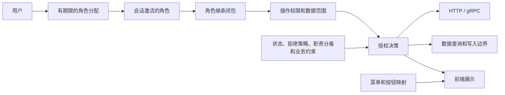

# 完整 RBAC 权限管理设计

> 日期：2026-09-30
> 状态：设计提案，尚未实现；本文件不表示线上已具备这些能力。
> 范围：现有平台的用户、后台操作和授权治理，并预留组织、多组织成员、组织内部门及组织域授权。路由使用资格、订阅权益、计费规则继续由各自领域管理。

## 1. 目标与模型

从 `users.role` 的单个等级升级为可维护、可解释、可委派的授权体系。完整交付包含权限目录、角色生命周期、角色继承、用户角色分配、会话角色激活、数据范围、静态/动态职责分离、受限授权委派、审计和权限模拟。

标准 RBAC 的核心是用户与角色、角色与权限、会话激活角色；层级和职责分离属于额外模型组件。本文覆盖这些组件，并增加产品需要的菜单映射、数据范围和授权治理。数据范围、字段权限和显式拒绝是本项目的授权扩展，不把它们误称为所有 RBAC 系统都必须具备的标准要素。参考 [NIST RBAC 模型说明](https://csrc.nist.gov/projects/role-based-access-control/faqs)。



产品能力固定为：

| 能力 | 完整行为 |
|---|---|
| 权限管理 | 资源/操作目录、搜索、分类、名称/说明、启停、绑定状态、风险等级、引用查询和变更影响 |
| 角色管理 | 创建、复制、编辑、启停、归档、成员、直接/继承权限、数据范围、授权差异、版本冲突检测 |
| 用户角色 | 多角色、开始/到期时间、撤销、批量预检与分配、来源、有效权限查询 |
| 角色继承 | 多个被继承角色组成 DAG；检查循环、传播范围和新增有效权限 |
| 会话角色 | 查看授权角色、选择激活角色、查询当前会话有效权限；服务端执行动态互斥 |
| 数据权限 | 本人、指定用户、指定资源、指定路由组；查询、详情、导出、统计、写入统一限制 |
| 字段与敏感操作 | 联系信息、资金数据、渠道密钥、凭证修改、财务动作各自明确权限 |
| 授权委派 | 限制可管理角色、可分配用户、可授予权限和范围、有效期；持有操作权不自动获得授予权 |
| 约束 | 静态/动态互斥、最大成员/激活数量、root 保护；业务状态约束独立执行 |
| 可解释性 | 展示角色来源、继承路径、允许范围、拒绝原因、版本和授权到期时间 |
| 审计 | 可查询的成功/失败记录、修改前后差异、操作者、会话、请求 ID、授权版本 |
| 组织扩展预留 | 平台/组织授权域、多组织成员、部门结构、组织内角色与委派、组织数据边界；启用门槛见第 12 节 |

本项目尚无用于用户授权的组织实体。本方案现在预留组织扩展的模型、字段和接口契约；组织是授权域，是否对应计费租户由未来业务单独定义。`users.group` 和路由组继续表示路由概念，不能充当组织或部门。现有数据和入口归入 platform 域，组织操作在第 12 节启用条件满足前保持草稿/未绑定，收到组织授权请求即拒绝，不回退为平台权限。

## 2. 当前实现与具体改造点

| 当前事实 | 源码 | 改造要求 |
|---|---|---|
| 单个 `Role`，值为 0/1/10/100，`IsAdmin`/`IsRoot` 数值比较 | [identity biz](../../app/identity/internal/biz/auth.go) | 替换为角色关系和显式授权；旧字段只保留兼容投影 |
| `SetRole` 按操作者和目标等级比较 | [角色变更用例](../../app/identity/internal/biz/auth.go) | 改为授权委派、有效权限影响分析和受保护账号规则 |
| 后台通过 `newAdminGuard` 统一检查 `role >= 10` | [admin HTTP](../../app/admin/internal/server/http.go) | 认证与操作授权分开，所有管理操作具有明确绑定 |
| 校验后台会话后再调用 `GetUser` 取得角色 | [admin service](../../app/admin/internal/service/admin.go) | 一次 RPC 返回当前会话、角色、权限及范围 |
| `ValidateSessionToken` 从数据库加载当前用户；JWT 有 JTI 和密码 epoch | [会话用例](../../app/identity/internal/biz/auth.go) | 复用身份校验；增加会话激活状态，旧 JWT 的 role 不参与权威决策 |
| 角色变更 RPC 验证 SERVICE_TOKEN 和独立操作者凭证 | [identity service](../../app/identity/internal/service/identity.go)、[identity gRPC](../../app/identity/internal/server/grpc.go) | 复用该信任链；扩展到管理 RPC，识别系统操作与用户操作 |
| identity 用户订单接口通过 `IsAdmin()` 放开跨用户访问 | [identity HTTP](../../app/identity/internal/server/http.go) | 本人查询或 `billing.payment.read` 对应的用户范围 |
| 渠道详情 DTO 包含完整 Key；订阅账号已有默认脱敏转换 | [channel service](../../app/channel/internal/service/channel.go) | 保留 relay 内部凭证路径；后台详情独立字段授权和脱敏 |
| 模型价格导入导出额外检查 root | [模型交换](../../app/admin/internal/server/model_exchange.go) | 对导入/导出和价格部分组合校验，迁移时保留原限制 |
| admin gRPC 主要检查服务凭证 | [admin gRPC](../../app/admin/internal/server/grpc.go) | 用户发起的管理操作必须检查同等权限和范围 |
| OAuth 管理 HTTP 通过 admin 代理保护，下游路由没有同等用户授权 | [channel HTTP](../../app/channel/internal/server/http.go) | 增加服务认证和操作者验证，禁止直接绕过代理权限 |
| 前端用角色等级控制后台入口、菜单；用户页提升/降级 | [AdminRoute](../../web/src/components/AdminRoute.tsx)、[导航](../../web/src/components/AppNavigation.tsx)、[用户页](../../web/src/pages/admin/UsersPage.tsx) | 页面、查询、字段、按钮分别绑定权限；用户页变为角色分配 |
| `platform/audit` 主要输出结构化日志 | [audit](../../platform/audit/audit.go) | 复用事件语义，补充事务内持久化和可查询授权审计 |

现有 `platform/security/auth.JWTClaims.CanAccess` 面向服务 JWT，未使用 action 区分操作且存在未知资源回退放行，不作为用户 RBAC 的执行器。

## 3. 权限目录：资源、操作、展示分别建模

### 3.1 操作码

使用稳定、精确匹配的 `领域.资源.操作`，如 `identity.user.disable`。操作码、资源类型和字段语义不可通过普通管理界面重写，避免改名后旧接口意外失去保护。

权限目录允许维护名称、描述、分类、排序、启停、风险等级和引用。新权限可以先建草稿，但只有存在经过代码注册的执行点才能发布；停用后已有角色绑定保留为失效引用，不能偷偷删除。退役权限不复用原 code。

执行点同时注册 `supported_context_types=platform/organization` 和允许的数据范围；当前默认只支持 platform，组织支持需通过第 12 节验收后由代码注册。该资格不可通过普通目录元数据编辑扩大。资源/权限目录保持平台统一、code 全局唯一；组织角色仅引用允许 organization 域使用的操作，不复制一套权限目录。

“创建一个权限记录”不等于创造一个新的后端能力。新增业务能力仍需实现对应执行点和测试；这与完整权限目录管理并不冲突。

不使用 `identity.user.*` 这类动态通配作为持久授权。界面“全选”展开成当前目录中的明确权限集合，显示 catalog revision；新增操作不会自动授予所有历史角色。

### 3.2 本项目的操作粒度

以下是目标目录，部分操作需要从现有复合接口拆出。实现时所有代码都必须对应执行点，不能只导入目录后声称完成授权。

| 资源 | 操作权限后缀（加资源前缀构成完整 code） |
|---|---|
| `admin.console` | `enter` |
| `admin.overview` | `read`；经营数据还要求对应财务读取权限 |
| `identity.user` | `list`、`read`、`create`、`update`、`enable`、`disable`、`delete`、`export`、`contact.read`、`email_binding.update`（含清空/解绑）、`credential.update`（其他登录凭证或绑定）、`sessions.revoke` |
| `identity.user_role` | `read`、`assign`、`revoke`、`batch_assign` |
| `identity.session` | `roles.read`、`roles.activate`、`self.revoke`；待选择角色的会话只开放经过认证的会话初始化能力 |
| `identity.routing_access` | `read`、`grant`、`revoke`、`default.update`、`public_access.update` |
| `channel.channel` | `list`、`read`、`create`、`update`、`enable`、`disable`、`delete`、`batch_delete`、`export`、`test`、`balance.refresh`、`secret.read`、`secret.rotate` |
| `channel.account` | `list`、`read`、`create`、`update`、`enable`、`disable`、`delete`、`quota.reset`、`recovery.clear`、`credential.update`、`oauth.bind` |
| `channel.model` | `list`、`read`、`create`、`update`、`enable`、`disable`、`delete`、`batch_update`、`import`、`export`、`canonical.preflight`、`canonical.merge` |
| `channel.model_mapping` | `read`、`create`、`update`、`delete`（同时检查来源资源范围） |
| `channel.model_routing` | `read`、`create`、`update`、`delete` |
| `channel.routing_group` | `list`、`read`、`create`、`update`、`enable`、`disable`、`archive`、`members.read`、`members.update`、`resource_override.update` |
| `monitor.health` | `channel.read`、`model.read`、`selector.read` |
| `billing.pricing` | `read`、`update`、`import`、`export` |
| `billing.upstream_cost` | `read`、`create`、`update`、`delete`、`migrate` |
| `billing.routing_policy` | `read`、`publish`、`user_override.read`、`user_override.update`、`user_override.delete` |
| `billing.account` | `read`、`balance.adjust`、`balance.reset`、`ledger.read`、`cost.read` |
| `billing.payment` | `list`、`read`、`refund` |
| `billing.reconciliation` | `read`、`run`、`issues.read` |
| `billing.redemption` | `list`、`read`、`create`、`batch_create`、`update`、`delete`、`export` |
| `subscription.quota_policy` | `list`、`read`、`create`、`update`、`delete` |
| `subscription.plan` | `list`、`read`、`create`、`update`、`publish`、`unpublish`、`delete` |
| `subscription.user_subscription` | `list`、`read`、`assign`、`change`、`extend`、`revoke`、`quota.reset`、`report.read` |
| `log.request` | `list`、`read`、`stats.read`、`export`、`delete`、`purge`、`content.read` |
| `system.option` | `read`、`update`、`security.update`、`payment.update`、`pricing.update` |
| `system.content` | `notice.update`、`about.update`、`home.update`（公开 GET 不因此变为管理操作） |
| `notify.notification` | `list`、`read`、`acknowledge`、`test`、`rules.update`，以实际 handler 能力注册 |
| `iam.permission` | `list`、`read`、`create`、`metadata.update`、`enable`、`disable`、`archive`、`references.read` |
| `iam.role` | `list`、`read`、`create`、`update`、`copy`、`enable`、`disable`、`archive`、`permissions.read`、`permissions.update`、`hierarchy.update`、`members.read` |
| `iam.delegation` | `read`、`create`、`update`、`revoke` |
| `iam.constraint` | `read`、`create`、`update`、`delete` |
| `iam.menu` | `list`、`read`、`create`、`update`、`archive`；只能引用已注册路由与权限 |
| `iam.authorization` | `self.read`、`user.read`、`explain`、`simulate` |
| `iam.audit` | `read`、`export` |

组织相关操作码预留如下，当前均为草稿/未绑定：

| 资源 | 预留操作与适用域 |
|---|---|
| `organization.organization` | `list`、`read`、`create`、`profile.update`、`enable`、`disable`、`archive`、`ownership.transfer`；创建/启停/归档属平台治理，组织资料与所有权变更使用独立注册的组织执行点 |
| `organization.member` | `list`、`read`、`invite`、`update`、`suspend`、`restore`、`remove`、`export`、`contact.read`；仅组织成员关系及组织内资料，不修改全局 users |
| `organization.member_role` | `read`、`assign`、`revoke`、`batch_assign`；限定同组织有效成员及角色，复用 IAM 分配用例 |
| `organization.unit` | `list`、`read`、`create`、`update`、`move`、`archive`、`members.read`、`members.update`；部门树和成员部门关系均限于同组织 |

未来 `iam.role`、`iam.delegation`、`iam.constraint`、`iam.authorization` 和 `iam.audit` 可注册组织执行点，角色闭包与治理范围按 context 隔离；平台权限目录维护、全局配置、全局用户凭证接管和全局用户启停/删除始终为平台能力。组织成员移除与全局用户删除使用不同操作，不能把旧 user.update/user.disable 接口换一个组织参数后直接复用其全局语义。

本人资料、本人 Key、本人订单等自助能力使用独立的 self 操作或既有所有权规则，不以管理权限自动放开。API Key 的模型白名单、路由组资格与后台 IAM 不相互授予。

### 3.3 菜单和按钮

菜单目录是界面组织方式，权限继承是角色图，二者独立。菜单父节点出现只说明至少一个子节点可见，不给用户任何父级或兄弟操作权限。

菜单项记录路由、名称、图标键、排序、状态及所需操作码；按钮由前端固定组件绑定相同操作码。菜单路由必须来自前端已注册路由，图标来自已有白名单，不接受任意脚本、任意跳转 URL 或任意组件代码。

页面准入、列表查询、详情字段和修改按钮分别检查。角色编辑器同时提供“按模块树”和“资源 × 操作矩阵”，并区分直接授权、继承授权、拒绝、未授权。

## 4. 授权语义与数据范围

### 4.1 主体、会话和继承

- 授权 DO/DTO 预留 AuthorizationContext：context_type、organization_id 与服务端生成的 context_key。合法组合仅 platform/0/`platform`，或 organization/正 ID/`organization:<规范十进制 ID>`；其他组合拒绝。请求一次只使用一个域，旧平台入口按注册契约解析为 platform，组织入口必须显式声明并由 identity 校验组织及成员事实；客户端组织选择、JWT 声明或 header 本身不构成授权。
- 登录仍使用当前 JWT 的 user_id、JTI、issuer、audience、有效期与 pwd_epoch，用户停用和密码撤销先于所有权限判断。
- 用户角色分配有状态、开始/到期时间和授权边界；过期、撤销或角色停用的分配不参与授权。
- 登录/会话创建时默认激活所有可兼容角色；若 DSD 冲突，进入角色选择界面，冲突解决前只开放本人会话和角色选择能力，不代替用户任意选择特权组合。
- 可激活角色是用户通过有效分配和继承获得的授权角色集合的子集。主动激活被继承角色时，仍保留其实际分配来源和来源边界。
- `senior_role_id → junior_role_id` 表示 senior 继承 junior 的权限。多个继承关系构成 DAG，检查自引用与循环，图更新必须计算所有受影响用户和继承角色。
- 不通过角色名称、数值、UI 排序推导等级或权限；停用一个被继承角色会使经该节点传播的授权失效，其他独立来源继续有效。
- 组织请求还要求组织启用、当前用户成员身份有效，并使用该域独立的会话激活状态。角色、继承、allow/deny、委派及 SSD/DSD 只在同一 context 中计算；平台角色和其他组织角色不加入闭包。平台用户停用及全局会话撤销仍作用于所有域。

### 4.2 允许与拒绝

传统角色授权以 allow 集合为基础。本项目额外支持 `effect=deny`，采用拒绝优先；只读角色通常只缺少写权限，不应批量设置 deny，以免与其他合法角色合并后意外阻断。

允许授权来自当前 context 的会话激活角色及其继承。为防止切换会话角色规避限制，显式 deny 来自该 context 内用户全部有效分配角色的继承闭包，独立于当前激活集合；组织 A 的 deny 不影响组织 B。角色停用、分配撤销或到期使相应 allow/deny 来源都失效；由于停用含 deny 的角色可能扩大允许范围，停用也必须执行扩权预检和委派检查，不能当作天然只会收权的操作。

授权决策按顺序执行：身份与用户状态 → 操作注册/启用 → 会话状态 → 职责分离和固定业务约束 → 命中 allow 及范围 → 排除 deny 范围。root 的内置角色受保护、无可编辑 deny 分配，仍不能绕过用户状态、会话撤销、未注册操作或资金领域不变量。

对详情/写入可表达为：

```text
allow(subject, operation, object) =
  identity_valid
  AND operation_registered_and_enabled
  AND session_valid
  AND context_valid_and_supported
  AND authoritative_object_context_matches
  AND constraints_pass
  AND allow_covers(operation, object, union(effective_active_allow_scopes))
  AND NOT deny_matches(operation, object, union(mandatory_deny_scopes))
  AND owning_domain_business_rules_pass
```

`allow_covers` 与 `deny_matches` 是两个独立谓词，使用第 4.3 节规定的覆盖/命中规则；不能复用一个 scope.contains(object) 同时判断允许与拒绝。列表先按读取规则计算可允许对象，再排除任一 deny 命中的对象；聚合、total 和导出使用同一对象谓词。没有 allow 就没有任何数据；解析不了范围、缺少来源事实、依赖不可用均拒绝，不回退成全部数据。默认拒绝和每个入口验证遵循 [OWASP 授权建议](https://cheatsheetseries.owasp.org/cheatsheets/Authorization_Cheat_Sheet.html)。

### 4.3 范围不能脱离权限合并

每条角色权限保留自己的范围；用户分配上的边界只缩小允许授权，不能扩大角色本来拥有的权限。允许集合按同一条来源路径计算：

```text
每条 allow 来源的有效范围 = context 固定边界 ∩ 角色权限范围 ∩ 该来源用户分配边界
同一 context、同一操作的允许范围 = 各条有效来源范围的并集
```

deny 的范围按原定义执行，分配上的允许边界不能缩小强制 deny；deny 有限范围应在角色权限本身配置。

组织边界是固定前置条件，不是可以用其他 grant 覆盖的范围：资源拥有者核实 owner_organization_id，组织请求只匹配当前组织；all 仅表示本组织内该操作支持的全部对象。self、user_ids、resource_ids、routing_group_ids 和 deny 均在此边界内执行。用户加入组织不使其全局余额、订单、日志或 Key 自动归该组织；缺少权威组织归属的现有对象继续使用平台域。共享全局资源也不因组织内 all 自动匹配，未来需显式共享关系和独立执行规则。

例：角色 A 允许“组 1 的渠道读取”，角色 B 允许“组 2 的渠道删除”。用户只能读取组 1、删除组 2，绝不能变成“两个组都能读写”。同理，订单查看权限与余额调整范围不能交叉拼接。

| 范围类型 | 对象匹配规则 | 支持边界 |
|---|---|---|
| `all` | 该操作资源类型中的所有对象 | 全局配置、批量迁移等操作只能使用明确的全局范围 |
| `self` | 资源拥有者为当前认证用户 | 订单、用户资金、本人信息、本人日志；不能把管理员创建的渠道误认为本人渠道 |
| `user_ids` | 资源所有者属于指定用户集合 | 支付、资金、订阅、日志；不是任意客户端 user_id |
| `resource_ids` | 资源真实 ID 属于指定集合 | 用户、渠道、账号、模型、角色等具体对象 |
| `routing_group_ids` | 所属或涉及路由组满足资源对应规则 | 只对明确支持组归属的操作开放 |
| `organization_ids`（预留） | 明确的组织 ID 集合 | 仅注册为平台组织治理的操作使用；不使普通平台业务权限自动变为跨组织访问 |
| `organization_unit_ids`（预留） | 组织内明确部门事实匹配指定单元 | 仅当前组织，所有 ID 必须同组织；成员属于部门不自动授予角色 |
| `organization_unit_subtree_ids`（预留） | 明确包含指定部门及后代的范围 | 后代范围需显式选择；移动部门/成员检查前后范围与受影响授权，见第 12 节 |

权限注册表声明支持哪些范围，界面只允许这些选项。范围采用固定结构与白名单，不能保存 SQL、正则脚本、CEL/JavaScript 表达式或自定义查询片段。

同一渠道/账号可能同时属于多个组。所有范围先逐来源与 allow_boundary 求交，保留资源 ID、所有者等非组条件，再按同一操作合并；不能先把不同来源的角色范围和分配边界分别合并，拼出不存在的授权路径。`routing_group_ids` 使用以下固定规则：

- 读取：同一操作的有效允许组集合与对象归属至少有一个交集。
- 整体修改、密钥操作或删除：同一操作的有效允许组集合必须覆盖全部受影响组。多个来源可共同覆盖，例如分别允许组 11 和组 12 可覆盖共享渠道；任何一条来源仍须满足自己的非组条件。
- 拒绝：任何有效 deny 与任一受影响组相交就拒绝，读取和整体写入均如此；不要求一条 deny 覆盖整个资源。对象 ID、所有者或全局 deny 命中也拒绝，显式对象/全局 allow 不能覆盖 deny。
- 成员关系操作以实际变更的组关系为检查单元，同时检查关联资源范围；跨组移动检查原、目标事实及受影响组的并集。空组归属不自动放行；无归属对象需命中适用的资源 ID/全局允许范围。

资源 ID/全局允许来源也先与分配边界求交，只有仍覆盖整个对象时才满足整体写入要求，不能用资源 ID 绕过组边界。例：共享渠道属于组 11/12，即使 allow=all，只要 deny 命中组 11，就不能读取、修改或删除该渠道；只有 allow 组 11 时可读取、不能整体写；allow 组 11 与另一来源的组 12 合并且没有 deny 时才可整体写。

未来部门范围使用相同的允许覆盖/拒绝命中分离规则：一名组织成员可属于多个部门，读取可命中任一允许部门，但暂停/移除成员、整体资料修改等影响整个成员的写操作必须覆盖全部受影响部门，或有仍满足边界的明确成员 ID/本组织全域授权；deny 命中任一受影响部门即拒绝。多个来源只在同域、同操作且各自非部门条件满足时合并。只修改某条部门成员关系时检查该部门及成员当前可管理范围，调动同时检查原、目标事实；无部门归属不自动放行。

用户列表中的 `routing_group_ids` 范围基于 identity 权威显式绑定/默认组事实，并在执行点定义是否包含公共使用资格；默认不把“可使用公开组”变成管理员可管理所有该组用户。订单不能因购买了某个套餐就推断其组归属，必须使用已保存的明确业务关联。

创建新对象在实际创建前检查目标归属范围；尚无 ID 的对象不能通过 resource_ids 权限自动放行。修改归属同时检查原对象与修改后的对象。bulk 操作默认原子拒绝；确有逐项业务 API 时逐项给结果，不能隐式跳过越权项。

列表、分页 total、聚合统计、导出和自动补全必须在数据库查询前施加相同范围，不能先查询所有记录再在内存隐藏。跨服务列表/聚合接口需要传递经过验证的 DO 范围并由拥有数据的服务编译为 SQL；不支持范围的旧 RPC 必须拒绝受限范围请求。

字段读取独立校验：`channel.channel.secret.read` 不因 channel.read 获得；联系人、资金和请求内容同理。禁止修改未授权敏感字段，使用 update_mask/已解析 DO 检查字段权限，不能用“普通编辑权限”修改密钥、角色、用户状态或支付设置。

用户普通 `identity.user.update` 禁止修改认证邮箱和其他登录凭证/绑定；设置、替换、清空或解绑用于登录/密码重置的邮箱均要求 `identity.user.email_binding.update`，其他登录凭证或绑定写入要求 `identity.user.credential.update`。认证字段写入还必须由 identity 在权威授权视图中验证第 5 节的 `target_kind=user_credentials` 接管委派及目标用户范围；有 `contact.read`、认证字段操作权限或本人持有目标账号的业务权限，均不能代替接管授权。对高权限目标账号的凭证接管不得绕过授予权限上限与自我扩权规则，root 账号继续受保护。启用邮件密码重置后，修改认证邮箱能间接获得账号身份，不能当作普通联系人编辑。

旧用户 `group` 字段不是普通资料：改变默认路由组要求 `identity.routing_access.default.update`；伴随创建或撤销使用授权时分别追加 `identity.routing_access.grant` / `revoke`。identity 必须核实目标用户、原组及目标组范围，预检实际授权差异，并将默认组、使用授权和授权版本在同一事务中更新，不能先更新资料再单独授权。

以上敏感字段规则在服务端以 update_mask、字段存在性和解析后的 DO 为准，区分未提供与显式清空，不依赖前端禁用按钮。管理创建/批量创建设置认证字段或组授权时同样检查对应权限、接管/授予边界；所有 HTTP 别名、兼容接口与用户发起的管理 RPC 走同一规则。注册等本人自助路径继续执行独立身份验证与所有权规则，不借管理写接口绕过校验。

## 5. 角色治理、委派和职责分离

### 5.1 生命周期

角色使用不可变 code 和可修改展示名称，状态为 draft/enabled/disabled/archived。复制默认是草稿，显示继承、deny、范围及委派差异，确认后才能发布。删除采用归档，角色 ID/code 不复用。

角色所属 context 不可通过普通更新或移动改变；code 在域内唯一，平台 root 只存在于 platform。组织 owner/admin 必须通过明确的组织角色分配获得权限，名称、部门职位或 organization.owner 字段不隐式授权。组织启用后，继承双方、约束成员、委派管理/目标角色及 creation_delegation_id 必须同域；跨域角色模板只允许有权主体复制成无成员/无委派的草稿，并逐项校验目标域操作资格和 ceiling，禁止复制继承边或创建来源。

被用户分配、其他角色继承或委派规则引用时，归档先预检并给出引用；不能无提示级联清空。用户角色批量分配先计算完整结果、SSD 冲突和权限差异，确认同一 revision 的结果后提交。

root 的角色、授权核心权限和救援入口不能由普通角色 CRUD 改写。维护权限目录、恢复授权和会话初始化必需的核心执行点为 protected，不允许通过普通目录 API 停用、退役或解除绑定，即使调用者是 root；防止把恢复入口一并关掉。任何角色权限、继承、状态、成员、范围变更都可能改变实际访问权，均进入授权治理与审计。

### 5.2 授权委派

`iam.role.permissions.update` 只表示可以执行编辑操作，不表示可以给任意角色添加任意权限。还必须有覆盖目标的 delegation。

delegation 固定声明管理角色、目标类型、允许动作、目标用户范围、可授予的“权限＋范围”上限、有效期与 revision。拥有某项业务权限不自动拥有其授予权；相反，可被明确委派分配某个财务角色而本人不执行财务操作。目标类型为固定枚举：

| target_kind | 目标与边界 |
|---|---|
| `role` | 明确的 target_role_id；只管理该角色及指定用户的分配 |
| `role_creation` | 无预先存在的角色 ID；允许创建/复制，并管理引用此创建委派的角色；actions、target_user_scope 和 grant_ceiling 持续限制后续管理 |
| `user_credentials` | 无 target_role_id；target_user_scope 限制可接管账号，actions 明确包含 email_binding.update / credential.update；grant_ceiling 限制目标账号的最大业务授权能力；普通路径禁止接管持有 IAM 委派 authority 的账号 |

所有委派保存 context；role/role_creation 在组织域仅覆盖本组织角色和有效成员，不能授予平台能力、其他组织权限或扩大固定组织边界。user_credentials 仅允许 platform 域，组织管理员只能管理本组织成员状态、组织内资料和本组织会话激活，不能改全局密码/认证邮箱、停用/删除全局用户或撤销该用户所有组织的会话。平台治理组织采用独立的平台操作、明确目标组织和审计，不通过跨域继承或普通跨域 delegation 实现；特权初始化/救援仍受保护账号和业务约束。
所有管理动作同时检查：

1. 操作者激活角色有对应的 IAM 操作权限；认证字段写使用对应 identity.user 操作权限。
2. 有效 delegation 的管理角色在操作者激活闭包中，并按 target_kind 覆盖目标角色/创建动作/账号、目标用户与管理动作；不同目标类型不能相互替代。
3. 变更后的有效 allow/deny、继承路径、分配范围、期限满足委派边界；撤销 deny 视为增加允许能力，也必须预检。
4. 受影响的继承角色及已有成员仍满足委派边界和 SSD；不能通过修改被继承角色间接给不可管理成员扩权。
5. 操作者不能编辑给自己或自身可激活角色扩权的关系；普通管理路径拒绝给自己分配/撤销管理角色、扩大自身委派、修改保护账号。

CreateRole/CopyRole 必须命中有效的 `role_creation` 委派及对应操作权限，在同一事务中校验初始直接/继承授权、创建草稿角色并写入不可由普通元数据更新改写的 `creation_delegation_id`。复制还要独立检查来源角色的读取/复制权限及管理范围，不复制成员或委派 authority。新角色通过这个引用进入该管理角色的可管理集合，不需要管理员另建一条委派，也不因 created_by 相同自动归其永久管理。

后续编辑、启停、继承及成员分配每次重新验证引用的创建委派、actions、目标用户和当前 ceiling；委派到期/撤销后该路径停止管理，已发布的业务授权不自动级联撤销，需由 root 或另一条有效明确委派治理。创建引用不能迁移到另一委派以绕过边界，重新移交须走有权的委派变更及影响预检。不能“先建空角色、分给自己、再加权限”绕过检查，也不能创建 builtin/root 或保留的角色 code。普通管理员不能创建新的委派链；委派创建/扩张需要额外 iam.delegation 权限及现有可再委派上限，未设置上限时仅 root 可创建。

`user_credentials` 是明确的账号接管授权，不是普通角色分配委派。identity 同事务读取目标用户和其直接/继承授权，验证账号落在 target_user_scope 中，且其最大 allow 能力不超出 grant_ceiling；比较包含未激活角色及尚未到期的未来分配，不能用临时 deny 或 DSD 隐藏高权限。普通管理路径仍拒绝 root/保护账号、修改自身接管委派及超出接管委派上限的间接扩权；目标能力超出上限时由 root/独立救援路径处理，不按旧数值等级判断。认证字段变更、密码 epoch/会话撤销、用户版本和审计同事务提交；本人修改走独立的重新认证流程，不能伪装成管理接管。

业务 allow 上限不能代表账号的完整 authority：目标可能没有财务操作权，却能给别人授予财务角色。因此普通凭证接管还必须检查目标全部有效/未来角色闭包对应的委派；存在有效或未来可用的 IAM 授予、角色创建/管理、账号接管或再委派 authority 即拒绝，由 root/独立救援处理。不能仅根据目标当前会话、业务权限列表或是否有财务 allow 判断可接管，未激活、临时 deny 或 DSD 不消除这项保护。该限制采用固定业务规则，不允许通过普通接管 delegation 编辑关闭。

新增组织后，平台凭证接管的目标保护检查必须逐域读取目标用户在 platform 及所有组织中的有效/未来角色和委派 authority，这是全局身份资源的安全检查，不把其他域角色加入操作者授权闭包。接管 ceiling 的比较条目预留明确 context_key，未声明对应域上限视为空，禁止丢弃组织授权或仅按同名操作码与平台上限比较；既有无域条目只表示委派所在域。role/role_creation ceiling 仍必须同域，user_credentials 的多域条目仅用于接管准入，不创建跨域角色授权。目标在任一域有上述 IAM authority 时普通接管均拒绝，即使其平台角色只有 member。

有效组织 owner 也属于全局凭证接管检查的保护目标，不因平台角色为 member 或没有显式 delegation 记录就允许普通接管；由 root/独立救援流程处理。

root 可给 IAM 管理员委派明确角色集合，后者再管理其成员及权限，不要求每次由 root 手工完成。根角色自身不可作为可委派目标。

### 5.3 SSD / DSD / 基数

约束定义一个角色集合和 `max_count`。SSD 检查用户授权角色闭包中落入集合的数量；DSD 检查同一会话激活角色及其闭包的数量。集合有两个角色、max_count=1 即二者互斥。

SSD/DSD 与基数默认按 context 检查；组织成员身份是组织角色分配的前提，其有效期必须覆盖角色分配区间。成员退出/到期使该组织授权及会话域失效，其他组织授权继续独立有效；恢复成员不能自动恢复已撤销/到期角色。跨组织的全局职责约束须另建固定平台业务规则，不把多个组织角色混进现有闭包。

新增用户分配、更新继承、启用角色、更新约束都要预检已有成员/会话。更新约束造成现存冲突时返回冲突清单；先明确撤销对应分配/激活，再发布约束，不静默撤销用户角色。约束计数去重，继承关系必须计入，不能仅检查直接分配。

角色还可限制有效成员数、用户分配数、会话激活数；在同一事务内验证并更新，不能用先 Count 后 Insert 的竞态实现。过期分配不占有效名额，审计历史不删除。有效期统一使用服务端权威 UTC 时间和半开区间 `[starts_at, expires_at)`；starts_at 默认事务当前时刻，没有 expires_at 表示无限期，开始时间必须早于到期时间。

带未来开始时间的分配在写入时就预留其有效区间：对提交后的全部相关分配收集起止边界，检查从当前时刻起每个区间的最大同时有效人数/分配数，边界相等时先结束再开始。成员按实际授权闭包中的用户去重，多条继承路径不重复占名额；SSD 同样按每个未来区间的授权闭包检查。分配新增、延期、恢复、边界修改及角色启用/继承/约束变更都执行此预检，拒绝会在未来超限的写入，不能等到授权请求时才让用户失权。角色启用和图变更还检查现存会话在其剩余有效期内的 DSD/激活上限；激活与身份有效期仍在每次决策时重新验证。

例：max_members=1，用户 U1 已获明日 10:00–11:00 的分配，给 U2 同一窗口的分配必须立即拒绝，即使两人当前都未生效；U2 从明日 11:00 开始则不重叠。串行写锁防止并发预留竞态，区间预检防止无写事务的时间推进突破上限，不能依赖定时任务抢名额。

职责分离不自动等同审批流程。若以后出现申请/审批、退款复核等产品流程，资源领域还需验证发起人和审批人不能相同，用户换会话或换角色也不能绕过。

## 6. 领域模型与存储

### 6.1 所有权与分层

identity 拥有全部 IAM 表和授权决策，未来组织、成员和部门事实也由此领域统一持有。DO、Repo 接口、role/permission/assignment/delegation/constraint 用例放在 identity biz；PO、GORM、范围引用和事务放在 identity data。service 校验 DTO 并转换，server 只接入认证/授权中间件和路由。

admin 提供界面 API 和跨领域影响预检，通过其 data 客户端实现 biz 的 Repo 接口调用 identity。禁止 admin 导入 identity 的 internal/biz、直接写 IAM 表，禁止权限中间件依赖 GORM。

跨服务需要的 operation code、Decision、Scope、Actor 等纯模型可放在新的 `domain/authorization`，不在那里复制 identity 的仓储、JWT secret 或缓存。资源范围匹配及数据过滤属于各数据所有者。

### 6.2 逻辑表结构

所有新增表按当前迁移框架提供 MySQL、PostgreSQL、SQLite 实现，字段类型和 JSON 存储按驱动适配，关系约束及行为保持一致。这里是逻辑结构，不直接把 MySQL DDL 复制到其他驱动。

| 表 | 核心字段/约束 |
|---|---|
| `iam_resources` | id、不可变 code、name、owner_service、enabled；资源 code 唯一 |
| `iam_permissions` | id、resource_id、不可变 code/action、name、category、status、risk_level、supported_scopes、supported_context_types、binding_state、revision；code 与 resource/action 全局唯一，域资格来自代码注册 |
| `iam_roles` | id、context_type、organization_id、context_key、不可变 code、name、description、status、builtin、max_members、creation_delegation_id（可空，创建管理来源）、revision、created/updated_by；context_key/code 唯一；创建来源只由同域有权治理路径变更 |
| `iam_role_permissions` | id、role_id、permission_id、effect、scope_descriptor、revision；role/permission/effect 唯一；每个 descriptor 是有限的范围子句并集 |
| `iam_role_inheritance` | context_key、senior_role_id、junior_role_id；关系唯一且两端同域，不允许自引用/环；继承变更参与 policy revision |
| `iam_user_roles` | id、context_key、user_id、membership_id（platform=0，organization 为同域成员 ID）、role_id、allow_boundary、starts_at、expires_at、status、assigned_by、revision；context_key/user/role 唯一且与角色、成员一致；有效期检查与角色/用户/时间索引支持区间预检，修改期限/状态复用当前关系；历史由审计保存 |
| `iam_sessions` | session_id(JWT JTI)、user_id、expires_at、revoked_at、revision；session ID 唯一，全局身份状态不保存单个当前组织 |
| `iam_session_contexts` | session_id、context_key、activation_state、revoked_at、revision；session/context 唯一，域内激活状态独立；第一期只建立 platform 行 |
| `iam_session_roles` | session_id、context_key、role_id；session/context/role 唯一且角色同域；激活路径和边界从该域当前分配重新推导 |
| `iam_delegations` | id、context_key、manager_role_id、target_kind=role/role_creation/user_credentials、target_role_id（仅 role 类型必填，其他类型为空）、actions、target_user_scope、grant_ceiling（按条目保留 context_key；角色授予必须同域，接管门槛按目标域独立比较）、can_redelegate、starts/expires_at、revision；管理/目标及创建来源同域，user_credentials 只属 platform；按类型验证字段组合和允许动作 |
| `iam_role_constraints` | id、context_key、type=SSD/DSD、name、max_count、enabled、revision |
| `iam_role_constraint_members` | context_key、constraint_id、role_id；关系唯一且约束/角色同域 |
| `iam_menu_items` | id、parent_id、route_key、name、icon_key、sort、enabled、required_all/required_any；只用于展示 |
| `iam_audit_events` | event_id、actor_user/service/session、context_key、target_context_key、action、target、before/after/diff、result、decision_versions、request_id、occurred_at、reason；追加写入，跨域治理明确记录主体域与目标域 |
| `iam_policy_state` | 单例 policy_revision、catalog_revision、authorization_mode=legacy/iam、cutover_state=idle/blocked/verified/complete、cutover_batch_id、cutover_verified_at；保证关系变更序列化与授权版本可验证，记录第 10 节事实源交接；切换字段仅迁移/救援流程可写 |

`scope_descriptor`、boundary、ceiling 采用 jsonx 编解码的受限 DO；不得保存执行表达式。跨服务资源引用不能依赖跨库 FK，使用领域预检，运行时资源不存在则无匹配，不自动补全。

context_key 始终为非空服务端规范值，platform 行统一 organization_id=0，不混用 NULL。有冗余 context 的关系采用同域组合引用约束及领域校验，不允许只凭角色 ID 忽略域。全局 users 不增加单一所属组织字段；组织逻辑实体及将来业务资源归属字段见第 12 节。

`users` 增加 `authorization_revision`，用于其分配、账号状态与授权相关事实变化；角色/继承/目录变更更新 policy_revision；会话激活变化更新 session-context revision，全局撤销更新 session revision。组织/成员/部门事实变化同时更新第 12 节相应版本与 policy_revision。不能只更新用户版本而漏掉角色权限修改。

需要细化资源所有者与查询范围的 DTO，不向上泄露 SQL、GORM builder 或 PO。JSON 一律经过 `pkg/jsonx`，错误 reason 在 identity/admin API 的 error_reason proto 中定义，再映射为 biz typed errors。

### 6.3 事务与一致性

授权关系写入、policy revision、用户/session revision、成功审计在一个事务中提交。权限/继承/约束/委派、成员分配、认证字段写事务先锁 iam_policy_state，再读取操作者权威授权、受影响关系及相关角色/用户/session，执行预检与 CAS，最后写入关系和审计。未来区间预留和创建角色/创建委派引用也在此事务内，不能只锁当前有效关系或先保存角色再补管理来源。IAM 写路径检查 authorization_mode，legacy 模式仅允许既定候选迁移写，普通账号写仍遵循切换前事实源；cutover_state 为 blocked/verified 时阻断账号与 IAM 管理写，只有迁移任务可按阶段写入，不能提前开启生产 IAM 管理。

使用一个策略行序列化 IAM 写入，是本项目低频管理场景的明确取舍；实施代码需留 `ponytail:` 注释说明吞吐上限和未来按作用域拆锁路径。SQLite 使用仓库已有事务/忙重试模式，并重新读取状态；不能假装支持 MySQL FOR UPDATE。

执行期间所有角色引用、catalog revision、委派边界都来自同一事务视图。批量更新默认整批成功或整批拒绝，禁止部分改动后再报统一失败。失败审计不写进回滚的成功事务，而在独立追加事务记录尝试结果。

组织启用后，事务还读取同域组织/成员/部门事实，验证分配区间、引用及固定组织边界；成员移除、部门移动、组织停用与 IAM 写采用现有 policy 行序列化，不先引入新的组织锁体系。组织状态、部门树和成员归属变化均执行影响预检及版本/审计更新。

角色停用、权限停用、继承图变化、角色分配变化都产生新的权威版本。第一版后台授权从主库读取，不添加允许继续使用旧授权的降级路径。

撤销保证“事务提交后开始的新权威授权决策不能继续使用旧权限”，不声称能取消已通过检查的所有在途业务请求。高风险写在资源拥有者的写入边界再次验证，并记录决策版本；跨库检查与写入仍有在途窗口。若产品要求撤销与资金提交严格串行，必须设计跨服务协议，不能用 Redis 通知或 TTL 宣称已经解决。

## 7. 服务 API 与执行链

### 7.1 identity RPC

扩展现有 API，具体 DTO 保持分页/过滤/更新字段掩码一致性；资源 CRUD 按仓库 DTO ↔ DO ↔ PO 规则实现。

| RPC 组 | 接口 |
|---|---|
| 目录 | ListResources、ListPermissions、GetPermission、CreatePermission、UpdatePermission、SetPermissionStatus、ArchivePermission、GetPermissionReferences |
| 角色 | ListRoles、GetRole、CreateRole、UpdateRole、CopyRole、SetRoleStatus、ArchiveRole、GetRoleReferences、ListRoleMembers |
| 角色授权 | GetRolePermissions、UpdateRolePermissions、UpdateRoleInheritance、PreviewRoleChange |
| 用户分配 | GetUserRoles、AssignUserRole、RevokeUserRole、BatchAssignUserRoles、PreviewUserRoleChange |
| 会话 | GetSessionAuthorization、GetSessionRoles、ActivateSessionRoles、RevokeUserSessions |
| 委派 | ListDelegations、CreateDelegation、UpdateDelegation、RevokeDelegation |
| 约束 | ListRoleConstraints、CreateRoleConstraint、UpdateRoleConstraint、DeleteRoleConstraint |
| 展示 | ListMenuItems、CreateMenuItem、UpdateMenuItem、ArchiveMenuItem |
| 决策/解释 | CheckAuthorization、GetUserEffectivePermissions、ExplainAuthorization、SimulateAuthorizationChange |
| 审计 | ListAuthorizationAuditEvents、GetAuthorizationAuditEvent |

CheckAuthorization 的 operation 来自资源服务注册的执行点，不从客户端传入的 permission 字符串决定要检查什么。object 输入是资源所有者核实的 ID/owner/group facts；未核实的对象属性不能作为授权事实。

授权/查询/治理 RPC 预留显式 AuthorizationContext，组织资源事实增加权威 owner_organization_id 和必要部门事实；context 与组织 HTTP 路径一致，经 identity 验证后传到资源拥有者。客户端传入的 organization_id 只是选择请求，不允许代替成员验证或资源归属；旧平台 RPC 按执行点默认 platform，未声明支持组织的 RPC 拒绝 organization context。普通关系写的主体/目标同域，平台组织治理的目标域通过独立操作显式声明并审计。

角色权限更新采用明确 grants 和 expected_revision，保存前返回直接/继承/deny/范围差异与影响人数。模拟结果绑定 base_policy_revision 和内容摘要，执行时重新检查，不能把 preview_token 当作授权凭证。

### 7.2 管理 HTTP

统一入口 `/api/v1/admin/iam`。所有目录读取和管理操作也按各自权限及委派范围过滤，不能给一个 IAM 列表权限就暴露所有角色成员或用户授权。

| 路径 | 行为 |
|---|---|
| `/resources`、`/permissions`、`/permissions/{id}` | 目录查询、草稿创建、元数据更新 |
| `/permissions/{id}/status`、`/permissions/{id}/references` | 启停/退役预检、引用查询 |
| `/roles`、`/roles/{id}`、`/roles/{id}/copy` | 角色列表、CRUD、复制 |
| `/roles/{id}/status`、`/roles/{id}/references` | 角色启停、归档预检与引用查询 |
| `/roles/{id}/permissions`、`/roles/{id}/inheritance` | 权限和继承读取/更新 |
| `/roles/{id}/members`、`/roles/{id}/preview` | 成员、变更预检 |
| `/users/{id}/roles`、`/users/{id}/roles/{assignment_id}` | 用户角色读取、分配、撤销 |
| `/users/roles:batchAssign` | 批量预检与原子执行 |
| `/users/{id}/effective-permissions`、`/users/{id}/sessions` | 有效权限与会话查询/撤销 |
| `/delegations`、`/delegations/{id}` | 委派生命周期 |
| `/constraints`、`/constraints/{id}` | 角色约束管理 |
| `/menus`、`/menus/{id}` | 展示元数据管理 |
| `/authorization:explain`、`/authorization:simulate` | 单对象决策解释、变更模拟 |
| `/audit-events`、`/audit-events/{id}` | 授权审计查询 |

本人使用 `/api/user/authorization`、`/api/user/session/roles` 查询/选择当前角色，不要求后台准入权限。只能操作本人已授权会话，不能通过这些接口传入其他 user_id。自己查看授权与修改别人授权使用不同权限。

现有 `/api/v1/admin/iam` 为平台域接口，组织 IAM 预留独立的 `/api/v1/admin/organizations/{organization_id}/iam`；组织成员以 membership_id 为管理目标，不能把全局 users CRUD 搬到组织路径。本人组织列表、会话域初始化及按域角色选择契约见第 12 节，缺少必需 context、路径/请求域不一致或组织能力未启用均拒绝。

内部 id 在 JSON/前端采用现有 protobuf int64 的安全字符串表示，避免 JavaScript Number 精度损失。敏感写必填 reason、expected_revision；HTTP 401/403/409 分别代表认证失败、权限拒绝、版本冲突，gRPC 映射为相应标准 codes。

### 7.3 决策快照

GetSessionAuthorization 返回认证用户、session、context、session-context、该域授权/激活角色、grant 的 code/effect/scope/source、deny 来源、可见菜单、版本与最早失效时间；组织启用后再包括组织和成员权威版本。前端可得到权限存在性摘要，但服务端快照不能只剩一个 permissions 字符串数组，否则无法执行数据范围和来源解释。

各管理请求：验证 JWT → identity 解析当前会话与策略 → operation gate → 资源服务验证对象/查询范围 → biz 执行业务规则 → data 过滤/原子写 → 审计。同一请求可复用快照，进入高风险资源写入边界按既定规则重验。

组织请求的验证链增加“执行点支持 context → 组织/成员有效 → 域内会话激活 → 固定归属边界”。下游 SQL 在查询前加 owner_organization_id 及授权范围；list/total/聚合/导出和写入均如此，不仅在 admin 代理层过滤。org/session-context 改动后旧快照不得用于另一域，资源归属与上下文不一致直接拒绝。

下游 gRPC 同时验证 SERVICE_TOKEN 和 `x-operator-authorization`；只接受内部服务传递的认证上下文。用户发起的管理 RPC 不因 SERVICE_TOKEN 有效而免除用户检查。relay、billing worker 等系统 RPC 单独声明服务操作与必要 capability，不给它们套后台页面权限。

目前共用 SERVICE_TOKEN 不能识别不同服务的真实身份，不能直接信任 `x-service-name`。若要根据调用服务区分管理、relay、worker capability，需要升级为分别可验证的服务身份（服务专属凭证或现有服务 JWT/mTLS 能力），再按 full method allowlist 校验；授权前不保留“只有共享密钥就可声称任意系统身份”的豁免。

`ADMIN_TOKEN` 继续兼容为独立认证的救援主体，audit 使用 system/admin-token。救援主体受已注册操作、保护账号和业务不变量约束；完整交付增加明确的救援开关和部署验证，日常管理使用用户会话。改变救援配置不能由普通 IAM 编辑完成。

### 7.4 现有入口绑定规则

| 现有入口 | 目标授权 |
|---|---|
| `/api/user`、`/api/user/{id}`、`/v1/users*` | 根据 list/read/create/update/delete 绑定；状态、角色字段追加对应操作；认证邮箱含清空/解绑要求 email_binding.update，其他登录凭证/绑定要求 credential.update，并执行 user_credentials 接管委派与 root 保护；旧 group 修改要求 routing_access.default.update，实际新增/撤销使用授权追加 grant/revoke；按第 4.3 节统一核实目标用户与原/目标组范围、原子写入，创建和管理 RPC 不豁免 |
| `/api/user/manage` | 按 action 分发 enable/disable/delete/user_role.assign/revoke；旧 promote/demote 最终停用 |
| `/api/user/export` | user.export + 同样的数据范围与字段权限 |
| `/api/channel*`、`/v1/channels*` | 渠道各 CRUD/status/batch 权限；secret 字段另检 |
| `/api/channel/test*`、`/api/channel/update_balance*` | channel.test / channel.balance.refresh，即使当前使用 GET 也不当作普通 read |
| `/api/subscription-accounts*`、`/v1/subscription-accounts*` | account CRUD/status/reset/recovery 分开；credential 修改另检 |
| `/api/v1/admin/accounts/subscription/oauth/*` | account.oauth.bind + 目标归属范围 + 服务认证 |
| `/api/admin/models*` | model CRUD/batch/merge；来源映射与路由单独权限 |
| 模型 import/export，含 `import_prices`/`export_prices` | model.import/export AND billing.pricing.import/export；两个操作都覆盖对应数据 |
| `/api/v1/admin/routing-groups*` | group 生命周期、成员、override、billing policy、用户价格分别检查 |
| `/api/v1/admin/routing-access/{user}` | identity.routing_access 操作 AND 目标用户/组范围 |
| `/api/group` 旧全量配置 | 对全部变更组授权；无法限制范围的全量替换仅允许全局管理主体 |
| `/api/v1/admin/subscriptions*` | assign/change/extend/revoke/reset/report 分开 |
| `/api/v1/admin/subscription-plans*`、`subscription-groups*` | plan 和 quota_policy 生命周期权限分开 |
| `/api/payment/orders*`、identity `/api/user/payment/orders*` | 管理 list/read 范围与本人所有权两条明确路径 |
| refund、topup、reset-quota | billing.payment.refund / account.balance.adjust / account.balance.reset |
| redeem/redemption 别名 | redemption CRUD/batch/export 对应权限 |
| `/api/log*`、`/v1/logs` | list/read/stats/export/delete/purge；内容字段另检 |
| `/api/reconciliation*` | read/run/issues.read；全局任务不对受限范围用户放行 |
| `/api/option*`、`/v1/system/options` | 按实际修改键类别叠加 security/payment/pricing 权限；不能用 option.update 修改一切 |
| `/api/notice`、`/api/about`、`/api/home_page_content` | GET 按既有公开规则；修改要求对应 content 权限 |
| summary、routing-ops、model-health、notifications | 页面准入、实际查询、操作/财务字段分开，按真实 handler 注册 |

绑定以业务 operation 为事实源，HTTP method/path 和 gRPC full method 只是执行入口；禁止通过修改可配置绑定撤掉固定的敏感操作校验。所有 protected route/RPC 在 CI 检查存在注册，公开和系统入口需显式声明；未知入口/未绑定/不支持范围都 fail closed。不要直接泛化当前按前缀挂 guard 的方式。

## 8. 管理界面与权限解释

新增“权限管理”导航组，包含以下页面；每页都有独立准入权限，列表、编辑、批量操作继续细分。

| 页面 | 交互与可见信息 |
|---|---|
| 权限目录 | 模块树、资源/操作、绑定状态、风险、启停、引用；草稿与未绑定显著标识 |
| 角色列表/详情 | 状态、成员数、直接/继承权限数、复制、启停、归档、revision |
| 角色授权 | 操作矩阵和目录树；scope 编辑；allow/deny；继承只读来源；保存前差异与影响预检 |
| 角色继承 | DAG 展示、引用关系、环/SSD/委派冲突提示；不把菜单树当作继承图 |
| 用户角色 | 多角色、来源、期限、范围边界、分配/撤销、批量预检；保护账号与不可委派项明确禁用 |
| 授权委派 | 可管理角色、用户边界、权限/范围 ceiling、期限；无委派权限时只读可见部分 |
| 职责分离 | SSD/DSD 集合、max_count、冲突预检、已受影响用户/会话 |
| 有效权限/模拟 | 查询“用户是否能在当前会话对这个资源执行操作”，列角色/继承/边界/deny/约束来源 |
| 授权审计 | 操作者、目标、时间、结果、reason、前后差异、request ID、授权版本 |
| 我的会话角色 | 激活切换、冲突说明、当前可操作模块；不提供越过用户分配的自助授权 |
| 组织扩展（预留） | 我的组织、组织选择、成员、部门、组织角色/委派/约束/审计；未启用时不显示可操作入口，明确平台视图与组织视图 |

权限树的父节点勾选只是批量选当前子项，保存仍是明确操作码；取消继承权限要求编辑来源或配置 deny，不伪造一条“取消勾选”就声称继承已撤销。角色复制不复制用户成员、现有会话或委派 authority。

沿用当前 React Query/路由/UI 组件；增加共用 `can(operation)`/`canAll`/`canAny` 展示判断，但不在浏览器推导复杂对象授权。详情使用服务端 permitted_actions，字段使用脱敏后的 DTO。列表查询和附属查询按权限启用；无总览权的用户默认进入首个可访问页面。

权限分配/角色激活变更后刷新当前用户 authorization 查询；遇到 403 刷新但不清掉正常登录会话。当前五分钟 user-self 缓存不能承担安全授权；本地 role/localStorage 仅作展示兼容。

组织启用后 React Query key 包含 context_key，菜单、权限解释、成员和业务查询均按域隔离。切换组织先验证该域并加载独立会话激活/授权快照，再发业务查询；多标签页可使用不同域，不通过全局“当前组织”字段相互覆盖。组织停用或成员失效刷新/关闭该域数据，不借重新选择组织恢复失效授权。

有效权限页返回明确原因，如 permission_missing、scope_mismatch、explicit_deny、assignment_expired、role_disabled、session_role_inactive、SSD/DSD_conflict、delegation_missing、revision_conflict。详细解释要求 explain 权限，普通 403 不泄露其他用户或隐藏资源信息。

## 9. 审计、缓存和实施选择

授权变更成功记录与策略同事务落库，并通过现有 platform/audit 输出相同 event_id 的结构化日志。记录 context/target_context、grant diff、范围、继承、constraint、revision，actor 增加 roles/active_roles 而不把多个角色伪装成单个数值等级。失败、救援主体、高风险决定也需记录，日志不含 JWT、ADMIN_TOKEN、API Key、上游密钥或完整私密请求内容。组织审计员仅可查询本组织可管理范围，不能从全局审计接口取得其他组织成员或授权历史。

审计表只提供查询/导出，不提供普通 CRUD 修改历史接口；保留与清理策略需独立运维权限。审计查询和权限模拟本身受管理范围限制，不能用它们探测自己无权管理的用户。

首先采用主库权威授权读取和请求内复用。将来若缓存，key/验证必须同时覆盖 context_key、user authorization_revision、policy_revision、session/session-context revision 和时间到期；组织启用后再覆盖 organization/member authorization_revision，部门树及部门成员变动也产生对应版本。失效事件不能代替权威版本核对。role 修改影响所有直接/继承成员、未读取过的会话也必须在下一次访问重验。禁止 TTL 内沿用撤销前授权的 fail-open 降级。

授权模型只接受固定 operation、关系图、固定范围和固定约束。可用 Go/SQL 实现受限评估，不引入通用表达式语言。Casbin 可用于角色继承和布尔策略评估，但不能自动提供本设计的委派检查、职责分离、事务审计或 SQL 范围过滤；若采用，须保持领域表为唯一事实源、解决 policy revision 与同步，避免双写两套权限表。参考 [Casbin RBAC](https://casbin.apache.org/docs/rbac/) 和 [域内角色](https://casbin.apache.org/docs/rbac-with-domains/)。本提案未安装依赖，也未预先绑定特定引擎。

## 10. 迁移、交付顺序与验收

### 10.1 兼容规则

- 新表先迁移与幂等回填：0→guest，1→member，10→platform_admin，100→root；按照当前数据库 role，不按 username 再推断 root。初次在线回填仅生成候选迁移分配，`users.role` 仍为事实源，不开放生产 IAM 管理写入，也不据此作权威授权；候选结果必须在 D 阶段停写后重新生成并完整对账。
- member/guest 的已有自助行为不在迁移时擅自收窄；platform_admin 明确枚举原可用操作，原 root-only 价格交换等能力不误授予它。
- 认证字段接管和旧 group 的新检查属于明确的安全收紧：原 user.update 不自动转换成任意账号接管或任意路由授予权，旧管理员编辑过账号也不自动获得 user_credentials 委派。切换前由 root 配置必要的受限委派并验证日常管理流程，不能为保留旧编辑能力跳过目标账号保护或组范围检查。
- root 为保护角色；已存在 root 在新模型继续保留。新安装的 bootstrap 在创建账号时同事务建立 root 分配。
- 切换后注册、邀请、OAuth、后台创建用户都在同事务建立默认角色；登录已存在用户不覆盖其角色。切换前的旧创建路径仍以 `users.role` 为准，新增用户由最终完整对账纳入，不能假定旧实例会写入 IAM。
- 为旧 session JWT 按真实 JTI 惰性创建 IAM 会话，过期 JWT 不落有效会话；存在 DSD 冲突时要求激活选择。不可仅根据 JWT role 创建分配。
- `users.role` 在切换后不参与授权，普通用户编辑也不能修改 IAM 关系；切换前旧 promote/demote 仍修改旧事实源，切换时永久关闭这些旧写入口。事实源切换后禁止旧实例、CLI 或脚本独立修改角色字段、创建无默认分配的用户或复活已删除用户；如需保留只读兼容投影，只能由新写路径维护。
- 多角色和范围不能可靠映射回旧数值等级；不可把具有部分后台权限的用户投影成 role=10，再让旧服务继续以 >=10 放行。
- 既有 IAM 行及旧 JWT 的会话域统一迁入 platform，organization_id=0；不按用户名、group、路由组或现有 user_id 分组自动创建组织，也不自动生成组织 owner/admin。组织启用是第 12 节的后续交付门槛，不与本次平台事实源切换混合回填。

### 10.2 完整交付阶段

| 阶段 | 实施内容 | 完成门槛 |
|---|---|---|
| A：模型与目录 | DO/PO/proto/migrations、目录执行点注册、候选内置回填、会话/层级/约束/委派、事务审计；预留 context/组织操作资格与按域会话结构 | 三种数据库约束和迁移可验证；新身份创建路径已实现同事务默认分配；生产保持旧事实源且关闭 IAM 管理写入；所有当前授权行属 platform，组织资格保持未绑定 |
| B：执行覆盖 | HTTP/RPC、内部身份、数据范围、字段过滤、复合操作、系统调用分离 | 未注册入口被拒绝，所有当前别名和管理入口通过权限矩阵检查 |
| C：完整管理产品 | 目录/角色/成员/继承/委派/约束/解释/模拟/审计/我的角色；现有页面按钮与查询改造 | 隔离验收环境内管理员能在委派边界内完成管理、受限用户没有旁路；生产仍不开放 IAM 管理写入 |
| D：切换 | shadow 对比、写入交接屏障、最终完整重建/对账、事实源切换、全部相关实例启用新规则后恢复新写路径 | 对账覆盖全部用户且无差异；旧写实例与入口退出、切换状态持久化后才恢复写入和开放自定义授权；失败保持停写并可幂等重试 |

shadow 只记录对比，不产生用户可见的新增授权，也不能代替全量对账：没有请求的用户同样必须核对。未完整执行范围/字段过滤前不得分配受限自定义角色。上线先确认所有实例的授权能力版本，不能在新旧粗粒度 guard 混跑时授予自定义角色。

D 阶段按以下固定顺序交接写入：

1. 在所有入口阻断旧账号/角色写入，包括注册、邀请、OAuth 新建、后台和自助资料/密码/注销、账号启停/删除、旧 promote/demote、CLI、任务及直接数据库脚本。覆盖所有会写 `users` 的旧路径，防止旧的整行更新覆盖角色；停止相关任务和旧写实例，排空在途请求/事务，并撤销旧进程与脚本的数据库写入通道。只关闭后台菜单或一个 HTTP 入口不算建立屏障。屏障确认后立即持久化 cutover_state=blocked 和 cutover_batch_id，成功后才进入步骤 2；记录失败保持停写。
2. 屏障建立后，由唯一迁移任务按最新 `users.role` 重建候选迁移分配并核对全部用户；新增用户补齐，降级用户移除原管理员分配，删除用户清除候选分配及会话引用。不得只补插缺失关系或只对最近活跃用户对账；发现未知 role 或不一致即中止，不猜测或升格授权。
3. 保持停写，验证回填、账号状态、默认分配、root 保护及各实例的 IAM 能力，持久化对账报告与事实源切换状态。完整对账完成后同事务记录 cutover_state=verified、验证时间及 authorization_mode=iam，仍不开放普通写。切换状态用于拒绝旧写与防止后续任务再用 `users.role` 覆盖 IAM；正式 IAM 写入开始后，旧回填任务不可再次执行。
4. 全部相关服务实例和前端启用 IAM 执行链后记录 cutover_state=complete，只恢复具备事务默认分配、授权治理和审计的新写路径，再开放 IAM 管理及自定义授权。任一步失败都保持屏障和停写，按持久化状态幂等重试；已到 verified 的任务只继续 IAM 验证，不重新按旧事实源回填；不得以恢复旧写实例来绕过失败。

事实源一旦切换，即使尚未创建自定义角色，也不能直接恢复旧版本写入或重新从 `users.role` 回填；需要回滚到仍识别 IAM、遵守切换状态的兼容版本。彻底回旧模型必须重新建立停写屏障，审查每个授权映射并完成反向全量对账，未能表达的角色不能直接提升为 admin，不能因回滚恢复已撤销授权。前端仍按本仓库部署方式单独更新 web/dist，不能把 admin 镜像更新当作前端上线。

本文件没有部署、发版、提交或标签操作。实际实现按仓库要求 make api/config/all 生成，不手改 pb/wire，正常发版遵循完整 release-artifact 流程。

### 10.3 必须留下的自动化检查

| 层 | 核心场景 |
|---|---|
| biz | 多角色与来源；继承环/传播/停用；active role 子集；SSD/DSD 含继承及未来有效区间；allow/deny 优先级与时间；root 和自我扩权保护 |
| delegation | 本人会执行但无授予权；三种目标类型不能混用；受限创建/复制及来源引用原子性；创建委派失效后不能继续管理；凭证接管不能借 deny/未激活角色绕过 ceiling，也不能接管有 IAM 委派 authority 的账号；修改被继承角色间接扩权；撤销 deny；再委派不得扩权 |
| scope | 不同操作范围不能交叉拼接；多来源独立边界；全局与本人；共享多组资源允许来源合并全覆盖、任一 deny 命中拒绝；资源 ID 不绕过分配边界；归属迁移；空范围不放行 |
| data | 关系唯一/FK或引用验证；CAS；并发及未来有效期成员上限/图更新；相邻半开区间与无限到期；成功变更与审计原子；失败事务不留下部分授权；三种数据库 |
| transport | SERVICE_TOKEN 与用户会话双验证；伪造 actor/服务名失败；HTTP 别名与 gRPC 同等检查；公共/系统边界；未绑定接口拒绝 |
| resources | 列表 total、聚合、导出、详情、自动补全与写入统一范围；API Key/凭证/联系人脱敏；认证邮箱/凭证设置、显式清空及管理创建独立授权；旧 group 变更不能绕过 grant/revoke/default.update；未授权 update_mask 被拒绝 |
| revocation | 角色/permission/继承/assignment/session 改动后新决策生效；旧 JWT role 不起作用；到期不依赖后台清理任务 |
| frontend | 菜单/页面/按钮独立控制；查询不偷跑；权限矩阵直接/继承/deny；变更预检；403 刷新；无总览权的入口 |
| migration | 0/1/10/100 回填；候选回填后降级/新增/删除完整对账；旧写在途排空与写通道撤销；交接失败停写和分阶段幂等恢复；切换后拒绝旧写/旧回填；创建账号默认角色；OAuth 不重置已有角色；旧 session；自定义角色禁止粗粒度回退 |
| integration | 渠道运维只能管被授予资源；财务角色无用户角色修改权；受委派管理员可分配允许角色但不能扩权；审计员只读；用户自助不越界 |
| organization reservation | platform/organization 合法组合与三库域内唯一；未启用组织请求拒绝；平台迁移不自动建组织；全局账号凭证仍受平台规则；后续组织隔离验收见第 12 节 |

权限注册覆盖检查和端到端矩阵是交付门槛；只增加 IAM 页面、表或权限字符串不足以证明完整 RBAC 已实现。实现完成后按改动运行相关层测试、架构检查、生成一致性与前端构建，不用与授权无关的镜像构建代替这些验证。

以下六组回归场景必须有明确预期，且通过真实后端入口验证：

| 修订项 | 场景与预期 |
|---|---|
| 认证邮箱接管 | 客服只有 user.update/contact.read，修改或清空 IAM 管理员认证邮箱返回 403，字段不变；即使有 email_binding.update，无接管委派或目标最大授权超出 ceiling 仍拒绝。目标没有财务业务 allow、但能授予财务角色或未来再委派时，普通凭证接管同样返回 403。启用邮件重置后，尝试“改邮箱→重置密码→登录目标账号”不能获得目标身份；合法普通账号接管提交后旧会话撤销 |
| 旧 group 旁路 | 通过每个用户编辑别名/RPC 将用户移入未获授予权的组，返回 403，默认组、使用 grant 和版本均不部分修改；缺少实际差异所需的 grant/revoke/default.update 任一权限也拒绝 |
| 多组 allow/deny | 渠道属于 11/12，allow=all 且 deny=11 时读取/删除均拒绝；只有 allow=11 时可读不可整体写；同一操作两条有效来源分别覆盖 11 和 12 时可写。来源的对象/所有者/分配边界不满足时不得参与覆盖；列表、total、导出同样排除 deny 对象 |
| 回填交接 | 候选回填后降级管理员、新建和删除用户，最终对账分别移除管理员分配、补默认分配、清理删除引用；没有请求的用户也核对。注入屏障/对账/切换故障，普通写保持关闭，重试不重复分配；切换后旧实例/CLI/回填任务不能写入旧授权 |
| 受限角色创建 | 无既存 target_role_id 的创建委派可以创建/复制草稿并原子保存来源；新角色只能在相应 actions/ceiling/用户范围内管理。越界复制、修改创建来源、给自己扩权和创建 builtin 拒绝；委派到期后管理入口拒绝，业务角色不被隐式级联删除 |
| 未来基数约束 | max_members=1 时先接受 U1 明日 10:00–11:00，再拒绝 U2 的相同窗口；U2 从 11:00 开始可接受，U1 延期导致重叠则拒绝。推进时钟且不运行清理任务，名额和 SSD 仍不超限；并发预约、继承传播和角色重新启用同样预检 |

## 11. 可执行的角色配置例子

用户 alice 分配 `resource_operator_east` 和 `finance_reader`：前者继承 channel_reader，对 routing_group_ids=[11] 有渠道读取/测试/启停，对资源 7 有独立密钥轮换权；后者只允许 user_ids=[101,102] 的订单和账本读取，没有余额调整或退款权限。

alice 能查看组 11 的渠道、测试这些渠道；共享组 11/12 的渠道只能读取，除非其写范围覆盖全部归属。她能读用户 101/102 的订单，不能读其他用户订单；没有 channel.secret.read，详情不会显示密钥；密钥轮换只针对资源 7，不能把该能力推广到组 11 全部资源。

IAM 管理员 bob 拥有 user_role.assign/revoke，并得到只允许管理 role=finance_reader、target users=[101,102] 的 delegation。他可以给这两个用户分配该角色，不能分配 finance_operator、不能把 finance_reader 加上退款权、不能给自己分配该角色。

有效权限解释必须能给出上述每项结果的 assignment、role、继承路径、scope、deny/约束与版本。角色管理页面保存之前应显示这些结果如何随修改变化。

## 12. 组织相关权限预留

### 12.1 第一阶段预留与组织实体

实现平台 RBAC 时即预留 AuthorizationContext、域内唯一约束、权限 supported_context_types、iam_session_contexts 和 RPC/快照上下文。第一阶段所有关系使用 platform，组织路径及范围在功能未启用时拒绝。组织实体采用以下逻辑模型作为后续契约，待组织功能交付时迁移和绑定，当前文档不表示这些表或 API 已实现：

| 逻辑实体 | 核心字段与约束 |
|---|---|
| `organizations` | id、code、name、status、owner_membership_id、revision、authorization_revision；code 唯一；启用组织的 owner 属于本组织且有效，owner 权限另由显式组织角色分配获得 |
| `organization_memberships` | id、organization_id、user_id、组织内展示资料、status、starts_at/expires_at、revision、authorization_revision；组织/user 唯一；全局 users 是独立身份，一人可加入多组织 |
| `organization_units` | id、organization_id、parent_id、code、name、status、revision；组织/code 唯一，父子同组织、无环；一个组织内的部门树，不自动产生 IAM 继承 |
| `organization_unit_memberships` | organization_id、unit_id、membership_id、revision；部门/成员唯一且二者属于同组织，允许成员加入多个部门；不把部门关系直接当角色分配 |

组织、成员和部门 DO/Repo 接口属于 identity biz，PO/引用校验/事务属于 identity data，DTO/字段解析属于 service。组织角色分配绑定 membership_id，role、member、assignment、delegation 和 constraint 的 context 一致；组织成员区间与角色分配区间使用第 5.3 节的未来重叠预检。平台用户状态或全局 session 失效会阻断所有组织，组织成员失效只阻断该组织。

### 12.2 组织治理与数据边界

组织角色的 all 固定为本组织，ceiling 和再委派也不能改变这一点。组织 administrator 仅管理被委派的本组织角色、成员和部门；组织 owner 不是平台 root。最后一个有效 owner 的移除、停用或角色撤销要被固定业务规则阻止。为避免纯时间推进失去 owner，owner_membership_id 对应成员及必要 owner 角色分配必须已生效且无限期，不能设置有限 expires_at；改其期限前须先显式移交。所有权移交必须同事务验证新的已生效、无限期 owner 成员和明确角色分配，再处理旧关系，不能用尚未生效的继任者制造空窗。

owner 保护同时覆盖全局用户停用/删除：身份用例须读取所有启用组织的 owner 引用，先完成有效移交或由有权平台治理流程停用相关组织，再改变该全局用户状态；不能用全局用户 CRUD 绕过组织侧保护。组织 owner 的凭证接管也适用第 5.2 节的跨域保护检查。

平台创建/启停/归档组织使用独立注册的治理执行点和显式目标组织范围；这类操作管理的是平台组织目录，以权威 target_organization_id 匹配 organization_ids，不要求操作者成为目标成员，也不授予组织业务数据访问权。它不能作为普通业务资源跳过 owner_organization_id 检查的通用豁免；普通平台业务角色的 all 不自动变成跨组织权限。组织授权初始化、平台特权救援须使用单独受保护的操作、目标域和审计，不能通过跨域普通继承/委派或混合角色闭包完成。

现有对象缺少组织事实时属于 platform；将来支持组织的资源由数据拥有者保存 owner_organization_id（0 为平台对象）、必要的部门归属和归属版本。组织请求必须命中当前组织的真实归属，不能按创建人、付款人、用户组织成员身份、套餐或路由组推断。写入、跨服务列表、统计、total、导出、详情和敏感字段检查均带同一上下文；未完成归属与 SQL 过滤的业务 RPC 不声明 organization 支持。

跨组织共享、平台共享渠道或目录需要资源所有者以后明确建模分享关系及允许动作；目前组织内 all/resource_ids 不放行 owner_organization_id=0 的资源。部门子树范围明确包含后代，部门移动/成员调动检查原与目标组织内范围、受影响 grant/deny/委派 ceiling，并更新版本和审计；组织/角色所属域不能以移动部门或修改 metadata 改变。跨域模板复制只复制目标域允许的操作及说明，重新配置范围，不复制成员、继承关系或来源创建委派；按第 5.2 节在目标域同一创建事务内验证新的 role_creation 委派并绑定 creation_delegation_id，保存为草稿。

### 12.3 API、会话与界面契约

| 预留接口 | 边界 |
|---|---|
| 平台 `/api/v1/admin/organizations` | List/Create/Get/SetStatus/ArchiveOrganization 等组织目录治理；按平台操作及明确 organization_ids 范围授权 |
| `/api/v1/admin/organizations/{id}/members`、`/units` | 组织成员、邀请、成员状态、部门/成员归属；仅同域成员资料，不转发全局用户 CRUD |
| `/api/v1/admin/organizations/{id}/iam/...` | 同域角色、成员角色分配、委派、约束、解释/模拟和审计；目标组织路径、context 与实际数据一致 |
| 本人 `/api/user/organizations` | ListMyOrganizations；返回本人有效成员组织，不通过请求 user_id 查询别人的组织 |
| 本人会话域与角色接口 | SelectAuthorizationContext/GetSessionAuthorization/GetSessionRoles/ActivateSessionRoles 显式带 context；仅当前 JWT/JTI 的已授权域，组织初始化须验证成员身份 |

JWT 继续证明全局用户身份，不用可长期缓存的 organization_id/组织角色 claim 代替权威关系。SelectAuthorizationContext 验证执行能力、组织/成员有效性并初始化或读取 `(session_id, context_key)` 会话域；待选择角色的状态只开放本域初始化能力。每个请求显式选择经验证的域，iam_session_contexts 独立保存激活状态和 revision；平台会话 roles 不与组织 roles 合并，多个组织标签页互不覆盖。

组织/成员退出时撤销对应 session-context 或使成员验证失效，保留同一 JTI 的其他域；全局密码 epoch、用户停用或全局 session 撤销仍使所有域无效。组织成员恢复要重新验证授权/约束，不恢复已撤销/过期关系。菜单与 React Query 查询按 context 隔离，前端选择值只用于发起请求，不能隐藏缺失的服务端校验。

### 12.4 版本、兼容与启用验收

沿用全局 policy 行和主库权威读取；组织状态、部门树、成员部门关系及组织 IAM 改动同时更新 organization.authorization_revision 和 policy_revision，成员状态/期限/部门变更更新 membership.authorization_revision；session-context 激活/撤销更新其独立 revision。快照包含组织/成员版本和其最早失效时间，未来缓存与查询 key 包含 context，审计同时记录主体域和目标域，组织管理员不能查询其他域历史。第一期无需按组织另拆锁或复制权限目录。

组织操作发布的门槛是组织/成员权威事实、同域引用、未来期限预检、独立会话激活、业务资源归属及查询/写入过滤、HTTP/RPC 执行覆盖都完成；否则组织操作保持 draft/unbound，组织 ID/header 不会触发平台权限回退。全局用户资料/Key/订单自助仍按原所有权规则执行，组织内权限不能代替平台或本人身份验证。

| 后续组织回归场景 | 必须结果 |
|---|---|
| 同一用户在 A/B 两组织 | A 的角色/allow/deny/委派/SSD/DSD 不与 B 合并；同名角色允许各域独立存在；多标签页角色激活/查询缓存不串域 |
| 组织与资源不一致 | A 的 all/resource_ids/user_ids/routing_group_ids 不能读写 B 或平台资源；缺失、伪造、未绑定 context 拒绝；列表、total、统计、导出、字段无跨域泄露 |
| 组织管理员边界 | 改全局邮箱/密码/状态、删除全局用户、赋予平台角色、继承 B 角色、修改创建来源或扩大跨域委派均拒绝；普通组织目录治理不获得业务数据权。目标平台角色仅 member、但组织 A 有角色授予委派或是有效 owner 时，普通平台凭证接管同样拒绝；缺少对应组织 ceiling 不按平台同名权限放行 |
| 成员与组织失效 | 用户退出/到期或组织停用后该域新决策立即拒绝，其他组织继续有效；全局用户停用/会话撤销使全部域失效；未来分配不能超过成员有效期 |
| 部门与 owner 变更 | 父子跨组织/环拒绝；子树移动和成员调动按前后事实预检范围/deny/ceiling，版本更新生效。成员同时属于部门 X/Y，只有 X 范围不可整体暂停/移除，deny 命中 Y 时即使全域 allow 仍拒绝；部门关系不自动获角色。当前 owner 成员或必要角色设置有限到期/未生效继任者均拒绝，原子移交至有效无限期关系后才可处理旧 owner；全局用户停用/删除也不能绕过该保护 |
